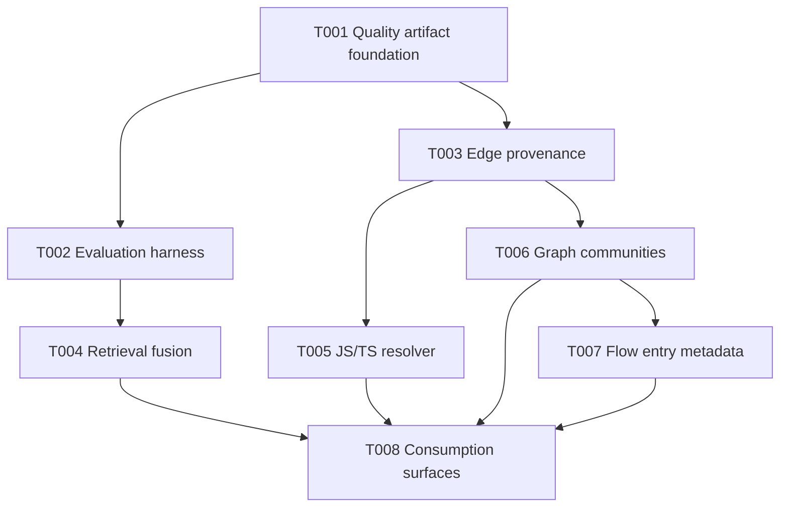

# Task Pack: Improve CRG Artifact Quality Algorithms

## Overview

This task pack derives from `docs/plans/2026-04-27-001-feat-crg-artifact-quality-algorithms-plan.md`. It is an executable handoff for `spec-work`, with the plan remaining the single source of truth.

The split follows the plan's dependency shape: first make quality measurable, then add evaluation and provenance foundations, then improve retrieval/resolution/structure, and finally expose quality-aware consumption surfaces.

---

## Source Summary

- **Source plan:** `docs/plans/2026-04-27-001-feat-crg-artifact-quality-algorithms-plan.md`
- **Task-ready branch:** compile
- **Why a task pack is useful:** the source plan has 8 implementation units, non-linear dependencies, schema changes, CLI surfaces, and multiple independent verification surfaces.
- **Scope boundaries shaping this pack:** no compiler-grade semantic engine, no default embeddings, no hard quality gate, no script-level semantic routing, no merged workspace graph DB, and no removal of directory-first communities before fallback coverage exists.
- **Implementation-time unknowns:** exact RRF constants, exact graph community dependency, exact metadata column names, and exact CLI command naming remain implementation decisions within the plan's boundaries.

---

## Traceability Matrix

| Source | Requirement / Acceptance | Task(s) | Validation |
|---|---|---|---|
| U1 | R1, R5, R10 | T001 | Quality report unit/build tests and generation artifact checks |
| U2 | R2, R3 | T002 | Retrieval metric scorer tests and retrieval fixture scoring |
| U3 | R3, R4, R9, R10 | T004 | Fusion/tokenizer/rerank tests and existing retrieval compatibility |
| U4 | R5, R9, R10 | T003 | Edge provenance, unresolved reason, and analysis tests |
| U5 | R5, R6 | T005 | TS config resolver fixtures and graph resolver integration |
| U6 | R1, R7, R9, R10 | T006 | Graph community mode tests and directory fallback tests |
| U7 | R1, R8, R9, R10 | T007 | Flow entrypoint and truncation metadata tests |
| U8 | R1, R2, R3, R9, R10 | T008 | Hook/workflow context/e2e JSON envelope tests |
| Scope Boundaries | No default embeddings, no hard gate, no script semantic routing | T001-T008 | `stop_if` guards and review focus on advisory evidence semantics |

---

## Task Graph

---

## Execution Waves

- **Wave 1:** T001. Establish graph quality artifact foundation before other tasks depend on quality fields.
- **Wave 2:** T002 and T003. These can run in parallel: T002 owns eval/search surfaces, T003 owns graph schema/provenance.
- **Wave 3:** T004 and T005. These can run in parallel after their foundations: retrieval fusion depends on T002, JS/TS resolver depends on T003.
- **Wave 4:** T006. Community metadata touches `src/crg/migrations.js`, so keep it serialized after T003.
- **Wave 5:** T007. Flow metadata also touches `src/crg/migrations.js` and now depends on T006 to avoid schema migration conflicts.
- **Wave 6:** T008. Consumption surfaces depend on the earlier artifacts and metadata being available.

---

## Task Cards

- T001
  task_id: T001
  source_unit: U1
  goal: Add a generation-scoped `graph-quality.json` artifact that summarizes active graph trustworthiness.
  dependencies: []
  files:
    - `src/crg/quality/report.js`
    - `docs/contracts/crg/graph-quality.schema.json`
    - `src/crg/cli/build.js`
    - `src/crg/cli/postprocess.js`
    - `src/crg/artifact-paths.js`
    - `src/crg/generations/promote.js`
    - `tests/unit/crg-quality-report.test.js`
    - `tests/unit/crg-build-cli.test.js`
  requirement_refs:
    - R1
    - R5
    - R10
  context_refs:
    - `docs/plans/2026-04-27-001-feat-crg-artifact-quality-algorithms-plan.md#Implementation-Units`
    - `docs/plans/2026-04-27-001-feat-crg-artifact-quality-algorithms-plan.md#System-Wide-Impact`
    - `src/crg/workspace/status.js`
    - `src/crg/generations/health.js`
    - `src/crg/artifact-paths.js`
  entry_hint: Start by reading the existing generation promotion and postprocess flow so `build.js` can pass a build-time quality snapshot to a generation-scoped report writer before promotion.
  test_focus: Quality report generation for healthy, empty-edge, degraded parser, no-parser, and parse-error cases, including files that never enter `nodes`.
  done_signal: Active generation artifacts include `graph-quality.json`, build tests prove generation identity alignment, and baseline community/flow sections can report `unknown` until later tasks enrich them.
  parallelizable: false
  risk_note: A root-level quality file could become a second source of truth if it is not generation-scoped.
  stop_if: A new hard workflow gate or durable artifact outside the source plan is required.
  wave: 1

- T002
  task_id: T002
  source_unit: U2
  goal: Add deterministic CRG evaluation helpers for retrieval ranking and token efficiency.
  dependencies: [T001]
  files:
    - `src/crg/eval/scorer.js`
    - `src/crg/eval/fixtures.js`
    - `docs/contracts/crg/retrieval-eval.schema.json`
    - `src/crg/commands/search.js`
    - `src/crg/cli/router.js`
    - `tests/unit/crg-eval-scorer.test.js`
    - `tests/unit/crg-retrieval.test.js`
  requirement_refs:
    - R2
    - R3
  context_refs:
    - `docs/plans/2026-04-27-001-feat-crg-artifact-quality-algorithms-plan.md#Implementation-Units`
    - `src/crg/retrieval/pack.js`
    - `tests/unit/crg-retrieval.test.js`
  entry_hint: Start with metric helpers before adding any CLI or command surface, using synthetic SQLite fixtures already common in CRG unit tests.
  test_focus: MRR, Recall@K, precision/recall/F1, token-efficiency edge cases, and fixture scoring of `retrieveContext`.
  done_signal: Retrieval evaluation helpers have deterministic unit coverage and can score retrieval output without mutating graph facts; impact/flow evaluation remains deferred until flow metadata exists.
  parallelizable: true
  risk_note: Metric output can mislead future tuning if fixtures are too broad or nondeterministic.
  stop_if: Evaluation requires model calls, network access, or a new mandatory runtime dependency.
  wave: 2

- T003
  task_id: T003
  source_unit: U4
  goal: Persist edge-level confidence, resolution method, evidence, and unresolved reasons.
  dependencies: [T001]
  files:
    - `src/crg/migrations.js`
    - `src/crg/graph.js`
    - `src/crg/parser.js`
    - `src/crg/analyze.js`
    - `tests/unit/crg-edge-provenance.test.js`
    - `tests/unit/crg-graph.test.js`
    - `tests/unit/crg-resolve-edges-cache.test.js`
    - `tests/unit/crg-migrations.test.js`
  requirement_refs:
    - R5
    - R9
    - R10
  context_refs:
    - `docs/plans/2026-04-27-001-feat-crg-artifact-quality-algorithms-plan.md#Key-Technical-Decisions`
    - `src/crg/migrations.js`
    - `src/crg/graph.js`
    - `tests/unit/crg-graph.test.js`
  entry_hint: Start from `resolveEdges` and the existing `nodes` metadata fields so edge metadata mirrors current confidence/evidence conventions.
  test_focus: Direct target id, relative import, ambiguous symbol, invalid target id, analysis consumption of edge confidence, and legacy DB additive migration for new edge/unresolved-edge metadata columns.
  done_signal: Resolved and unresolved edges are auditable without changing existing resolution behavior for callers that ignore new metadata.
  parallelizable: true
  risk_note: False-positive edges are more damaging than unresolved edges; ambiguous candidates should stay unresolved with evidence.
  stop_if: Provenance requires changing node id format, edge id format, or public graph identity semantics.
  wave: 2

- T004
  task_id: T004
  source_unit: U3
  goal: Add reason-preserving multi-source fusion with fixture-backed comparison before switching default retrieval ranking.
  dependencies: [T002]
  files:
    - `src/crg/retrieval/fusion.js`
    - `src/crg/retrieval/tokenize.js`
    - `src/crg/retrieval/lexical-overlap-rerank.js`
    - `src/crg/retrieval/api.js`
    - `src/crg/retrieval/seed.js`
    - `src/crg/retrieval/rerank.js`
    - `src/crg/retrieval/semantic-rerank.js`
    - `tests/unit/crg-retrieval-fusion.test.js`
    - `tests/unit/crg-retrieval-tokenize.test.js`
    - `tests/unit/crg-semantic-rerank.test.js`
  requirement_refs:
    - R3
    - R4
    - R9
    - R10
  context_refs:
    - `docs/plans/2026-04-27-001-feat-crg-artifact-quality-algorithms-plan.md#Key-Technical-Decisions`
    - `src/crg/retrieval/profiles.js`
    - `src/crg/retrieval/expand.js`
    - `src/crg/retrieval/pack.js`
  entry_hint: Start by extracting tokenization and fusion helpers, then compare the fusion path against U2 fixtures before wiring it as the default while preserving the public result shape.
  test_focus: Unicode query tokenization, PascalCase/snake_case boosts, FTS fallback, changed-file/candidate-test preservation, budget packing, and fixture parity/improvement versus the previous ranking path.
  done_signal: Retrieval fixtures demonstrate stable or improved ranking with richer `reasons` and `score_breakdown`, and the previous ranking behavior remains available internally until parity is proven.
  parallelizable: true
  risk_note: Ranking changes can silently degrade planning/review context if existing profile behavior is not preserved.
  stop_if: The implementation requires default dense embeddings, provider configuration, or network access.
  wave: 3

- T005
  task_id: T005
  source_unit: U5
  goal: Add dependency-light JS/TS `tsconfig` path resolution into edge resolution.
  dependencies: [T003]
  files:
    - `src/crg/resolvers/tsconfig.js`
    - `src/crg/graph.js`
    - `src/crg/lang-config.js`
    - `tests/unit/crg-tsconfig-resolver.test.js`
    - `tests/unit/crg-graph.test.js`
  requirement_refs:
    - R5
    - R6
  context_refs:
    - `docs/plans/2026-04-27-001-feat-crg-artifact-quality-algorithms-plan.md#Implementation-Units`
    - `src/crg/graph.js`
    - `src/crg/topology/modules.js`
  entry_hint: Start with nearest `tsconfig.json` JSONC parsing, `baseUrl`/`paths`, extension probing, and `index.*`; add relative `extends` and `tsconfig.app.json` discovery only after invalid/ambiguous cases stay unresolved.
  test_focus: Alias resolution from the nearest config, inherited config, invalid JSONC fallback, directory index probing, and provenance propagation.
  done_signal: JS/TS alias fixture imports resolve to module nodes with explicit resolution metadata and nonfatal failure behavior.
  parallelizable: true
  risk_note: Resolver false positives can create misleading graph edges; unresolved with reason is preferable to guessed resolution.
  stop_if: The resolver requires package-manager workspace dependency inference or a new external parser dependency not declared by the plan.
  wave: 3

- T006
  task_id: T006
  source_unit: U6
  goal: Add graph-based or hybrid community detection metadata while preserving directory-first fallback.
  dependencies: [T003]
  files:
    - `src/crg/communities/graph-partition.js`
    - `src/crg/communities.js`
    - `src/crg/migrations.js`
    - `src/crg/commands/communities.js`
    - `tests/unit/crg-communities-graph.test.js`
    - `tests/unit/crg-communities.test.js`
    - `tests/unit/crg-migrations.test.js`
  requirement_refs:
    - R1
    - R7
    - R9
    - R10
  context_refs:
    - `docs/plans/2026-04-27-001-feat-crg-artifact-quality-algorithms-plan.md#Key-Technical-Decisions`
    - `src/crg/communities.js`
    - `tests/unit/crg-communities.test.js`
  entry_hint: Start by projecting module-level graph edges and adding algorithm/source/cohesion metadata without removing current directory grouping.
  test_focus: Graph-mode grouping, no-edge fallback, isolate handling, deterministic oversized splitting, `community_id` propagation, and legacy DB additive migration for community metadata columns.
  done_signal: Community command/output can explain whether a boundary came from directory, graph, or fallback.
  parallelizable: false
  risk_note: New partitioning can create unstable community ids and noisy generated artifacts.
  stop_if: A heavy native graph dependency is needed or directory-first fallback must be removed.
  wave: 4

- T007
  task_id: T007
  source_unit: U7
  goal: Add explicit flow entry candidate sources, confidence, and truncation metadata.
  dependencies: [T003, T006]
  files:
    - `src/crg/flows/entrypoints.js`
    - `src/crg/flows.js`
    - `src/crg/migrations.js`
    - `src/crg/commands/flows.js`
    - `src/crg/commands/flow.js`
    - `tests/unit/crg-flow-entrypoints.test.js`
    - `tests/unit/crg-flows-scoring.test.js`
    - `tests/unit/crg-migrations.test.js`
  requirement_refs:
    - R1
    - R8
    - R9
    - R10
  context_refs:
    - `docs/plans/2026-04-27-001-feat-crg-artifact-quality-algorithms-plan.md#Implementation-Units`
    - `src/crg/flows.js`
    - `src/crg/changes.js`
  entry_hint: Start from current zero-in-degree flow detection and add conservative entry source metadata before adding new entry candidate signals.
  test_focus: CLI-like entries, zero-in-degree fallback, max-node truncation, no-call graph limitations, command output compatibility, and legacy DB additive migration for flow entry metadata columns.
  done_signal: Flow outputs expose entry confidence/source and truncation facts without implying runtime certainty.
  parallelizable: false
  risk_note: Entry heuristics can look semantic; output must keep them as candidates with confidence.
  stop_if: Implementing entries requires framework-specific runtime analysis beyond path/name/static graph signals.
  wave: 5

- T008
  task_id: T008
  source_unit: U8
  goal: Surface quality summaries and evidence reasons through CRG workflow hooks and context commands.
  dependencies: [T004, T005, T006, T007]
  files:
    - `src/crg/hooks/before-plan.js`
    - `src/crg/hooks/before-work.js`
    - `src/crg/hooks/before-review.js`
    - `src/crg/workflow-context/stage.js`
    - `src/crg/commands/review-context.js`
    - `src/crg/commands/architecture.js`
    - `docs/02-架构设计/05-crg-作为工作流质量底座.md`
    - `tests/unit/crg-workflow-context-hooks.test.js`
    - `tests/unit/crg-review-context.test.js`
    - `tests/e2e/crg-all-commands.sh`
  requirement_refs:
    - R1
    - R2
    - R3
    - R9
    - R10
  context_refs:
    - `docs/plans/2026-04-27-001-feat-crg-artifact-quality-algorithms-plan.md#System-Wide-Impact`
    - `src/crg/hooks/shared.js`
    - `src/crg/workflow-context/stage.js`
  entry_hint: Start with existing hook envelope and workflow context patterns, adding compact quality summaries and top limitations as advisory decision inputs.
  test_focus: Hook output with quality available, hook output with missing quality, before-review limitations, CRG-facing documentation of the evidence/confidence model, and e2e JSON envelope compatibility.
  done_signal: Agents receive quality/evidence summaries in existing consumption surfaces, CRG docs describe the new evidence/confidence model, and scripts still do not select semantic targets.
  parallelizable: false
  risk_note: Hook output can become too noisy or imply hard routing decisions if quality facts are not summarized carefully.
  stop_if: The implementation requires changing public workflow routing semantics or modifying the project role baseline.
  wave: 6

---

## Validation Notes

- This task pack derives from `docs/plans/2026-04-27-001-feat-crg-artifact-quality-algorithms-plan.md`.
- `source_plan_hash` is a task-relevant `sha256` over the source plan sections listed in frontmatter. If those execution-relevant sections change, reject this task pack and regenerate it.
- The split is useful because T001/T002/T003 establish measurable and auditable foundations before T004-T007 alter ranking and graph algorithms.
- T001 is intentionally limited to baseline quality observability; richer community and flow quality sections are enriched by T006 and T007.
- T006 and T007 are serialized through an explicit T007 dependency because both touch `src/crg/migrations.js`; this avoids schema conflicts.
- T008 is last because workflow consumption should only expose quality fields once the underlying artifacts and metadata exist.

---

## Regeneration Rules

Regenerate this task pack when any of these change in the source plan:

- requirements,
- scope boundaries,
- implementation units,
- declared files,
- test scenarios,
- verification expectations,
- deferred implementation unknowns.

Reject this task pack for `spec-work` handoff if:

- `source_plan_hash` no longer matches the current source plan,
- `spec_id` differs from the source plan,
- task files are manually broadened beyond repo-relative boundaries,
- a task's `stop_if` triggers during implementation,
- the source plan is replaced by a new independent delivery chain.
