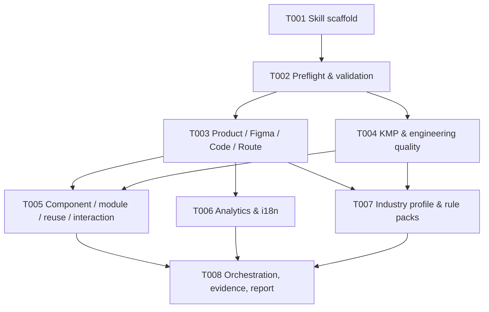

# Task Pack: spec-app-consistency-audit v0.1

## Overview

This is an executable task pack derived from `docs/02-架构设计/spec_app_consistency_audit_技术方案.md`.

It now carries source-plan identity via `spec_id`, so it can be treated as a `spec-work` handoff after downstream consumers recheck the source plan hash and task contract.

The split is organized around the plan's real execution spine:

1. skill scaffold and host entrypoints
2. preflight and artifact validation
3. contract extraction by domain
4. industry profiling and rule-pack selection
5. expert orchestration and evidence gating
6. final report, writeback preview, and MVP validation

## Source Summary

- Source plan: `docs/02-架构设计/spec_app_consistency_audit_技术方案.md`
- Task-ready branch: `compile`
- Why this task pack helps: the plan spans many phases, schema artifacts, prompts, rule packs, and review outputs; a task pack reduces execution-time context switching.
- Scope boundaries shaping the split: default static-only mode, no hard runtime gate, no auto-writeback to repo-profile, no generated runtime hand-editing, and no turning rule packs into project facts.
- App-audit expert prompts stay skill-local under `skills/spec-app-consistency-audit/prompts/`; `agents/` remains out of scope for the MVP handoff.
- Implementation-time unknowns: exact script wiring, exact schema file names, and the final packaging path for generated runtime assets remain implementation decisions within the plan boundary.

## Traceability Matrix

| Source | Requirement / Acceptance | Task(s) | Validation |
| --- | --- | --- | --- |
| 5.1, 5.3.1, 6.1, 6.2 | Input layering, local read boundary, source/runtime boundary | T001, T002 | path allowlist, symlink escape, and artifact metadata tests |
| 7 Phase 0, 9, 11, 15 | Preflight, issue protocol, runtime verification, script responsibilities | T002, T008 | schema and validation tests for degraded mode and issue fields |
| 7 Phase 1-3.5 | Product / Figma / Code / Route extraction | T003 | contract extraction fixtures and boundary tests |
| 7 Phase 4, 4.5, 12A | KMP architecture and App engineering quality | T004 | architecture and quality candidate tests |
| 7 Phase 5-6 | Component, module, reuse, and interaction review | T005 | component / module / interaction state tests |
| 7 Phase 7-8 | Analytics and i18n extraction | T006 | event coverage and locale / placeholder tests |
| 7 Phase 9-10, 16 | Industry profiling and rule pack selection | T007 | preview-only industry selection and rule-pack activation tests |
| 8, 9, 10, 11, 13, 17 | Expert roles, evidence gate, severity, report structure, MVP gate | T008 | report synthesis, evidence rejection, and validation-gate tests |

## Task Graph



## Execution Waves

- Wave 1: T001
- Wave 2: T002
- Wave 3: T003 and T004
- Wave 4: T005 and T006
- Wave 5: T007
- Wave 6: T008

## Task Pack Contract

```json
{
  "schema_version": "task-pack/v1",
  "execution_waves": [
    { "wave": 1, "tasks": ["T001"] },
    { "wave": 2, "tasks": ["T002"] },
    { "wave": 3, "tasks": ["T003", "T004"] },
    { "wave": 4, "tasks": ["T005", "T006"] },
    { "wave": 5, "tasks": ["T007"] },
    { "wave": 6, "tasks": ["T008"] }
  ],
  "tasks": [
    {
      "task_id": "T001",
      "requirement_refs": ["6.1", "14"],
      "goal": "Scaffold the source-of-truth skill, host entrypoint, and governance contract without touching generated runtime assets.",
      "dependencies": [],
      "files": [
        "skills/spec-app-consistency-audit/SKILL.md",
        "templates/claude/commands/spec/app-consistency-audit.md",
        "src/cli/contracts/dual-host-governance/skills-governance.json",
        "tests/unit/spec-app-consistency-audit-entry.test.js"
      ],
      "test_focus": "Skill discovery, host entry routing, and source/runtime boundary preservation.",
      "done_signal": "The new skill and host entrypoint reference the same source contract and the generated runtime remains untouched.",
      "wave": 1,
      "stop_if": "Implementation needs to edit `.claude/`, `.codex/`, or `.agents/skills/` directly.",
      "parallelizable": false,
      "risk_note": "If the scaffold leaks into generated runtime, source-of-truth drift starts immediately."
    },
    {
      "task_id": "T002",
      "requirement_refs": ["5.1", "5.3.1", "6.2", "7 Phase 0", "11", "15"],
      "goal": "Implement deterministic preflight, local input boundaries, artifact metadata, and validation helpers.",
      "dependencies": ["T001"],
      "files": [
        "skills/spec-app-consistency-audit/scripts/preflight.js",
        "skills/spec-app-consistency-audit/scripts/build-audit-context.js",
        "skills/spec-app-consistency-audit/scripts/validate-artifacts.js",
        "skills/spec-app-consistency-audit/schemas/preflight.schema.json",
        "skills/spec-app-consistency-audit/schemas/audit-report.schema.json",
        "tests/unit/spec-app-consistency-audit-preflight.test.js",
        "tests/unit/spec-app-consistency-audit-validate.test.js"
      ],
      "test_focus": "Path allowlisting, symlink escape rejection, file-size limits, degraded mode facts, and artifact metadata completeness.",
      "done_signal": "Preflight emits structured degraded facts and validators reject malformed or incomplete artifacts before expert review runs.",
      "wave": 2,
      "stop_if": "Input parsing requires network access, non-text execution, or a new durable state file not declared by the plan.",
      "parallelizable": false,
      "risk_note": "If preflight is weak, all later contract extraction will inherit untrusted input."
    },
    {
      "task_id": "T003",
      "requirement_refs": ["7 Phase 1", "7 Phase 2", "7 Phase 3", "7 Phase 3.5", "12.1", "12.2"],
      "goal": "Extract product, Figma, codebase, and page-route contracts from source inputs into reviewable artifacts.",
      "dependencies": ["T002"],
      "files": [
        "skills/spec-app-consistency-audit/scripts/extract-prd-contract.js",
        "skills/spec-app-consistency-audit/scripts/extract-figma-contract.js",
        "skills/spec-app-consistency-audit/scripts/extract-code-contract.js",
        "skills/spec-app-consistency-audit/scripts/extract-page-routes.js",
        "skills/spec-app-consistency-audit/prompts/product-expert.md",
        "skills/spec-app-consistency-audit/prompts/figma-design-expert.md",
        "skills/spec-app-consistency-audit/prompts/page-route-expert.md",
        "tests/unit/spec-app-consistency-audit-contract-extraction.test.js"
      ],
      "test_focus": "Product journey extraction, Figma trust boundary, route coverage, and PRD-to-Figma-to-code trace fidelity.",
      "done_signal": "Product, design, code, and route contracts are generated as separate artifacts and can be reviewed independently.",
      "wave": 3,
      "stop_if": "Extraction starts depending on unrestricted MCP traversal or invents pages and routes without evidence.",
      "parallelizable": true,
      "risk_note": "Merging route and product extraction too early can hide mismatches between journey, screen, and route layers."
    },
    {
      "task_id": "T004",
      "requirement_refs": ["7 Phase 4", "7 Phase 4.5", "12A", "12.4", "12.10"],
      "goal": "Extract KMP architecture and App engineering-quality candidates without turning the scripts into a rule engine.",
      "dependencies": ["T002"],
      "files": [
        "skills/spec-app-consistency-audit/scripts/extract-kmp-architecture.js",
        "skills/spec-app-consistency-audit/scripts/extract-engineering-quality.js",
        "skills/spec-app-consistency-audit/prompts/kmp-clean-architect.md",
        "skills/spec-app-consistency-audit/prompts/engineering-quality-expert.md",
        "tests/unit/spec-app-consistency-audit-architecture.test.js",
        "tests/unit/spec-app-consistency-audit-engineering-quality.test.js"
      ],
      "test_focus": "commonMain / androidMain / iosMain boundaries, dependency direction, candidate complexity, and App-specific availability or safety risks.",
      "done_signal": "Architecture and engineering-quality candidate facts are emitted with locations and counts, not auto-confirmed judgments.",
      "wave": 3,
      "stop_if": "The implementation starts auto-classifying findings as confirmed issues or requires a backend-style rules engine.",
      "parallelizable": true,
      "risk_note": "This surface must stay App-specific; back-end code review heuristics should not leak in unmodified."
    },
    {
      "task_id": "T005",
      "requirement_refs": ["7 Phase 5", "7 Phase 6", "12.3", "12.5", "12.6"],
      "goal": "Extract component, module, reuse, and interaction review inputs from the same source graph.",
      "dependencies": ["T003", "T004"],
      "files": [
        "skills/spec-app-consistency-audit/scripts/extract-components.js",
        "skills/spec-app-consistency-audit/scripts/extract-modules.js",
        "skills/spec-app-consistency-audit/scripts/merge-contracts.js",
        "skills/spec-app-consistency-audit/prompts/component-module-expert.md",
        "skills/spec-app-consistency-audit/prompts/mobile-ux-expert.md",
        "tests/unit/spec-app-consistency-audit-component-module.test.js",
        "tests/unit/spec-app-consistency-audit-interaction.test.js"
      ],
      "test_focus": "Variant coverage, module boundary clarity, reuse safety, loading/empty/error state completeness, and keyboard or safe-area risk signals.",
      "done_signal": "Component and module review inputs can be merged with interaction facts without losing the original trace to Figma and code.",
      "wave": 4,
      "stop_if": "The task needs a new component taxonomy or a runtime UI test harness not declared by the plan.",
      "parallelizable": true,
      "risk_note": "Over-abstracting reuse can flatten strong business-specific or industry-specific UI semantics."
    },
    {
      "task_id": "T006",
      "requirement_refs": ["7 Phase 7", "7 Phase 8", "12.7", "12.8"],
      "goal": "Extract analytics and i18n contracts so key-path coverage and locale risks are explicit.",
      "dependencies": ["T003"],
      "files": [
        "skills/spec-app-consistency-audit/scripts/extract-analytics.js",
        "skills/spec-app-consistency-audit/scripts/extract-i18n.js",
        "skills/spec-app-consistency-audit/prompts/analytics-expert.md",
        "skills/spec-app-consistency-audit/prompts/i18n-expert.md",
        "skills/spec-app-consistency-audit/prompts/accessibility-i18n-lens.md",
        "tests/unit/spec-app-consistency-audit-analytics.test.js",
        "tests/unit/spec-app-consistency-audit-i18n.test.js"
      ],
      "test_focus": "Event coverage, failure reason structure, key consistency, accessibility, placeholder handling, pluralization, and locale-specific layout risk signals.",
      "done_signal": "Analytics and i18n artifacts are generated separately and can be consumed by expert review without re-reading the source files.",
      "wave": 4,
      "stop_if": "The implementation auto-infers analytics policy or locale policy beyond what the plan specifies.",
      "parallelizable": true,
      "risk_note": "Analytics and i18n drift often looks harmless until it breaks reviewability across platforms."
    },
    {
      "task_id": "T007",
      "requirement_refs": ["7 Phase 9", "7 Phase 10", "16", "8.13"],
      "goal": "Implement industry profiling and rule-pack selection as preview-only knowledge enhancement.",
      "dependencies": ["T003", "T004", "T005", "T006"],
      "files": [
        "skills/spec-app-consistency-audit/scripts/build-industry-profile.js",
        "skills/spec-app-consistency-audit/scripts/select-rule-packs.js",
        "skills/spec-app-consistency-audit/prompts/industry-expert.md",
        "skills/spec-app-consistency-audit/rule-packs/common-app/rules.yaml",
        "skills/spec-app-consistency-audit/rule-packs/common-app/checklist.md",
        "skills/spec-app-consistency-audit/rule-packs/kmp-clean-architecture/rules.yaml",
        "skills/spec-app-consistency-audit/rule-packs/component-module-reuse/rules.yaml",
        "skills/spec-app-consistency-audit/rule-packs/analytics/rules.yaml",
        "skills/spec-app-consistency-audit/rule-packs/i18n/rules.yaml",
        "skills/spec-app-consistency-audit/rule-packs/industries/securities/rules.yaml",
        "skills/spec-app-consistency-audit/rule-packs/industries/ecommerce/rules.yaml",
        "tests/unit/spec-app-consistency-audit-industry.test.js",
        "tests/unit/spec-app-consistency-audit-rule-packs.test.js"
      ],
      "test_focus": "Industry detection confidence, advisory-only downgrades, preview selection, and rule-pack activation without confirmed truth leakage.",
      "done_signal": "Industry profile and selected rule packs are preview artifacts only, and confirmed issues still require project-specific evidence.",
      "wave": 5,
      "stop_if": "Industry selection starts auto-writing durable project profile state or promoting rule-pack hits directly to confirmed issues.",
      "parallelizable": false,
      "risk_note": "Industry automation can overfit to generic terminology if preview-only boundaries are not enforced."
    },
    {
      "task_id": "T008",
      "requirement_refs": ["8", "9", "10", "11", "13", "17", "12.9", "13", "17"],
      "goal": "Wire expert orchestration, evidence gating, final report generation, regression suggestions, writeback preview, and the v0.1 validation gate.",
      "dependencies": ["T002", "T003", "T004", "T005", "T006", "T007"],
      "files": [
        "skills/spec-app-consistency-audit/prompts/orchestrator.md",
        "skills/spec-app-consistency-audit/prompts/evidence-auditor.md",
        "skills/spec-app-consistency-audit/prompts/regression-expert.md",
        "skills/spec-app-consistency-audit/prompts/report-writer.md",
        "skills/spec-app-consistency-audit/scripts/merge-contracts.js",
        "skills/spec-app-consistency-audit/scripts/validate-artifacts.js",
        "skills/spec-app-consistency-audit/references/report-format.md",
        "tests/unit/spec-app-consistency-audit-report.test.js",
        "tests/unit/spec-app-consistency-audit-evidence.test.js",
        "tests/unit/spec-app-consistency-audit-mvp-gate.test.js"
      ],
      "test_focus": "Evidence rejection, issue severity sorting, report section coverage, regression suggestion shape, writeback preview only, and pilot validation rules.",
      "done_signal": "The final report includes Scope & Degraded Modes, page routing, App engineering quality, medium/low findings, and writeback preview without auto-apply.",
      "wave": 6,
      "stop_if": "The implementation adds a hard runtime gate, auto-writes repo-profile, or removes the preview-only writeback model.",
      "parallelizable": false,
      "risk_note": "If evidence gating is too weak, rule packs and candidate facts can be mistaken for confirmed issues."
    }
  ]
}
```

## Task Cards

- T001
  goal: Scaffold the source-of-truth skill, host entrypoint, and governance contract without touching generated runtime assets.
  dependencies: []
  files:
    - `skills/spec-app-consistency-audit/SKILL.md`
    - `templates/claude/commands/spec/app-consistency-audit.md`
    - `src/cli/contracts/dual-host-governance/skills-governance.json`
    - `tests/unit/spec-app-consistency-audit-entry.test.js`
  requirement_refs:
    - `6.1`
    - `14`
  entry_hint: Start from the skill and host entry surfaces so the source-of-truth contract is established before any script work.
  test_focus: Skill discovery, host entry routing, and source/runtime boundary preservation.
  done_signal: The new skill and host entrypoint reference the same source contract and the generated runtime remains untouched.
  parallelizable: false
  risk_note: If the scaffold leaks into generated runtime, source-of-truth drift starts immediately.
  stop_if: Implementation needs to edit `.claude/`, `.codex/`, or `.agents/skills/` directly.
  wave: 1

- T002
  goal: Implement deterministic preflight, local input boundaries, artifact metadata, and validation helpers.
  dependencies:
    - T001
  files:
    - `skills/spec-app-consistency-audit/scripts/preflight.js`
    - `skills/spec-app-consistency-audit/scripts/build-audit-context.js`
    - `skills/spec-app-consistency-audit/scripts/validate-artifacts.js`
    - `skills/spec-app-consistency-audit/schemas/preflight.schema.json`
    - `skills/spec-app-consistency-audit/schemas/audit-report.schema.json`
    - `tests/unit/spec-app-consistency-audit-preflight.test.js`
    - `tests/unit/spec-app-consistency-audit-validate.test.js`
  requirement_refs:
    - `5.1`
    - `5.3.1`
    - `6.2`
    - `7 Phase 0`
    - `11`
    - `15`
  entry_hint: Start with the preflight and validation helper surfaces so later extractors can rely on structured degraded facts.
  test_focus: Path allowlisting, symlink escape rejection, file-size limits, degraded mode facts, and artifact metadata completeness.
  done_signal: Preflight emits structured degraded facts and validators reject malformed or incomplete artifacts before expert review runs.
  parallelizable: false
  risk_note: If preflight is weak, all later contract extraction will inherit untrusted input.
  stop_if: Input parsing requires network access, non-text execution, or a new durable state file not declared by the plan.
  wave: 2

- T003
  goal: Extract product, Figma, codebase, and page-route contracts from source inputs into reviewable artifacts.
  dependencies:
    - T002
  files:
    - `skills/spec-app-consistency-audit/scripts/extract-prd-contract.js`
    - `skills/spec-app-consistency-audit/scripts/extract-figma-contract.js`
    - `skills/spec-app-consistency-audit/scripts/extract-code-contract.js`
    - `skills/spec-app-consistency-audit/scripts/extract-page-routes.js`
    - `skills/spec-app-consistency-audit/prompts/product-expert.md`
    - `skills/spec-app-consistency-audit/prompts/figma-design-expert.md`
    - `skills/spec-app-consistency-audit/prompts/page-route-expert.md`
    - `tests/unit/spec-app-consistency-audit-contract-extraction.test.js`
  requirement_refs:
    - `7 Phase 1`
    - `7 Phase 2`
    - `7 Phase 3`
    - `7 Phase 3.5`
    - `12.1`
    - `12.2`
  entry_hint: Start with the product and route contracts, then thread Figma and code evidence into the same trace model.
  test_focus: Product journey extraction, Figma trust boundary, route coverage, and PRD-to-Figma-to-code trace fidelity.
  done_signal: Product, design, code, and route contracts are generated as separate artifacts and can be reviewed independently.
  parallelizable: true
  risk_note: Merging route and product extraction too early can hide mismatches between journey, screen, and route layers.
  stop_if: Extraction starts depending on unrestricted MCP traversal or invents pages and routes without evidence.
  wave: 3

- T004
  goal: Extract KMP architecture and App engineering-quality candidates without turning the scripts into a rule engine.
  dependencies:
    - T002
  files:
    - `skills/spec-app-consistency-audit/scripts/extract-kmp-architecture.js`
    - `skills/spec-app-consistency-audit/scripts/extract-engineering-quality.js`
    - `skills/spec-app-consistency-audit/prompts/kmp-clean-architect.md`
    - `skills/spec-app-consistency-audit/prompts/engineering-quality-expert.md`
    - `tests/unit/spec-app-consistency-audit-architecture.test.js`
    - `tests/unit/spec-app-consistency-audit-engineering-quality.test.js`
  requirement_refs:
    - `7 Phase 4`
    - `7 Phase 4.5`
    - `12A`
    - `12.4`
    - `12.10`
  entry_hint: Start from the KMP source-set evidence and the engineering-quality candidate surface before wiring any expert review.
  test_focus: `commonMain` / `androidMain` / `iosMain` boundaries, dependency direction, candidate complexity, and App-specific availability or safety risks.
  done_signal: Architecture and engineering-quality candidate facts are emitted with locations and counts, not auto-confirmed judgments.
  parallelizable: true
  risk_note: This surface must stay App-specific; back-end code review heuristics should not leak in unmodified.
  stop_if: The implementation starts auto-classifying findings as confirmed issues or requires a backend-style rules engine.
  wave: 3

- T005
  goal: Extract component, module, reuse, and interaction review inputs from the same source graph.
  dependencies:
    - T003
    - T004
  files:
    - `skills/spec-app-consistency-audit/scripts/extract-components.js`
    - `skills/spec-app-consistency-audit/scripts/extract-modules.js`
    - `skills/spec-app-consistency-audit/scripts/merge-contracts.js`
    - `skills/spec-app-consistency-audit/prompts/component-module-expert.md`
    - `skills/spec-app-consistency-audit/prompts/mobile-ux-expert.md`
    - `tests/unit/spec-app-consistency-audit-component-module.test.js`
    - `tests/unit/spec-app-consistency-audit-interaction.test.js`
  requirement_refs:
    - `7 Phase 5`
    - `7 Phase 6`
    - `12.3`
    - `12.5`
    - `12.6`
  entry_hint: Use the existing component and module traces to derive interaction facts instead of inventing a separate UI-state model.
  test_focus: Variant coverage, module boundary clarity, reuse safety, loading/empty/error state completeness, and keyboard or safe-area risk signals.
  done_signal: Component and module review inputs can be merged with interaction facts without losing the original trace to Figma and code.
  parallelizable: true
  risk_note: Over-abstracting reuse can flatten strong business-specific or industry-specific UI semantics.
  stop_if: The task needs a new component taxonomy or a runtime UI test harness not declared by the plan.
  wave: 4

- T006
  goal: Extract analytics and i18n contracts so key-path coverage and locale risks are explicit.
  dependencies:
    - T003
  files:
    - `skills/spec-app-consistency-audit/scripts/extract-analytics.js`
    - `skills/spec-app-consistency-audit/scripts/extract-i18n.js`
    - `skills/spec-app-consistency-audit/prompts/analytics-expert.md`
    - `skills/spec-app-consistency-audit/prompts/i18n-expert.md`
    - `skills/spec-app-consistency-audit/prompts/accessibility-i18n-lens.md`
    - `tests/unit/spec-app-consistency-audit-analytics.test.js`
    - `tests/unit/spec-app-consistency-audit-i18n.test.js`
  requirement_refs:
    - `7 Phase 7`
    - `7 Phase 8`
    - `12.7`
    - `12.8`
  entry_hint: Start from the key-path event model and reuse the same evidence chain for locale extraction.
  test_focus: Event coverage, failure reason structure, key consistency, accessibility, placeholder handling, pluralization, and locale-specific layout risk signals.
  done_signal: Analytics and i18n artifacts are generated separately and can be consumed by expert review without re-reading the source files.
  parallelizable: true
  risk_note: Analytics and i18n drift often looks harmless until it breaks reviewability across platforms.
  stop_if: The implementation auto-infers analytics policy or locale policy beyond what the plan specifies.
  wave: 4

- T007
  goal: Implement industry profiling and rule-pack selection as preview-only knowledge enhancement.
  dependencies:
    - T003
    - T004
    - T005
    - T006
  files:
    - `skills/spec-app-consistency-audit/scripts/build-industry-profile.js`
    - `skills/spec-app-consistency-audit/scripts/select-rule-packs.js`
    - `skills/spec-app-consistency-audit/prompts/industry-expert.md`
    - `skills/spec-app-consistency-audit/rule-packs/common-app/rules.yaml`
    - `skills/spec-app-consistency-audit/rule-packs/common-app/checklist.md`
    - `skills/spec-app-consistency-audit/rule-packs/kmp-clean-architecture/rules.yaml`
    - `skills/spec-app-consistency-audit/rule-packs/component-module-reuse/rules.yaml`
    - `skills/spec-app-consistency-audit/rule-packs/analytics/rules.yaml`
    - `skills/spec-app-consistency-audit/rule-packs/i18n/rules.yaml`
    - `skills/spec-app-consistency-audit/rule-packs/industries/securities/rules.yaml`
    - `skills/spec-app-consistency-audit/rule-packs/industries/ecommerce/rules.yaml`
    - `tests/unit/spec-app-consistency-audit-industry.test.js`
    - `tests/unit/spec-app-consistency-audit-rule-packs.test.js`
  requirement_refs:
    - `7 Phase 9`
    - `7 Phase 10`
    - `16`
    - `8.13`
  entry_hint: Start with preview-only industry classification, then layer rule-pack activation on top of confirmed user intent or confirmed preview.
  test_focus: Industry detection confidence, advisory-only downgrades, preview selection, and rule-pack activation without confirmed truth leakage.
  done_signal: Industry profile and selected rule packs are preview artifacts only, and confirmed issues still require project-specific evidence.
  parallelizable: false
  risk_note: Industry automation can overfit to generic terminology if preview-only boundaries are not enforced.
  stop_if: Industry selection starts auto-writing durable project profile state or promoting rule-pack hits directly to confirmed issues.
  wave: 5

- T008
  goal: Wire expert orchestration, evidence gating, final report generation, regression suggestions, writeback preview, and the v0.1 validation gate.
  dependencies:
    - T002
    - T003
    - T004
    - T005
    - T006
    - T007
  files:
    - `skills/spec-app-consistency-audit/prompts/orchestrator.md`
    - `skills/spec-app-consistency-audit/prompts/evidence-auditor.md`
    - `skills/spec-app-consistency-audit/prompts/regression-expert.md`
    - `skills/spec-app-consistency-audit/prompts/report-writer.md`
    - `skills/spec-app-consistency-audit/scripts/merge-contracts.js`
    - `skills/spec-app-consistency-audit/scripts/validate-artifacts.js`
    - `skills/spec-app-consistency-audit/references/report-format.md`
    - `tests/unit/spec-app-consistency-audit-report.test.js`
    - `tests/unit/spec-app-consistency-audit-evidence.test.js`
    - `tests/unit/spec-app-consistency-audit-mvp-gate.test.js`
  requirement_refs:
    - `8`
    - `9`
    - `10`
    - `11`
    - `13`
    - `17`
    - `12.9`
  entry_hint: Start from the evidence gate and report shape so the orchestrator can combine all earlier artifacts without promoting weak evidence.
  test_focus: Evidence rejection, issue severity sorting, report section coverage, regression suggestion shape, writeback preview only, and pilot validation rules.
  done_signal: The final report includes Scope & Degraded Modes, page routing, App engineering quality, medium/low findings, and writeback preview without auto-apply.
  parallelizable: false
  risk_note: If evidence gating is too weak, rule packs and candidate facts can be mistaken for confirmed issues.
  stop_if: The implementation adds a hard runtime gate, auto-writes repo-profile, or removes the preview-only writeback model.
  wave: 6
```

## Orientation Evidence

- Provider: `direct-repo-reads`
- Posture: `bounded`
- Evidence refs:
  - `docs/02-架构设计/spec_app_consistency_audit_技术方案.md`
  - `skills/spec-write-tasks/SKILL.md`
  - `skills/spec-write-tasks/references/task-pack-schema.md`
  - `docs/tasks/2026-04-27-001-feat-crg-artifact-quality-algorithms-tasks.md`
  - `docs/2026-04-22-full-audit/10-actionable-tasks.md`
- Limitations:
- The source plan now carries `spec_id`.
- The task boundaries are derived from the plan phases and planned source tree, not from an existing implementation tree for this feature.

## Validation Notes

- The source plan hash in frontmatter was captured from the current plan body as `sha256:74d116fad8902945ffb61a87fff9deefbfbdafd34b5c01ab73b18d5f7fbae66b`.
- The source plan now has `spec_id`, so this task pack is executable in principle.
- Keep the same source plan path and regenerate the hash after any plan body change.
- The best proof that the split is useful is whether T002 can stabilize preflight, T003-T007 can produce separate artifacts, and T008 can merge them without turning the pipeline into a hard gate.

## Regeneration Rules

- Regenerate if the source plan changes, especially around workflow phases, source/runtime boundaries, issue protocol, or MVP validation.
- Regenerate if the plan receives `spec_id` frontmatter and the goal becomes an executable handoff.
- Regenerate if file ownership changes and any task now touches overlapping files or needs a different wave split.
- Regenerate if the plan adds or removes extraction phases, expert roles, or report sections.
- Do not reuse this task pack after the source plan body, `spec_id`, or file ownership changes.
