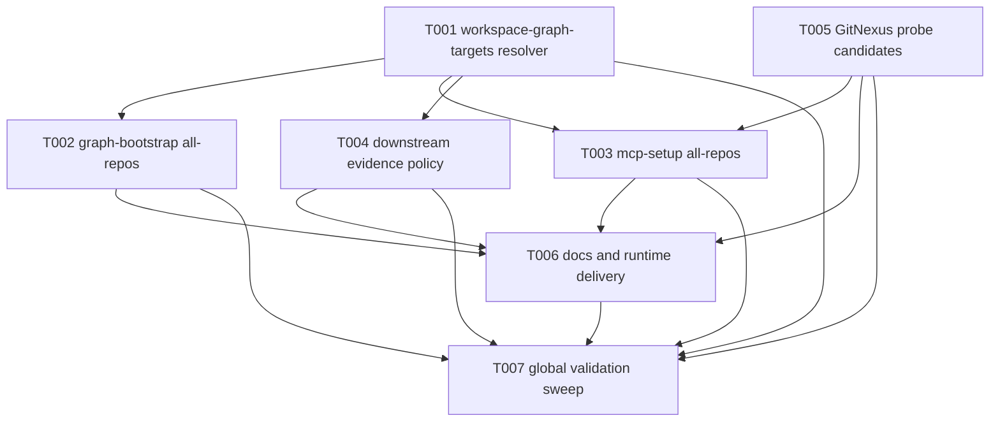

# Task Pack: workspace graph query router

## Overview

This is an executable task pack derived from `docs/plans/2026-05-03-001-feat-workspace-graph-query-router-plan.md`.

The source plan is task-ready because it has stable goals, non-goals, implementation units, file boundaries, and concrete validation surfaces. The split keeps `spec-plan` as the source of truth and only rearranges execution into smaller handoff slices for `spec-work`.

The work is organized around the durable path:

1. establish the provider-neutral workspace graph resolver,
2. add explicit all-repos maintenance paths without weakening write boundaries,
3. update downstream GitNexus-first evidence policy,
4. improve GitNexus query proof candidates,
5. document runtime delivery and run a global validation sweep.

## Source Summary

- Source plan: `docs/plans/2026-05-03-001-feat-workspace-graph-query-router-plan.md`
- Task-ready branch: `compile`
- Target repo: `spec-first`
- Why this task pack helps: the plan spans shell and PowerShell scripts, source skill prose, generated-host instruction source, documentation, and multiple contract tests; task splitting reduces execution-time context load and keeps overlapping files serialized.
- Scope boundaries shaping the split: parent workspace remains a control-plane/read-only routing context, child repos own canonical graph artifacts, scripts emit deterministic facts, LLMs decide semantic target candidates, and write workflows still require explicit `target_repo`.
- Implementation-time unknowns: exact JSON field naming inside `workspace-graph-targets.v1` can be finalized while implementing tests; exact `--all-repos` option shape can follow existing script style if the source-plan behavior remains intact.

## Traceability Matrix

| Source | Requirement / Acceptance | Task(s) | Validation |
| --- | --- | --- | --- |
| U1 | R1, R2, R3, R4 | T001 | Resolver schema, stale/dirty classification, setup-owned config reads, parent no-write tests |
| U2 graph-bootstrap side | R2, R6, R9 | T002 | Explicit `--all-repos` graph bootstrap summary, selected-child unchanged, parent no canonical graph artifacts |
| U2 setup side | R2, R6, R9 | T003 | Setup all-repos language-map contract, per-child `serena_language_required`, partial success behavior |
| U3 | R3, R4, R5, R7, R11 | T004 | Skill prose contracts for GitNexus-first read-only routing and strict write `target_repo` gates |
| U4 | R4, R8 | T005 | Candidate demotion tests for health/status infrastructure tokens and preserved query policy shape |
| U5 | R2, R3, R5, R6, R9, R10 | T006 | User docs, README, managed source instruction block, Claude templates, init dry-run/runtime delivery tests |
| U6 | R1-R10 | T007 | Global contract sweep, fresh-source review, narrow-to-broader validation, changelog entry |

## Task Graph



## Execution Waves

- Wave 1: T001
- Wave 2: T002, T004, T005
- Wave 3: T003
- Wave 4: T006
- Wave 5: T007

Wave 2 is the main parallel window. T003 is intentionally serialized after T005 because both touch `skills/spec-mcp-setup/SKILL.md`, `tests/unit/mcp-setup.sh`, and PowerShell setup contracts.

## Task Pack Contract

```json
{
  "schema_version": "task-pack/v1",
  "execution_waves": [
    { "wave": 1, "tasks": ["T001"] },
    { "wave": 2, "tasks": ["T002", "T004", "T005"] },
    { "wave": 3, "tasks": ["T003"] },
    { "wave": 4, "tasks": ["T006"] },
    { "wave": 5, "tasks": ["T007"] }
  ],
  "tasks": [
    {
      "task_id": "T001",
      "source_unit": "U1",
      "requirement_refs": ["R1", "R2", "R3", "R4"],
      "goal": "Implement the provider-neutral `workspace-graph-targets.v1` resolver and tests for parent-workspace read-only graph readiness aggregation.",
      "dependencies": [],
      "files": [
        "skills/spec-graph-bootstrap/scripts/resolve-workspace-graph-targets.sh",
        "skills/spec-graph-bootstrap/scripts/resolve-workspace-graph-targets.ps1",
        "skills/spec-graph-bootstrap/SKILL.md",
        "tests/unit/spec-graph-bootstrap.sh",
        "tests/unit/mcp-setup-powershell-contracts.test.js"
      ],
      "test_focus": "Parent workspace discovery, setup-owned config reads, canonical graph fact reads, stale revision detection, `dirty-uncertain` handling, and parent no-write guarantees.",
      "done_signal": "A parent workspace fixture emits stable `workspace-graph-targets.v1` JSON with per-child statuses and no parent `.spec-first/graph`, `.spec-first/impact`, `.spec-first/providers`, or `.serena` artifacts.",
      "wave": 1,
      "stop_if": "Resolver implementation needs script-owned semantic repo ranking, provider-specific group mode as a required path, or parent repo-local canonical graph artifacts.",
      "context_refs": [
        "docs/plans/2026-05-03-001-feat-workspace-graph-query-router-plan.md#U1",
        "skills/spec-mcp-setup/scripts/resolve-project-target.sh",
        "skills/spec-mcp-setup/scripts/resolve-project-target.ps1",
        "skills/spec-graph-bootstrap/scripts/bootstrap-providers.sh"
      ],
      "entry_hint": "Start from the existing project target resolver contract and add only the read-only graph target facts needed by downstream consumers.",
      "parallelizable": false,
      "risk_note": "This is the foundation contract; overloading `project-target.v1` or writing parent canonical graph state would compromise later tasks.",
      "review_focus": "Schema stability, dirty/stale fail-closed behavior, shell/PowerShell parity, and source/runtime boundary.",
      "target_repo": "spec-first"
    },
    {
      "task_id": "T002",
      "source_unit": "U2",
      "requirement_refs": ["R2", "R6", "R9"],
      "goal": "Add explicit `--all-repos` graph-bootstrap maintenance behavior using the child repo graph provider flow and workspace summary output.",
      "dependencies": ["T001"],
      "files": [
        "skills/spec-graph-bootstrap/SKILL.md",
        "skills/spec-graph-bootstrap/scripts/bootstrap-providers.sh",
        "skills/spec-graph-bootstrap/scripts/bootstrap-providers.ps1",
        "tests/unit/spec-graph-bootstrap.sh",
        "tests/unit/spec-graph-bootstrap-contracts.test.js"
      ],
      "test_focus": "Explicit parent-workspace `--all-repos`, selected-child compatibility, per-child partial success, degraded child summaries, and absence of parent canonical graph artifacts.",
      "done_signal": "`spec-graph-bootstrap --all-repos` can sequentially run child provider bootstrap, emit per-child results, and preserve existing `--repo <child>` behavior.",
      "wave": 2,
      "stop_if": "The implementation starts scanning arbitrary folders, defaults unresolved parent workspace to all repos, or writes parent `.spec-first/graph`, `.spec-first/impact`, or `.spec-first/providers` as canonical artifacts.",
      "context_refs": [
        "docs/plans/2026-05-03-001-feat-workspace-graph-query-router-plan.md#U2",
        "skills/spec-graph-bootstrap/scripts/bootstrap-providers.sh",
        "tests/unit/spec-graph-bootstrap.sh"
      ],
      "entry_hint": "Use the new resolver output as the target list and keep the provider execution path child-repo-local.",
      "parallelizable": true,
      "risk_note": "All-repos graph bootstrap must remain an explicit maintenance path with partial success semantics.",
      "review_focus": "No implicit fan-out, no parent canonical graph facts, and PowerShell parity.",
      "target_repo": "spec-first"
    },
    {
      "task_id": "T004",
      "source_unit": "U3",
      "requirement_refs": ["R3", "R4", "R5", "R7", "R11"],
      "goal": "Update downstream workflow source skills so parent-workspace read-only evidence is GitNexus-first while write/fix work still requires explicit repo scope.",
      "dependencies": ["T001"],
      "files": [
        "skills/spec-plan/SKILL.md",
        "skills/spec-work/SKILL.md",
        "skills/spec-work-beta/SKILL.md",
        "skills/spec-debug/SKILL.md",
        "skills/spec-code-review/SKILL.md",
        "skills/using-spec-first/SKILL.md",
        "tests/unit/spec-plan-contracts.test.js",
        "tests/unit/spec-work-contracts.test.js",
        "tests/unit/spec-work-beta-contracts.test.js",
        "tests/unit/spec-debug-contracts.test.js",
        "tests/unit/spec-code-review-contracts.test.js",
        "tests/unit/using-spec-first-contracts.test.js"
      ],
      "test_focus": "Skill prose contracts for `workspace-graph-targets.v1`, bounded candidate repos, GitNexus-first read-only questions, degraded fallback language, and strict write `target_repo` gates.",
      "done_signal": "Plan/work/debug/review/entry-governance source skills consistently distinguish read-only multi-repo evidence discovery from code-modifying child repo execution.",
      "wave": 2,
      "stop_if": "The prose duplicates a full routing state machine, makes GitNexus group mode required, or weakens write workflow target scope.",
      "context_refs": [
        "docs/plans/2026-05-03-001-feat-workspace-graph-query-router-plan.md#U3",
        "skills/spec-plan/SKILL.md",
        "skills/spec-work/SKILL.md",
        "skills/spec-code-review/SKILL.md",
        "skills/using-spec-first/SKILL.md"
      ],
      "entry_hint": "Start from each skill's existing graph readiness or workspace scope block and add the smallest shared evidence policy language.",
      "parallelizable": true,
      "risk_note": "The downstream policy must improve evidence selection without turning ordinary questions into mandatory workflow entry.",
      "review_focus": "Read-only/write boundary, stale/degraded evidence wording, and source skill as source-of-truth.",
      "target_repo": "spec-first"
    },
    {
      "task_id": "T005",
      "source_unit": "U4",
      "requirement_refs": ["R4", "R8"],
      "goal": "Improve GitNexus query probe candidate selection so weak health/status/infrastructure tokens do not dominate business-flow candidates.",
      "dependencies": [],
      "files": [
        "skills/spec-mcp-setup/scripts/write-provider-config.sh",
        "skills/spec-mcp-setup/scripts/write-provider-config.ps1",
        "skills/spec-mcp-setup/SKILL.md",
        "tests/unit/mcp-setup.sh",
        "tests/unit/mcp-setup-powershell-contracts.test.js"
      ],
      "test_focus": "Candidate ranking demotes `Health*`, `Ping*`, `Actuator*`, `Status*`, `Info*`, `Error*`, and `Metrics*` while preserving candidate limit and query policy compatibility.",
      "done_signal": "A repo containing both `HealthController` and a business controller selects the business-flow candidate first, while health-only repos still produce a clear low-confidence fallback.",
      "wave": 2,
      "stop_if": "Candidate selection requires broad unbounded search, provider-specific semantic graph queries during setup, or breaking `query_probe_policy` backward compatibility.",
      "context_refs": [
        "docs/plans/2026-05-03-001-feat-workspace-graph-query-router-plan.md#U4",
        "skills/spec-mcp-setup/scripts/write-provider-config.sh",
        "skills/spec-mcp-setup/scripts/write-provider-config.ps1",
        "CHANGELOG.md"
      ],
      "entry_hint": "Start with the existing weak proof and workflow signal helper functions and tighten ranking reasons rather than adding a new provider runner.",
      "parallelizable": true,
      "risk_note": "Over-filtering can remove legitimate business tokens; preserve fallback candidates and reason codes.",
      "review_focus": "Spring/Java weak-entry demotion, candidate cap of 5, and shell/PowerShell parity.",
      "target_repo": "spec-first"
    },
    {
      "task_id": "T003",
      "source_unit": "U2",
      "requirement_refs": ["R2", "R6", "R9"],
      "goal": "Add explicit `--all-repos` setup/verify maintenance behavior without letting scripts guess Serena language for first-time child repos.",
      "dependencies": ["T001", "T005"],
      "files": [
        "skills/spec-mcp-setup/SKILL.md",
        "skills/spec-mcp-setup/scripts/install-mcp.sh",
        "skills/spec-mcp-setup/scripts/install-mcp.ps1",
        "skills/spec-mcp-setup/scripts/verify-tools.sh",
        "skills/spec-mcp-setup/scripts/verify-tools.ps1",
        "tests/unit/mcp-setup.sh",
        "tests/unit/mcp-setup-powershell-contracts.test.js"
      ],
      "test_focus": "Setup all-repos behavior with explicit language map, existing `.serena/project.yml`, per-child `serena_language_required`, partial success summaries, and single-repo rejection/no-op semantics.",
      "done_signal": "`spec-mcp-setup --all-repos` can prepare eligible child repos and report action-required children without creating parent repo-local state or inferring languages from file extensions.",
      "wave": 3,
      "stop_if": "The implementation needs shell-owned language inference, implicit all-repos behavior for unresolved parent workspace, or a new durable workspace state file not declared by the plan.",
      "context_refs": [
        "docs/plans/2026-05-03-001-feat-workspace-graph-query-router-plan.md#U2",
        "skills/spec-mcp-setup/scripts/install-mcp.sh",
        "skills/spec-mcp-setup/scripts/verify-tools.sh",
        "skills/spec-mcp-setup/scripts/activate-serena.sh"
      ],
      "entry_hint": "Start with the existing child `--repo` setup flow and add batch orchestration around it, not a second setup engine.",
      "parallelizable": false,
      "risk_note": "The Serena language gate is the main script/LLM boundary risk; fail closed with `serena_language_required` when language facts are absent.",
      "review_focus": "Language map contract, per-child reason codes, partial success, and host/project artifact boundaries.",
      "target_repo": "spec-first"
    },
    {
      "task_id": "T006",
      "source_unit": "U5",
      "requirement_refs": ["R2", "R3", "R5", "R6", "R9", "R10"],
      "goal": "Update user documentation, README surfaces, and generated-host instruction source for the multi-repo GitNexus-first workflow boundary.",
      "dependencies": ["T002", "T003", "T004", "T005"],
      "files": [
        "docs/05-用户手册/08-三种开发模式.md",
        "README.md",
        "README.zh-CN.md",
        "CLAUDE.md",
        "AGENTS.md",
        "src/cli/instruction-bootstrap.js",
        "templates/claude/hooks/session-start",
        "templates/claude/commands/spec/graph-bootstrap.md",
        "templates/claude/commands/spec/mcp-setup.md",
        "tests/unit/dual-host-governance-contracts.test.js",
        "tests/unit/init-dry-run.test.js",
        "tests/smoke/cli.sh"
      ],
      "test_focus": "Docs and generated-host source mention read-only GitNexus-first parent workspace routing, explicit `--repo`/`--all-repos`, strict write `target_repo`, and source-first runtime delivery.",
      "done_signal": "User-facing docs and host instruction source consistently describe multi-repo workspace behavior without duplicating the full workflow state machine or requiring manual generated runtime edits.",
      "wave": 4,
      "stop_if": "The task requires editing `.claude/`, `.codex/`, or `.agents/skills/` directly, or embedding a second full copy of downstream routing policy in managed bootstrap text.",
      "context_refs": [
        "docs/plans/2026-05-03-001-feat-workspace-graph-query-router-plan.md#U5",
        "docs/05-用户手册/08-三种开发模式.md",
        "src/cli/instruction-bootstrap.js",
        "templates/claude/commands/spec/graph-bootstrap.md",
        "templates/claude/commands/spec/mcp-setup.md"
      ],
      "entry_hint": "Start from `instruction-bootstrap.js` as the generated instruction source and keep AGENTS/CLAUDE managed text thin.",
      "parallelizable": false,
      "risk_note": "Runtime delivery drift can occur if generated mirrors are hand-edited instead of source templates and init contracts.",
      "review_focus": "Source/runtime boundary, terminology consistency, and thin host-level evidence trigger.",
      "target_repo": "spec-first"
    },
    {
      "task_id": "T007",
      "source_unit": "U6",
      "requirement_refs": ["R1", "R2", "R3", "R4", "R5", "R6", "R7", "R8", "R9", "R10"],
      "goal": "Run the final characterization-first validation sweep, fresh-source review, and changelog update for the multi-repo query router change set.",
      "dependencies": ["T001", "T002", "T003", "T004", "T005", "T006"],
      "files": [
        "tests/unit/mcp-setup.sh",
        "tests/unit/spec-graph-bootstrap.sh",
        "tests/unit/spec-plan-contracts.test.js",
        "tests/unit/spec-work-contracts.test.js",
        "tests/unit/spec-work-beta-contracts.test.js",
        "tests/unit/spec-debug-contracts.test.js",
        "tests/unit/spec-code-review-contracts.test.js",
        "tests/unit/using-spec-first-contracts.test.js",
        "tests/unit/mcp-setup-powershell-contracts.test.js",
        "tests/unit/dual-host-governance-contracts.test.js",
        "tests/unit/init-dry-run.test.js",
        "tests/smoke/cli.sh",
        "CHANGELOG.md"
      ],
      "test_focus": "Resolver schema, parent no-write behavior, selected-child behavior, all-repos summaries, downstream prose contracts, probe candidate demotion, runtime generated script path delivery, and changelog coverage.",
      "done_signal": "The narrow relevant tests pass, fresh-source review finds no policy drift, and `CHANGELOG.md` records the user-visible multi-repo GitNexus-first behavior change.",
      "wave": 5,
      "stop_if": "Validation exposes a source-plan scope gap, a required schema/version change absent from the plan, or a HIGH/CRITICAL blast radius that needs replanning.",
      "context_refs": [
        "docs/plans/2026-05-03-001-feat-workspace-graph-query-router-plan.md#U6",
        "docs/10-prompt/结构化项目角色契约.md",
        "tests/unit/mcp-setup.sh",
        "tests/unit/spec-graph-bootstrap.sh"
      ],
      "entry_hint": "Start by running the most focused tests for touched surfaces, then broaden only as impact warrants.",
      "parallelizable": false,
      "risk_note": "The final sweep must verify source/runtime and shell/PowerShell parity without reverting unrelated dirty files.",
      "review_focus": "Global contract coherence, stale/degraded evidence posture, and no unrelated worktree churn.",
      "target_repo": "spec-first"
    }
  ]
}
```

## Task Cards

- T001
  - source_unit: U1
  - goal: Implement the `workspace-graph-targets.v1` resolver.
  - dependencies: none
  - files: `skills/spec-graph-bootstrap/scripts/resolve-workspace-graph-targets.sh`, `skills/spec-graph-bootstrap/scripts/resolve-workspace-graph-targets.ps1`, `skills/spec-graph-bootstrap/SKILL.md`, `tests/unit/spec-graph-bootstrap.sh`, `tests/unit/mcp-setup-powershell-contracts.test.js`
  - test_focus: parent workspace JSON contract, dirty/stale classification, setup-owned config reads, parent no-write
  - done_signal: resolver facts are usable by downstream read-only evidence selection without creating parent repo-local graph state
  - wave: 1

- T002
  - source_unit: U2
  - goal: Add explicit graph-bootstrap `--all-repos` maintenance behavior.
  - dependencies: T001
  - files: `skills/spec-graph-bootstrap/SKILL.md`, `skills/spec-graph-bootstrap/scripts/bootstrap-providers.sh`, `skills/spec-graph-bootstrap/scripts/bootstrap-providers.ps1`, `tests/unit/spec-graph-bootstrap.sh`, `tests/unit/spec-graph-bootstrap-contracts.test.js`
  - test_focus: child-local provider execution, workspace summary, partial success, selected-child compatibility
  - done_signal: all-repos graph bootstrap is explicit, sequential by default, and parent-safe
  - wave: 2

- T004
  - source_unit: U3
  - goal: Align downstream skills on GitNexus-first read-only multi-repo evidence and strict write scope.
  - dependencies: T001
  - files: `skills/spec-plan/SKILL.md`, `skills/spec-work/SKILL.md`, `skills/spec-work-beta/SKILL.md`, `skills/spec-debug/SKILL.md`, `skills/spec-code-review/SKILL.md`, `skills/using-spec-first/SKILL.md`, and their focused contract tests
  - test_focus: skill prose contract invariants
  - done_signal: ordinary parent-workspace code facts can use workspace graph targets first, while writes still require `target_repo`
  - wave: 2

- T005
  - source_unit: U4
  - goal: Improve GitNexus query probe candidate quality.
  - dependencies: none
  - files: `skills/spec-mcp-setup/scripts/write-provider-config.sh`, `skills/spec-mcp-setup/scripts/write-provider-config.ps1`, `skills/spec-mcp-setup/SKILL.md`, `tests/unit/mcp-setup.sh`, `tests/unit/mcp-setup-powershell-contracts.test.js`
  - test_focus: weak health/status token demotion and query policy compatibility
  - done_signal: business-flow candidates win over infrastructure probes when available
  - wave: 2

- T003
  - source_unit: U2
  - goal: Add explicit setup/verify `--all-repos` maintenance behavior with Serena language gating.
  - dependencies: T001, T005
  - files: `skills/spec-mcp-setup/SKILL.md`, `skills/spec-mcp-setup/scripts/install-mcp.sh`, `skills/spec-mcp-setup/scripts/install-mcp.ps1`, `skills/spec-mcp-setup/scripts/verify-tools.sh`, `skills/spec-mcp-setup/scripts/verify-tools.ps1`, `tests/unit/mcp-setup.sh`, `tests/unit/mcp-setup-powershell-contracts.test.js`
  - test_focus: explicit language map, existing Serena project facts, `serena_language_required`, partial success
  - done_signal: setup batch prepares eligible children and fails closed on language ambiguity
  - wave: 3

- T006
  - source_unit: U5
  - goal: Update docs, README, and generated-host instruction source.
  - dependencies: T002, T003, T004, T005
  - files: `docs/05-用户手册/08-三种开发模式.md`, `README.md`, `README.zh-CN.md`, `CLAUDE.md`, `AGENTS.md`, `src/cli/instruction-bootstrap.js`, Claude templates, and runtime delivery tests
  - test_focus: terminology, thin host evidence trigger, source-first runtime generation
  - done_signal: users can distinguish read-only graph routing from child-scoped write execution
  - wave: 4

- T007
  - source_unit: U6
  - goal: Run final validation, fresh-source review, and changelog update.
  - dependencies: T001, T002, T003, T004, T005, T006
  - files: focused unit/contract tests, `tests/smoke/cli.sh`, `CHANGELOG.md`
  - test_focus: end-to-end contract coherence across setup, bootstrap, downstream skills, docs, and runtime delivery
  - done_signal: narrow relevant tests pass and the changelog records the user-visible behavior change
  - wave: 5

## Orientation Evidence

- provider: `direct-repo-reads`
- posture: `bounded`
- evidence_refs:
  - `docs/plans/2026-05-03-001-feat-workspace-graph-query-router-plan.md`
  - `skills/spec-write-tasks/SKILL.md`
  - `skills/spec-write-tasks/references/task-pack-schema.md`
  - `docs/tasks/2026-05-01-001-feat-spec-app-consistency-audit-tasks.md`
  - `tests/unit/spec-graph-bootstrap.sh`
  - `tests/unit/spec-work-contracts.test.js`
  - `src/cli/instruction-bootstrap.js`
- limitations:
  - No semantic source orientation beyond the plan-indicated files was used; this task pack does not expand implementation scope.
  - Current compiled graph facts for this repo were marked stale in the source plan; task splitting used the reviewed plan, direct source reads, and deterministic hash tooling.

## Validation Notes

- The deterministic validator checks frontmatter identity/freshness and the machine-readable `Task Pack Contract` structure only.
- The same-wave file overlap rule is handled by serializing setup-side and probe-candidate work into separate waves.
- `source_plan_hash` was produced with `node bin/spec-first.js tasks hash docs/plans/2026-05-03-001-feat-workspace-graph-query-router-plan.md`.
- This task pack is scoped to `target_repo: spec-first`; it must not be reused as a task pack for the CRM multi-repo workspace.
- `CHANGELOG.md` is intentionally owned by the final validation task to avoid forcing all implementation slices into one wave.

## Regeneration Rules

- Rebuild this task pack if the source plan body hash changes.
- Rebuild this task pack if the source plan changes `spec_id`, requirements, scope boundaries, implementation units, or file ownership.
- Return to `spec-plan` if execution discovers a need for GitNexus group mode as a required path, cross-repo dependency graph contracts, new durable workspace state beyond the advisory summaries, or script-owned semantic repo ranking.
- Do not update generated runtime mirrors directly while executing these tasks; modify source files and use `spec-first init --codex|--claude` only when runtime regeneration is required.
