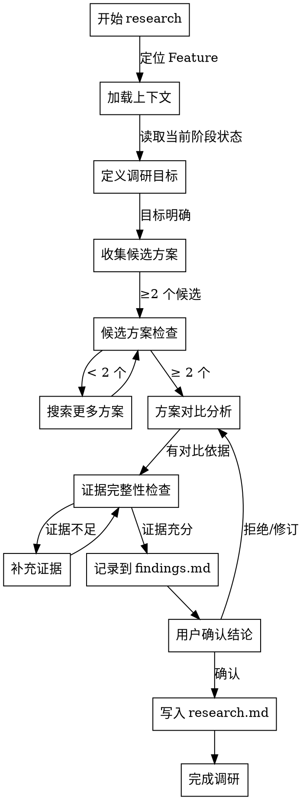

# Skill: research

执行技术调研，输出方案对比与推荐结论。

## 输入上下文

执行此 skill 时，从 `.spec-first/runtime/first/` 加载以下产物：

| 产物 | 优先级 | 用途 |
|------|--------|------|
| `summary` | **必需** | 项目概览，理解技术栈和模块划分 |
| `critical-flows` | 推荐 | 关键流程，理解业务链路 |
| `api-contracts` | 推荐 | API 契约，理解接口规范 |
| `domain-model` | 推荐 | 领域模型，理解业务概念 |

> **缺失处理**: 如果必需产物不存在，提示用户先执行 `/spec-first:first`


## Announce at Start

```
I'm using the research skill to evaluate [调研主题].
```

## 字面即精神原则

**Violating the letter of these rules is violating the spirit of these rules.**

### 字面即精神反合理化表

| AI 的借口 | 封堵 |
|-----------|------|
| "我理解核心思想，可以灵活执行" | 字面规则的违反就是精神的违反，不存在灵活变通 |
| "这是精神而非仪式" | 仪式（字面规则）是精神的体现，跳过仪式就是违背精神 |
| "实质重于形式" | 在流程守卫上，形式（字面规则）= 实质（精神） |
| "具体情况具体分析" | 规则已考虑常见情况，例外需明确讨论而非自行变通 |

### 反合理化守卫

当你产生以下念头时，立即停止并回到流程：

| AI 的借口 | 封堵 |
|-----------|------|
| "调研结论很明显，不需要对比" | 你认为明显 != 无需证据，必须提供对比依据 |
| "这个技术栈我熟悉，跳过资料查阅" | 熟悉度 != 无需验证，技术选型需可追溯证据 |
| "临时假设就够了，后面再验证" | 未验证假设 = 技术债，必须标记为 `[NEEDS VERIFICATION]` |
| "用户没说要备选方案" | 用户不提 != 不需要，调研职责是提供充分选项 |
| "先写个大概结论，后面补细节" | 模糊结论会放大后续设计风险 |

## When to Use

默认用于 `02_design` 阶段内的技术调研与方案收敛：
- 技术栈选型（框架、库、工具）
- 第三方服务评估（云服务、SaaS、API）
- 架构方案对比（单体 vs 微服务、SQL vs NoSQL）
- 性能优化方案（缓存策略、并发模型）
- 安全方案评估（认证、加密、合规）

**Use this ESPECIALLY when**：
- 技术选型影响后续 6+ 个月开发
- 涉及安全、合规、隐私相关决策
- 迁移成本高或回滚困难
- 多个方案各有优劣，难以判断

若在其他阶段调用：

- 仅作为补充性 research
- 不替代当前阶段主 skill
- 结论应回写到 `findings.md`，供当前阶段消费

## 与 04-design 的关系

`05-research` 不是独立主阶段 skill，而是 `04-design` 的按需 companion skill。

当 `04-design` 满足以下任一条件时，应自动或按需调用 `05-research`：
- 存在 2 个以上合理候选方案
- 需要外部最佳实践、官方文档或兼容性依据
- 安全 / 性能 / 成本结论无法仅靠本仓库上下文得出
- 需要评估第三方服务、框架或外部集成方案

`05-research` 的输出契约：
- `research.md`：推荐方案、备选方案、证据路径、风险与限制、未验证假设
- `findings.md`：本次 research 摘要、证据路径、下一步动作

`04-design` 的回流契约：
- 读取 `research.md` 和 `findings.md`
- 将最终采用方案、采用理由、关键风险、待验证项回写到 `design.md`

边界：
- `05-research` 不直接生成 `design.md`
- `04-design` 不应绕过 `research.md` 直接用外部资料拍板
- `05-research` 是 design 的证据输入，不替代 design 本身

## 调研任务分型

默认按下列类型选择输出结构：

1. `TYPE A: 方案选型`
   - 多个候选方案中给出推荐
   - 重点输出：对比矩阵、推荐结论、风险与依赖
2. `TYPE B: 最佳实践 / 实现参考`
   - 收敛官方推荐、兼容实践、参考实现
   - 重点输出：来源链接、版本范围、适用边界
3. `TYPE C: 背景追溯 / 历史决策`
   - 解释历史选择、迁移包袱、反证据
   - 重点输出：背景、反证据、当前建议

## 工具选择策略

调研默认按以下优先级使用工具：

1. 外部网页内容、公告、文章、非结构化资料：
   - 优先 `mcp__fetch__fetch`
2. 官方文档、SDK、API、规范类资料：
   - 优先 `mcp__context7__resolve-library-id`
   - 再用 `mcp__context7__query-docs`
3. 本地代码结构、符号引用、模块关系：
   - 优先 `mcp__serena__get_symbols_overview`
   - 再用 `mcp__serena__find_symbol`

降级策略：

- `fetch` 不可用：退回 `WebSearch` 或手工提供链接
- `context7` 不可用：退回官方站点手工查阅，并在 findings 中标记
- `serena` 不可用：退回 `rg + Read`

## 短版决策框架

默认按以下顺序评估推荐优先级：

1. 问题匹配度
2. 与现有栈兼容性
3. 长期维护成本
4. 风险与回滚成本
5. 证据强度

默认必须给出首选方案；除非证据不足，才允许输出“暂不推荐”。

## Don't Skip Research When

**即使情况看似简单，也不应跳过调研**：

| 场景 | 常见借口 | 实际风险 |
|------|----------|----------|
| 技术栈看似熟悉 | "我做过类似项目" | 版本差异可能有 breaking changes |
| 有现成方案 | "大家都用这个" | 可能不符合当前场景的特殊需求 |
| 时间紧 | "先做再说" | 错误选型返工成本是调研成本的 10x |
| 用户说"你决定" | "用户不关心" | 用户不承担技术债，责任在开发者 |
| 小功能 | "影响范围小" | 小功能可能演变成核心依赖 |
| 临时方案 | "以后再重构" | 临时方案往往变成永久方案 |

> **Iron Law**: "NO TECHNICAL DECISION WITHOUT EVIDENCE."

## 模板驱动约束

research 阶段输出技术选型依据，不输出实现方案：
- **必须写**：调研目标、候选方案、对比维度（成本/风险/成熟度/生态）、优劣分析、推荐结论
- **禁止写**：具体实现代码、类/函数设计、部署细节（这些属于 design/code 阶段）
- **自我修正上限**：`3` 轮
- **假设标记**：当结论依赖未验证假设时，必须标记 `[NEEDS VERIFICATION][TYPE]`
  - `PERF`（性能假设）
  - `COMPAT`（兼容性假设）
  - `COST`（成本假设）
  - `SEC`（安全假设）
  - `SCALE`（可扩展性假设）

## Evidence Protocol

research 阶段的证据规则以 [evidence-types.md](./references/evidence-types.md) 为真理源。

主文档只保留三条硬规则：

1. 每个关键结论都必须有可追溯证据
2. 未验证假设必须标记 `[NEEDS VERIFICATION][TYPE]`
3. 发现反证据时必须记录并重新评估推荐结论

## Research 流程决策图



## Plan Mode 协同

- 对高风险技术选型（如新框架引入、架构迁移、安全敏感方案），优先在 Plan Mode 中先收敛结论
- Plan Mode 的关键结论必须同步到 `findings.md`，包含：
  - 目标阶段
  - 推荐方案
  - 风险等级
  - 待验证项
  - 建议下一步命令

## 2-Action Rule（Planning-with-Files P0-1）

- 每连续完成 2 个关键动作（查阅资料、对比方案、得出结论）后，必须把结论写入 `findings.md`
- 若中断会话，至少留下：调研目标、已确认结论、待验证假设
- 最小落盘字段：
  - **当前结论**：本次调研确定的技术选型或方案
  - **证据路径**：参考文档链接或 `research.md` 中的位置
  - **下一步**：待验证的假设或需要补充的调研项
- 未落盘的信息一律视为不可靠上下文

## Hooks 行为规范

本 skill 配置了自动化 hooks，用于强化 2-Action Rule 和证据留存：

### PreToolUse（工具调用前提醒）

| 匹配工具 | 提醒内容 | 目的 |
|---------|---------|------|
| `WebSearch` / `mcp__fetch__fetch` | 查阅资料后立即更新 findings.md | 强化证据收集后的落盘 |
| `Write` / `Edit` | 写入文件前检查是否同步 findings.md | 确保 findings.md 与研究结论同步 |

### PostToolUse（工具调用后提醒）

| 匹配工具 | 提醒内容 | 目的 |
|---------|---------|------|
| `Write` / `Edit` | 文件已更新，检查是否需同步 findings.md | 确保变更反映到 findings.md |
| `WebSearch` / `mcp__fetch__fetch` | 资料已查阅，提取关键结论到 findings.md | 提醒及时处理检索到的信息 |

### Stop（会话结束前检查）

会话结束时触发 checkpoint，检查：
- `research.md` 是否完整
- `findings.md` 是否同步
- 未验证假设是否已标记 `[NEEDS VERIFICATION]`

### 工具白名单（allowed-tools）

| 工具类别 | 包含工具 | 用途 |
|---------|---------|------|
| 文件操作 | `Read`, `Write`, `Edit` | 读写调研文档 |
| 命令执行 | `Bash` | 执行 CLI 命令 |
| 代码搜索 | `Glob`, `Grep` | 搜索代码库 |
| 网络检索 | `WebSearch`, `mcp__fetch__fetch` | 查阅技术资料 |

**注意**：

- `WebSearch` 代表宿主提供的搜索能力；不同宿主可映射到不同实际工具名
- 若当前宿主没有搜索工具，至少保留本地文档读取 + `mcp__fetch__fetch` 抓取能力

## 模板引用路径

本 skill 使用的模板位于：

| 模板类型 | 路径 | 用途 |
|---------|------|------|
| 检查清单 | `references/research-checklist.md` | 输出前自检 |
| 对比矩阵 | `references/tech-comparison-template.md` | 标准对比模板 |
| 证据规则 | `references/evidence-types.md` | 假设类型与证据强度 |
| 协作约定 | `references/coordination-conventions.md` | 操作分工与确认边界 |

**使用方式**：在输出前引用对应模板，确保格式一致。

## 触发条件

- **阶段**：`02_design` 按需执行
- **Command**：`/spec-first:research`
- **典型场景**：
  - 新技术栈选型
  - 第三方服务对比
  - 架构方案评估
  - 性能瓶颈分析
  - 安全方案调研


## Feature 定位规则

### 优先级

1. **显式参数**: 用户提供 featureId 参数时直接使用
2. **自动定位**: 读取 `.spec-first/current` 获取当前激活 Feature
3. **交互式**: 列出可用 Feature 供用户选择

### 错误处理

- `.spec-first/current` 不存在或为空 → 降级到交互式
- 指定 Feature 不存在 → 报错并终止
- 若在非 `02_design` 阶段调用：仅允许作为补充性 research，不应替代当前阶段主 skill

## 执行阶段

- **P0**: 定位 Feature 上下文
- **P1**: 加载当前阶段交付物、constitution.md，识别调研目标
- **P2**: 收集候选方案（至少 2 个），执行对比分析
- **P3**: 与用户确认调研发现
- **P4**: 将调研笔记写入 `research.md`，更新 `findings.md`
- **P5**: 执行 review checklist 自检

## CLI / 能力依赖

- Feature 上下文定位
- `spec.md` / `design.md` / `findings.md` 读取
- 外部资料检索或抓取
- `research.md` / `findings.md` 落盘

## 输出路径

- `specs/{featureId}/research.md`
- `specs/{featureId}/findings.md`（同步更新）

## 确认策略

根据调研风险等级选择：
- **strict**（高风险）：涉及安全、合规、核心架构变更
- **assisted**（中风险）：常规技术选型、第三方服务对比（默认推荐）
- **auto**（低风险）：非阻断性调研、信息收集类任务

## 成功标准

- `research.md` 已写入，包含：
  - 调研目标与背景
  - 候选方案列表（≥2 个）
  - 对比矩阵（成本/风险/成熟度/生态）
  - 优劣分析
  - 推荐结论与依据
- `findings.md` 已同步更新
- 用户已确认研究结论
- 所有未验证假设已标记 `[NEEDS VERIFICATION]`
- Review Checklist 已通过自检

## Review Checklist

输出前必须通过自检（见 `references/research-checklist.md`）：

### 必查项（A-F）
- [ ] 调研目标清晰、可衡量
- [ ] 至少 2 个候选方案
- [ ] 对比维度完整（成本/风险/成熟度/生态）
- [ ] 每个结论有证据支撑
- [ ] 推荐方案明确、理由充分
- [ ] findings.md 已同步更新

### 特定场景（G）
- 性能敏感：包含 Benchmark 数据
- 安全敏感：包含安全评估
- 成本敏感：包含 TCO 计算
- 迁移场景：包含迁移成本评估

### 常见陷阱（H）
- 无"我觉得"等主观表述
- 无"大概"、"可能"等模糊词汇
- 无单一来源依赖
- 无忽视反面证据

## 示例（research.md 输出格式）

```markdown
# Research: 短信验证码服务选型

## 调研目标

为 FR-AUTH-001（短信验证码登录）选择短信服务商。

**约束条件**：
- 目标用户主要在中国大陆
- 预算 < ¥5000/月
- 需要支持 10万+ 日发送量

## 候选方案

| 方案 | 成本 | 延迟 | 可达率 | 生态 |
|------|------|------|--------|------|
| 阿里云 SMS | ¥0.045/条 | <200ms | 99% | ⭐⭐⭐⭐⭐ |
| 腾讯云 SMS | ¥0.045/条 | <200ms | 99% | ⭐⭐⭐⭐⭐ |
| Twilio | ¥0.08/条 | <500ms | 95% | ⭐⭐⭐⭐ |

## 对比分析

### 阿里云 SMS
**优势**：国内覆盖率最高、价格适中、文档完善
**劣势**：需企业认证、海外覆盖弱
**证据**：官方文档、GitHub 案例

### 腾讯云 SMS
**优势**：微信生态集成、价格与阿里云持平
**劣势**：需企业认证、API 限流较严格
**证据**：官方文档、社区反馈

### Twilio
**优势**：全球覆盖、开发体验最佳
**劣势**：价格约为国内 2 倍、跨境合规复杂
**证据**：官方文档、StackOverflow 讨论

## 推荐结论

**推荐**：阿里云 SMS

**理由**：
1. 成熟度：国内大规模验证，稳定可靠 ⭐⭐⭐⭐⭐
2. 成本：价格适中，符合预算（¥0.045/条）
3. 集成：SDK 完善，接入成本低
4. 生态：文档完善、社区活跃

**风险与依赖**：
- [NEEDS VERIFICATION][PERF] 实际延迟需在 POC 中验证（目标 < 200ms）
- [NEEDS VERIFICATION][COST] 月成本需验证（预计 ¥4500/月）
- 风险：单一供应商依赖
- 依赖：需完成企业认证流程

**下一步**：
1. 执行 POC 验证实际可达率
2. 完成企业认证
3. 评估备选方案（腾讯云）作为 fallback

## 参考文档

- [阿里云 SMS 文档](https://help.aliyun.com/product/44282.html)
- [腾讯云 SMS 文档](https://cloud.tencent.com/product/sms)
- [Twilio SMS Pricing](https://www.twilio.com/sms/pricing)
```

## References

本 skill 的参考文档位于 `references/` 目录：

- `research-checklist.md` — 调研质量检查清单
- `tech-comparison-template.md` — 技术对比标准模板
- `evidence-types.md` — 证据类型分类与标记规范
