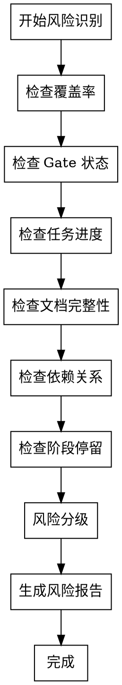

# Risk Indicators Reference

风险识别与分级指南。

## 风险等级定义

| 等级 | 图标 | 触发条件 | 影响 | 响应时间 | 处理优先级 |
|------|------|----------|------|----------|-----------|
| 🔴 高风险 | Critical | 阻塞阶段推进、安全漏洞、数据丢失风险 | 严重 | 立即处理 | P0 |
| 🟡 中风险 | Warning | 覆盖率不足、质量问题、进度延期 | 中等 | 24h 内处理 | P1 |
| 🟢 低风险 | Info | 轻微延期、文档不完整 | 轻微 | 本周内处理 | P2 |

---

## 风险类型目录

### 1. 覆盖率风险

| 风险 | 等级 | 检测条件 | 建议行动 |
|------|------|----------|----------|
| C1 未达标 | 🟡 | C1 < 阈值 | 执行 `/spec-first:spec` 补充需求 |
| C2 未达标 | 🔴 | C2 < 100% | 执行 `/spec-first:design` 补充设计 |
| C3 未达标 | 🔴 | C3 < 100% | 执行 `/spec-first:task` 补充任务 |
| C4 未达标 | 🟡 | C4 < 当前阶段 Gate 阈值 | 回到 `task/code` 补齐测试设计与 TDD 证据 |
| C5 未达标 | 🟡 | C5 < 90% (M/L), < 60% (S) | 补充 AC 测试用例 |
| C6 未达标 | 🟡 | C6 < 100% | 继续实现任务 |
| C7 未达标 | 🟡 | C7 < 100% | 修复 PR 合规问题 |
| C8 未达标 | 🟡 | C8 < 100% | 修正 TASK 字段 |
| C9 未达标 | 🟡 | C9 < 100% | 修正 TC 字段 |

### 2. 质量门禁风险

| 风险 | 等级 | 检测条件 | 建议行动 |
|------|------|----------|----------|
| Gate 失败 | 🔴 | Gate check 返回 FAIL | 修复失败条件后重新验证 |
| Gate WAIVER | 🟡 | Gate check 返回 PASS_WITH_WAIVER | 记录豁免，跟踪有效期 |
| 多个条件失败 | 🔴 | FAIL 条件数 ≥ 2 | 优先修复，暂停推进 |

### 3. 任务进度风险

| 风险 | 等级 | 检测条件 | 建议行动 |
|------|------|----------|----------|
| 任务阻塞 | 🔴 | 存在 blocked 状态任务 | 解除阻塞，调整依赖 |
| 进度严重延期 | 🔴 | 实际进度 < 预期进度 30% | 重新评估计划，增加资源 |
| 进度轻微延期 | 🟡 | 预期进度 - 20% ≤ 实际进度 < 预期进度 | 关注进度，评估风险 |
| 任务分布不均 | 🟢 | 单人任务数 > 平均值 × 1.5 | 重新分配任务 |

### 4. 测试覆盖风险

| 风险 | 等级 | 检测条件 | 建议行动 |
|------|------|----------|----------|
| 测试缺失 | 🔴 | C4 = 0 或 C5 = 0 | 回到 `task/code` 补齐测试设计与 TDD 证据 |
| 关键路径无测试 | 🔴 | 核心 FR 无对应 TC | 补充关键路径测试 |
| E2E 测试缺失 | 🟡 | 无 E2E 层级测试 | 补充端到端测试 |
| 边界测试不足 | 🟢 | Edge Case 覆盖 < 50% | 补充边界条件测试 |

### 5. 文档完整性风险

| 风险 | 等级 | 检测条件 | 建议行动 |
|------|------|----------|----------|
| 核心文档缺失 | 🔴 | spec.md 或 design.md 不存在 | 补充核心文档 |
| 文档过期 | 🟡 | 文档更新时间 > 7 天 | 更新文档内容 |
| 文档不一致 | 🟡 | 矩阵与文档不匹配 | 同步矩阵与文档 |
| README 缺失 | 🟢 | 无 README 或内容不完整 | 补充 README |

### 6. 依赖关系风险

| 风险 | 等级 | 检测条件 | 建议行动 |
|------|------|----------|----------|
| 循环依赖 | 🔴 | 检测到任务循环依赖 | 调整依赖关系 |
| 依赖阻塞 | 🔴 | 依赖任务处于 blocked 状态 | 优先解除依赖阻塞 |
| 依赖链过长 | 🟡 | 依赖层级 > 5 | 重新规划任务拆解 |
| 依赖未标记 | 🟢 | 存在隐式依赖 | 显式标记依赖关系 |

### 7. 运行态 / docs 输出风险

| 风险 | 等级 | 检测条件 | 建议行动 |
|------|------|----------|----------|
| docs 输出缺失 | 🟡 | 固定 docs 输出未生成或条件型 docs 输出缺失 | 标记同步状态，补齐 docs 输出 |
| runtime 真源异常 | 🔴 | runtime 真源缺失或健康状态异常 | 优先修复 runtime 数据源，再重新查询状态 |
| 同步状态异常 | 🟡 | 同步状态 = attention | 输出建议动作并提醒执行补齐/刷新 |

### 8. 阶段停留风险

| 风险 | 等级 | 检测条件 | 建议行动 |
|------|------|----------|----------|
| 停留时间过长 | 🟡 | 停留时间 > 预期时间 × 1.5 | 评估是否需要调整计划 |
| 阶段回退 | 🔴 | 从后续阶段回退 | 分析回退原因，修复问题 |
| 跳过阶段 | 🔴 | 阶段顺序不连续 | 补充跳过的阶段 |

---

## 风险识别流程



---

## 风险报告格式

### 标准格式

```markdown
## ⚠️ 风险识别

### 🔴 高风险 ({count})

{如无高风险，显示"无"}

{如有高风险，按以下格式列出：}
1. **{风险标题}** — {风险描述}
   - 影响: {影响说明}
   - 建议: {可执行的修复建议}

### 🟡 中风险 ({count})

{格式同上}

### 🟢 低风险 ({count})

{格式同上}
```

### 示例：有风险

```markdown
## ⚠️ 风险识别

### 🔴 高风险 (2)

1. **C2 覆盖率不足** — FR-AUTH-003 缺少对应 DS
   - 影响: 无法拆解任务，阻塞实现
   - 建议: 执行 `/spec-first:design --focus FR-AUTH-003`

2. **任务阻塞** — TASK-AUTH-005 处于 blocked 状态
   - 影响: 依赖任务无法开始
   - 建议: 解除阻塞，调整依赖关系

### 🟡 中风险 (1)

1. **进度延期** — 实际进度 60%，预期进度 80%
   - 影响: 可能延期 2 天
   - 建议: 评估是否需要增加资源

### 🟢 低风险 (1)

1. **文档过期** — design.md 更新时间 > 7 天
   - 影响: 文档可能与实际不符
   - 建议: 更新文档内容
```

### 示例：无风险

```markdown
## ⚠️ 风险识别

### 🔴 高风险 (0)
无

### 🟡 中风险 (0)
无

### 🟢 低风险 (0)
无
```

---

## 风险处理优先级

### P0 - 立即处理（高风险）

**响应时间**: 立即
**处理方式**: 停止其他工作，优先处理

| 风险类型 | 处理步骤 |
|---------|----------|
| Gate 失败 | 1. 识别失败条件<br>2. 修复问题<br>3. 重新验证<br>4. 记录到 findings.md |
| 任务阻塞 | 1. 分析阻塞原因<br>2. 解除阻塞<br>3. 调整依赖<br>4. 恢复任务 |
| 覆盖率严重不足 | 1. 补充缺失产物<br>2. 更新矩阵<br>3. 验证覆盖率<br>4. 重新评估 |

### P1 - 24h 内处理（中风险）

**响应时间**: 24 小时内
**处理方式**: 安排时间处理，不阻塞当前工作

| 风险类型 | 处理步骤 |
|---------|----------|
| 覆盖率不足 | 1. 评估影响<br>2. 制定补充计划<br>3. 执行补充<br>4. 验证结果 |
| 进度延期 | 1. 分析延期原因<br>2. 调整计划<br>3. 增加资源（如需要）<br>4. 跟踪进度 |
| 文档不一致 | 1. 对比差异<br>2. 更新文档<br>3. 同步矩阵<br>4. 验证一致性 |

### P2 - 本周内处理（低风险）

**响应时间**: 本周内
**处理方式**: 安排在空闲时间处理

| 风险类型 | 处理步骤 |
|---------|----------|
| 文档过期 | 1. 检查变更<br>2. 更新文档<br>3. 提交变更 |
| 任务分布不均 | 1. 评估负载<br>2. 重新分配<br>3. 更新 Owner |
| 边界测试不足 | 1. 识别边界条件<br>2. 补充测试<br>3. 更新矩阵 |
