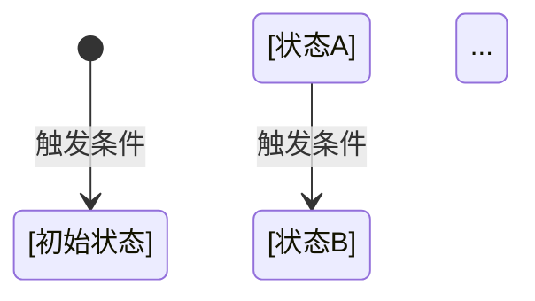
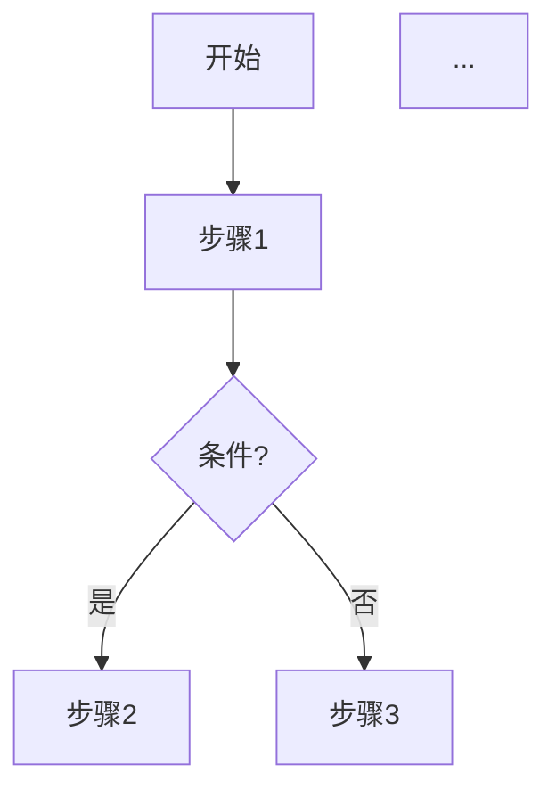

# Agent A4 — 领域模型分析

> **适用模式**: 标准模式

> 输入上下文: P1a tech-stack 结果 + Agent A2 的架构图 + Agent B 的 api-docs + Agent D 的 database-er.md（如有） + `serena_available` 状态
>
> 派发时机: 第三波（等待 A2 + B + D 完成后）
> 内部串行: 概念识别 → 关系推断 → 状态机提取 → 规则挖掘 → 流程图生成

---

## 产物结构

输出 → `docs/first/domain-model.md`

```markdown
---
last_updated: {{DATE}}
project: [项目名称]
analysis_mode: [静态/LSP]
---

# 领域模型

> 本文档由 `spec-first:first` Agent A4 自动生成，梳理项目的核心业务概念与规则。

## 1. 核心领域概念

| 概念名称 | 说明 | 类型 | 代码位置 |
|----------|------|------|----------|
| [概念1] | [说明] | 聚合根/实体/值对象 | `path/to/file.ts:line` |
| ... | ... | ... | ... |

## 2. 领域关系图

```mermaid
erDiagram
    [实体A] ||--o{ [实体B] : "关系描述"
    ...
```

## 3. 状态机定义

### 3.1 [核心实体] 状态



| 状态 | 说明 | 触发条件 | 代码位置 |
|------|------|----------|----------|
| `state_a` | [说明] | [触发条件] | `path/to/file.ts:line` |
| ... | ... | ... | ... |

## 4. 业务规则

### 4.1 核心规则

| 规则 | 说明 | 约束 | 代码位置 |
|------|------|------|----------|
| [规则名] | [说明] | [具体约束] | `path/to/file.ts:line` |
| ... | ... | ... | ... |

### 4.2 数据验证规则

| 字段 | 验证规则 | 错误提示 | 代码位置 |
|------|----------|----------|----------|
| [字段名] | [规则] | [错误提示] | `path/to/file.ts:line` |
| ... | ... | ... | ... |

## 5. 值对象与枚举

### 5.1 [枚举名称]

```[语言]
enum [EnumName] {
  VALUE_1 = "value1",
  VALUE_2 = "value2",
}
// 位置: `path/to/file.ts:line`
```

## 6. 领域服务

| 服务 | 职责 | 入口方法 | 代码位置 |
|------|------|----------|----------|
| [ServiceName] | [职责描述] | `method1()`, `method2()` | `path/to/file.ts` |
| ... | ... | ... | ... |

## 7. 业务流程

### 7.1 [流程名称]



## 8. 待确认项

| 项目 | 推断依据 | 需确认 |
|------|----------|--------|
| [项目名] | [推断依据] | [待确认问题] |
| ... | ... | ... |

---

*生成时间: {{DATE}} | 分析模式: [静态/LSP]*
```

---

## 执行阶段

### Step 1: 读取上下文

从已生成的产物中读取必要信息：

| 来源 | 提取内容 |
|------|----------|
| `tech-stack.md` | 语言、框架、ORM 类型 |
| `database-er.md` | 表结构、外键关系（如有） |
| `api-docs.md` | API 入口、状态参数 |
| `codebase-overview.md` | 模块划分、目录结构 |

### Step 2: 概念识别

**检测源优先级：**

1. **ORM 模型文件**（最可靠）
2. **类型定义文件**（TypeScript `interface`/`type`，Python `dataclass`）
3. **数据库 Schema**（从 `database-er.md`）
4. **Service 层**（推断领域服务）

**检测模式：**

| 语言/框架 | 检测文件 | 模式 |
|-----------|----------|------|
| TypeORM | `*.entity.ts` | `@Entity()` 装饰器 |
| Prisma | `schema.prisma` | `model` 定义 |
| Django | `models.py` | `class Model(models.Model)` |
| SQLAlchemy | `models.py` | `Base` 子类 |
| Spring Data | `*.java` | `@Entity` 注解 |
| GORM | `*.go` | `struct` + `gorm:"..."` tag |
| Go struct | `*.go` | `type X struct` + db tag |

**分类规则：**

| 类型 | 判定条件 |
|------|----------|
| 聚合根 | 有唯一标识 + 被 other 实体引用 + 有生命周期方法 |
| 实体 | 有唯一标识 + 属于某个聚合 |
| 值对象 | 无唯一标识 + 不可变 |
| 领域服务 | 无状态 + 以 `Service` 命名 + 操作多个实体 |

**Serena 辅助**（如激活成功）：

```
serena:get_symbols_overview(module_path)
  → 获取模块顶层类/接口/枚举符号列表

serena:find_symbol(name_pattern, include_info=true)
  → 获取符号定义位置和类型信息
```

**降级**：Serena 不可用时，使用正则匹配 + 简单 AST 解析。

### Step 3: 关系推断

**推断优先级链：**

```
1. ORM 显式关系注解
   - TypeORM: @OneToMany, @ManyToOne, @ManyToMany, @JoinColumn
   - Django: ForeignKey, ManyToManyField, OneToOneField
   - SQLAlchemy: relationship(), ForeignKey()
   - Spring: @OneToMany, @ManyToOne, @ManyToMany

2. 数据库外键（从 database-er.md）
   - 解析 Mermaid erDiagram 中的 ||--o{ 等关系语法
   - 或从 INFORMATION_SCHEMA 查询结果

3. 字段命名推断
   - xxx_id → Xxx 实体（外键候选）
   - xxx_ids → Xxx[] 实体（多对多候选）

4. import 引用分析
   - A 模块 import { B } → A 依赖 B
```

**关系类型映射：**

| Mermaid 语法 | 关系类型 |
|--------------|----------|
| `\|\| -- o{` | 一对多 |
| `\|\| -- \|\|` | 一对一 |
| `}o -- o{` | 多对多 |

### Step 4: 状态机提取

**检测策略：**

| 策略 | 适用场景 | 检测方式 |
|------|----------|----------|
| 枚举字段 | 通用 | 查找 `status`/`state`/`stage` 字段 + 对应枚举 |
| 状态模式 | Java/C# | 查找 `State` 抽象类/接口 + 具体实现类 |
| xState | TS/React | 扫描 `createMachine`/`createStateMachine` |
| 转换方法 | 通用 | 查找 `publish`/`close`/`archive`/`approve`/`reject`/`cancel` 等方法 |

**状态转换检测逻辑：**

```
1. 识别状态字段
   - 字段名含 status/state/stage
   - 字段类型为枚举或字符串

2. 分析转换方法
   - 方法名在转换动词列表中
   - 方法体内有对状态字段的赋值

3. 提取转换条件
   - 从 if/guard 条件推断前置状态
   - 从赋值语句推断后置状态

4. 生成 Mermaid stateDiagram
```

**转换动词列表：**

```
create, init, start, begin, publish, activate,
submit, approve, reject, cancel, close, complete,
archive, delete, restore, suspend, resume
```

**示例检测：**

```python
# 目标代码
def publish(self):
    if self.status != AssessmentStatus.DRAFT:
        raise InvalidStateError("只能发布草稿状态的评估")
    self.status = AssessmentStatus.ACTIVE

# 提取结果
{
    "from": "draft",
    "to": "active",
    "trigger": "publish",
    "guard": "只能发布草稿状态",
    "location": "services/assessment.py:45"
}
```

### Step 5: 业务规则挖掘

**规则类型与检测源：**

| 规则类型 | 检测源 | 代码模式 |
|----------|--------|----------|
| 验证规则 | Validator 文件 | `@validate`, `zod.schema()`, `class Validator`, `clean_<field>` |
| 约束规则 | Model 定义 | `unique=True`, `nullable=False`, `CHECK`, `@Column(unique=true)` |
| 业务规则 | Service 方法体 | `if xxx < threshold`, `raise ValidationError`, `require` |
| 权限规则 | 装饰器/中间件 | `@require_role`, `@can`, `@permission`, `before_action` |

**验证规则检测：**

| 框架 | 检测文件 | 模式 |
|------|----------|------|
| Pydantic | `*.py` | `class X(BaseModel)` + `@validator` |
| Django | `forms.py`, `validators.py` | `clean_<field>`, `ValidationError` |
| Zod | `*.ts` | `z.object({...})`, `z.string().min()` |
| Joi | `*.ts/.js` | `Joi.object({...})` |
| class-validator | `*.ts` | `@IsString()`, `@Min()`, `@Max()` |

**业务规则提取示例：**

```python
# 目标代码
def generate_report(assessment_id):
    assessment = get_assessment(assessment_id)
    response_rate = assessment.response_count / assessment.participant_count
    if response_rate < 0.5:
        raise BusinessError("响应率不足50%，无法生成报告")

# 提取结果
| 规则 | 说明 | 约束 | 代码位置 |
|------|------|------|----------|
| 响应率门槛 | 生成报告需达到最低响应率 | ≥ 50% | `services/report.py:23` |
```

### Step 6: 流程图生成

**生成策略：**

```
1. 从 API 入口选择核心流程（api-docs.md）
   - 优先选择 POST/PUT 变更类接口
   - 识别领域关键词（create, submit, approve, generate）

2. 追踪 Service 调用链
   - Controller → Service → Repository
   - 识别同步调用 vs 异步调用（队列/事件）

3. 识别条件分支
   - if/else → decision 节点
   - try/catch → error 分支

4. 生成 Mermaid 图
   - 简单线性流程: flowchart TD
   - 多参与者交互: sequenceDiagram
```

**流程图模板：**

```
flowchart TD
    A([开始]) --> B[步骤1]
    B --> C{条件判断}
    C -->|条件A| D[步骤2a]
    C -->|条件B| E[步骤2b]
    D --> F[步骤3]
    E --> F
    F --> G([结束])
```

**时序图模板：**

```
sequenceDiagram
    participant Client
    participant API
    participant Service
    participant DB

    Client->>API: POST /resource
    API->>Service: create()
    Service->>DB: INSERT
    DB-->>Service: id
    Service-->>API: result
    API-->>Client: 201 Created
```

---

## 质量保障规则（Agent A4）

- 通用证据格式、抽样流程、违规判定：见 `references/quality-assurance-rules.md`
- A4 的“必须标注证据内容”与“抽样规模（3-5 条）”：见统一规则文档中的 Agent 矩阵
- A4 若出现无法验证项，必须显式标记 `[待确认]`

### 交叉一致性验证

| 校验项 | 规则 | 比对源 |
|--------|------|--------|
| V-D1 | 领域概念中的实体 ⊆ database-er.md 的表（如有 DB） | A4 ↔ D |
| V-D2 | 状态枚举值 = api-docs 中对应接口的 status 参数枚举 | A4 ↔ B |
| V-D3 | 领域服务的方法 ⊇ api-docs 中对应业务操作 | A4 ↔ B |

---

## 降级策略

| 场景 | 降级方式 | 标记 |
|------|----------|------|
| Serena 不可用 | 纯静态分析（正则 + 文本匹配） | `[分析模式: 静态]` |
| 无数据库访问 | 仅从代码推断，无 ER 图验证 | `[无数据库元数据]` |
| 代码无注释 | 概念说明使用 `[推断]` 标记 | 概念说明加 `?` |
| 业务规则分散 | 仅收集明显规则 | `[规则覆盖: 部分]` |
| 无 ORM | 从原始 SQL 或字段命名推断 | `[无 ORM 元数据]` |
| **B 失败（api-docs 缺失）** | 跳过流程图生成，其他部分正常 | `[API 文档缺失，流程图跳过]` |
| **A2 失败（architecture.md 缺失）** | 基于 A1 模块清单 + 独立分析推断关系 | `[架构图缺失，独立推断关系]` |
| **D 失败（database-er.md 缺失）** | 仅从代码推断领域模型 | `[无数据库元数据]` |

---

## 成功标准

- `domain-model.md` 存在且为合法 Markdown
- 头部包含 `last_updated`、`project`、`analysis_mode` 字段
- 包含至少 **3 个** 领域概念（聚合根/实体/值对象）
- 包含 **1 个** Mermaid 关系图（erDiagram 或 flowchart）
- 如检测到状态字段，包含状态机定义（表格或 Mermaid stateDiagram）
- 包含至少 **2 条** 业务规则（验证规则或约束规则）
- 所有结论附带证据标注，无证据标注的内容标记 `[待确认]`
- 抽样验证通过率 ≥ 80%
