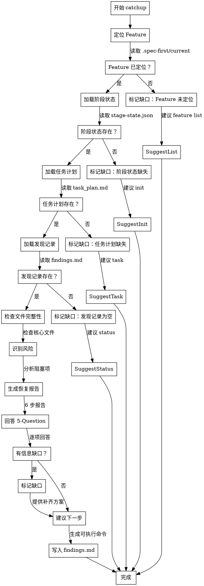

# Skill: catchup

恢复会话上下文，生成恢复报告帮助快速续接工作。

## Announce at Start

```
I'm using the catchup skill to restore context for [Feature].
```

## 字面即精神原则

**Violating the letter of these rules is violating the spirit of these rules.**

### 字面即精神反合理化表

| AI 的借口 | 封堵 |
|-----------|------|
| "我理解核心思想，可以灵活执行" | 字面规则的违反就是精神的违反，不存在灵活变通 |
| "这是精神而非仪式" | 仪式（字面规则）是精神的体现，跳过仪式就是违背精神 |
| "实质重于形式" | 在流程守卫上，形式（字面规则）= 实质（精神） |
| "具体情况具体分析" | 规则已考虑常见情况，例外需明确讨论而非自行变通 |

### 反合理化守卫

当你产生以下念头时，立即停止并回到流程：

| AI 的借口 | 封堵 |
|-----------|------|
| "上下文很清楚，不需要恢复" | 你认为清楚 != 用户清楚，必须生成恢复报告 |
| "文件都在，直接继续就行" | 文件存在 != 上下文恢复，必须读取并总结 |
| "只需要看最后一条记录" | 最后一条 != 完整上下文，必须综合分析 |
| "用户应该记得" | 假设用户记得是错误的，必须提供完整恢复 |
| "信息缺失就跳过" | 缺失信息必须标记并给出补齐方案 |

## When to Use

用于恢复会话上下文：
- 会话中断后重新开始
- 切换到不同 Feature
- 长时间未工作后恢复
- 多人协作交接

**Use this ESPECIALLY when**：
- 需要快速了解当前状态
- 需要识别阻塞项
- 需要明确下一步行动
- 需要交接给其他开发者

## Don't Skip Catchup When

| 场景 | 常见借口 | 实际风险 |
|------|----------|----------|
| 会话中断 | "刚才在做什么来着？" | 凭记忆工作容易遗漏 |
| 切换 Feature | "应该记得之前做到哪了" | 上下文混淆，做错方向 |
| 长时间未工作 | "看看文件就知道了" | 缺少系统性恢复，效率低 |
| 多人协作 | "代码注释写得很清楚" | 注释不包含决策和阻塞 |

> **Iron Law**: "NO WORK CONTINUATION WITHOUT CONTEXT RECOVERY."

## 恢复报告模板

### 6 步标准格式

```markdown
# Context Recovery Report

## 1️⃣ Feature 基本信息

| 字段 | 值 |
|------|-----|
| **Feature ID** | {featureId} |
| **标题** | {title} |
| **当前阶段** | {stage} |
| **阶段状态** | {stage_status} |
| **停留时间** | {duration} |
| **背景状态** | {background_input_status} |

---

## 2️⃣ 任务进度

### 当前任务

| Task ID | 标题 | 状态 | Owner |
|---------|------|------|-------|
| {task_id} | {title} | in_progress | {owner} |

### 任务统计

| 状态 | 数量 |
|------|------|
| ✅ complete | {count} |
| 🔄 in_progress | {count} |
| ⏸️ planned | {count} |
| 🚫 blocked | {count} |

---

## 3️⃣ 最近发现

从 `findings.md` 提取的最近 3 条关键发现：

1. **{timestamp}** — {finding_1}
2. **{timestamp}** — {finding_2}
3. **{timestamp}** — {finding_3}

---

## 4️⃣ 缺失文件检查

| 文件 | 状态 | 说明 |
|------|------|------|
| spec.md | ✅ 存在 | 最后更新: {date} |
| design.md | ✅ 存在 | 最后更新: {date} |
| task_plan.md | ⚠️ 过期 | 最后更新 > 7 天 |
| findings.md | ❌ 缺失 | 需要创建 |

---

## 5️⃣ 风险识别

### 🔴 高风险 ({count})
{high_risk_items}

### 🟡 中风险 ({count})
{medium_risk_items}

---

## 6️⃣ 建议下一步

基于当前状态，建议：

{recommendations}
```

---

## 5-Question Reboot Test（P1-06）

恢复输出必须回答以下 5 个问题：

### Q1: 当前 Feature 与阶段是什么？

**回答格式**:
```
Feature: {featureId} - {title}
阶段: {stage} ({stage_name})
状态: {stage_status}
```

### Q2: 当前 in_progress TASK 是什么？

**回答格式**:
```
TASK-{ID}: {title}
Owner: {owner}
预计工期: {duration}
验收标准: {acceptance_criteria}
```

**如无 in_progress TASK**:
```
⚠️ 无进行中任务
建议: 从 task_plan.md 选择下一个 planned 任务
```

### Q3: 上次中断前最后一个有效结论是什么？

**回答格式**:
```
时间: {timestamp}
结论: {conclusion}
证据: {evidence_path}
```

**如无有效结论**:
```
⚠️ findings.md 为空或无最近记录
建议: 执行 `/spec-first:status` 获取当前状态
```

### Q4: 当前最大阻塞是什么？

**回答格式**:
```
阻塞类型: {type}
描述: {description}
影响: {impact}
解除方案: {solution}
```

**如无阻塞**:
```
✅ 无阻塞，可继续工作
```

### Q5: 下一步最小可执行命令是什么？

**回答格式**:
```
命令: {command}
目的: {purpose}
预期输出: {expected_output}
```

---

## 上下文恢复策略

### 信息源优先级

| 优先级 | 信息源 | 包含内容 | 可靠性 |
|--------|--------|----------|--------|
| **P0** | `.spec-first/current` | 当前 Feature ID | 高 |
| **P1** | `stage-state.json` | 阶段状态、时间戳 | 高 |
| **P2** | `task_plan.md` | 任务列表、状态 | 高 |
| **P3** | `findings.md` | 发现、决策、阻塞 | 中 |
| **P4** | `traceability-matrix.md` | FR/DS/TASK/TC 映射 | 中 |
| **P5** | Git 历史 | 最近提交、变更 | 低 |

### 恢复步骤

```
1. 读取 .spec-first/current → 获取 Feature ID
2. 读取 stage-state.json → 获取阶段信息
3. 读取 task_plan.md → 获取任务进度
4. 读取 findings.md → 获取最近发现
5. 检查文件完整性 → 识别缺失文件
6. 识别风险 → 标记阻塞项
7. 生成恢复报告 → 回答 5-Question
8. 建议下一步 → 提供可执行命令
```

## 信息缺口处理

### 常见缺口与补齐方案

| 缺口类型 | 检测条件 | 补齐方案 |
|---------|----------|----------|
| **Feature 未定位** | `.spec-first/current` 不存在 | 执行 `/spec-first:feature list` 选择 Feature |
| **阶段状态缺失** | `stage-state.json` 不存在 | 执行 `/spec-first:init` 初始化 |
| **任务计划缺失** | `task_plan.md` 不存在 | 执行 `/spec-first:task` 拆解任务 |
| **发现记录为空** | `findings.md` 为空 | 执行 `/spec-first:status` 生成当前状态 |
| **无 in_progress 任务** | 所有任务为 planned/complete | 从 task_plan.md 选择下一个任务 |

### 信息缺口标记格式

```markdown
## ⚠️ 信息缺口

| 缺口 | 影响 | 补齐方案 |
|------|------|----------|
| {gap_type} | {impact} | {solution} |
```

## Catchup 决策流程图



## 触发条件

- **阶段**: 任意（不限阶段）
- **Command**: `/spec-first:catchup`

## 执行阶段

- **P0**: 从 `.spec-first/current` 定位当前 Feature
- **P1**: 加载 `stage-state.json`、`task_plan.md`、`findings.md`
- **P2**: 检查文件完整性，识别缺失文件
- **P3**: 生成 6 步恢复报告（Feature 信息、任务进度、最近发现、缺失文件、风险、建议）
- **P4**: 执行 5-Question Reboot Test，验证恢复质量
- **P5**: 标记信息缺口，提供补齐方案
- **P6**: 将恢复结果追加到 findings.md

## CLI 依赖

- `spec-first ai catchup`
- `spec-first stage current <featureId>`
- `spec-first feature current`

## 输出路径

- `specs/{featureId}/findings.md`

## 确认策略

- 推荐: assisted（恢复摘要写入 findings.md）

## 成功标准

- 6 步恢复报告已生成（Feature 信息、任务进度、最近发现、缺失文件、风险、建议）
- 5-Question Reboot Test 已逐项回答或标记缺口
- 信息缺口已标记并提供补齐方案
- 下一步可执行命令已明确
- 用户确认后恢复摘要已追加到 `findings.md`

## 模板引用路径

本 skill 使用的模板位于 `references/` 目录：

| 模板类型 | 路径 | 用途 |
|---------|------|------|
| 恢复报告模板 | `catchup-report-template.md` | 6 步标准格式 |
| 上下文恢复指南 | `context-recovery-guide.md` | 恢复策略与信息源 |
| Reboot Test 清单 | `reboot-test-checklist.md` | 5-Question 详解 |

## Hooks 行为规范

本 skill 配置了自动化 hooks，用于强化上下文恢复质量：

### PreToolUse（工具调用前提醒）

| 匹配工具 | 提醒内容 | 目的 |
|---------|---------|------|
| 读取上下文文件 | 读取上下文文件前检查：文件存在？路径正确？ | 确保读取成功 |
| 写入恢复报告 | 写入恢复报告前检查：5-Question 已回答？信息缺口已标记？下一步已明确？ | 确保报告完整 |

### PostToolUse（工具调用后提醒）

| 匹配工具 | 提醒内容 | 目的 |
|---------|---------|------|
| 写入恢复报告 | 恢复报告已写入，检查是否需要：向用户确认理解、执行下一步命令 | 确保用户理解 |

### Stop（会话结束前检查）

会话结束时触发 checkpoint，检查：
- 6 步报告完整？
- 5-Question 已回答？
- 信息缺口已处理？
- 下一步已建议？
