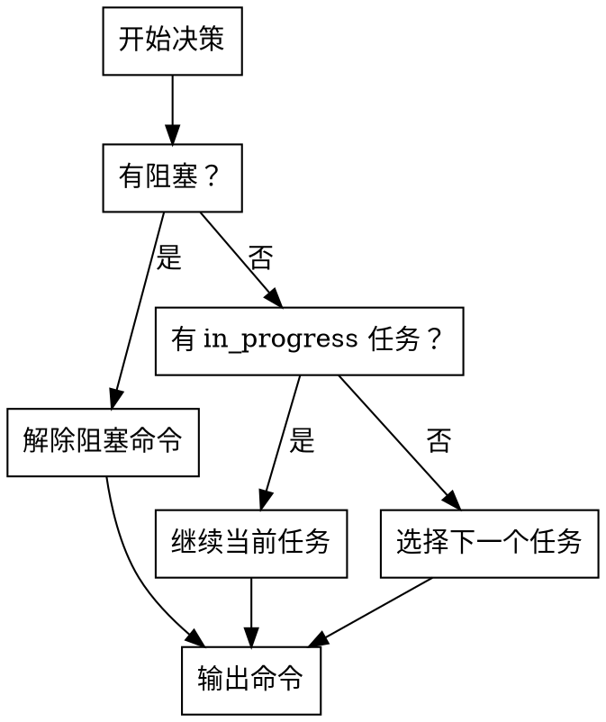

# 5-Question Reboot Test Checklist

5-Question Reboot Test 详解与验证清单。

## 测试目的

验证上下文恢复的完整性和准确性，确保 AI 能够快速续接工作。

---

## Q1: 当前 Feature 与阶段是什么？

### 检查项

- [ ] Feature ID 已识别（格式：`FSREQ-YYYYMMDD-<ABBR>-NNN`）
- [ ] Feature 标题已获取
- [ ] 当前阶段已确定（00_init ~ 08_done）
- [ ] 阶段状态已确定（in_progress/completed）
- [ ] 停留时间已计算

### 信息来源

| 信息 | 文件 | 字段 |
|------|------|------|
| Feature ID | `.spec-first/current` | 文件内容 |
| 阶段 | `stage-state.json` | `stage` |
| 状态 | `stage-state.json` | `status` |
| 时间戳 | `stage-state.json` | `timestamp` |

### 回答格式

```markdown
✅ 已回答
Feature: {featureId} - {title}
阶段: {stage} ({stage_name})
状态: {stage_status}
停留时间: {duration}
```

### 失败处理

```markdown
❌ 无法回答
原因: {reason}
补齐方案: {solution}
```

**常见失败原因**：
- `.spec-first/current` 不存在 → 执行 `spec-first feature list` 选择 Feature
- `stage-state.json` 不存在 → 执行 `spec-first init` 初始化

---

## Q2: 当前 in_progress TASK 是什么？

### 检查项

- [ ] 已识别 in_progress 任务
- [ ] Task ID 已获取（格式：`TASK-<ABBR>-NNN`）
- [ ] 任务标题已获取
- [ ] Owner 已识别
- [ ] 预计工期已获取
- [ ] 验收标准已列出

### 信息来源

| 信息 | 文件 | 位置 |
|------|------|------|
| 任务列表 | `task_plan.md` | Markdown 表格 |
| 任务状态 | `task_plan.md` | Status 列 |
| Owner | `task_plan.md` | Owner 列 |
| 验收标准 | `task_plan.md` | 任务详情段落 |

### 回答格式

```markdown
✅ 已回答
TASK-{ID}: {title}
Owner: {owner}
预计工期: {duration}
验收标准:
- {criterion_1}
- {criterion_2}
```

### 无进行中任务

```markdown
⚠️ 无进行中任务
建议: 从 task_plan.md 选择下一个 planned 任务
候选任务:
- TASK-{ID}: {title}
```

### 失败处理

**常见失败原因**：
- `task_plan.md` 不存在 → 执行 `/spec-first:task` 拆解任务
- 所有任务为 planned/complete → 从 task_plan.md 选择下一个任务

---

## Q3: 上次中断前最后一个有效结论是什么？

### 检查项

- [ ] 已识别最后一条有效结论
- [ ] 时间戳已获取
- [ ] 结论内容已提取
- [ ] 证据路径已标注

### 信息来源

| 信息 | 文件 | 位置 |
|------|------|------|
| 发现记录 | `findings.md` | 最后 3-5 条记录 |
| 时间戳 | `findings.md` | 记录时间 |
| 结论 | `findings.md` | 记录内容 |

### 回答格式

```markdown
✅ 已回答
时间: {timestamp}
结论: {conclusion}
证据: {evidence_path}
```

### 失败处理

```markdown
❌ 无法回答
原因: findings.md 为空或无最近记录
补齐方案: 执行 `/spec-first:status` 获取当前状态
```

**常见失败原因**：
- `findings.md` 不存在 → 执行 `/spec-first:status` 生成状态
- `findings.md` 为空 → 执行 `/spec-first:status` 生成状态
- 最后记录 > 7 天 → 标记为过期，建议重新生成

---

## Q4: 当前最大阻塞是什么？

### 检查项

- [ ] 已识别阻塞项（如有）
- [ ] 阻塞类型已分类
- [ ] 阻塞描述已提取
- [ ] 影响已评估
- [ ] 解除方案已提供

### 阻塞类型

| 类型 | 检测条件 | 影响 |
|------|----------|------|
| 任务阻塞 | 存在 blocked 状态任务 | 阻塞后续任务 |
| Gate 失败 | Gate check 返回 FAIL | 阻塞阶段推进 |
| 覆盖率不足 | C1-C9 任一指标未达标 | 影响质量 |
| 依赖阻塞 | 依赖任务未完成 | 阻塞当前任务 |
| 资源不足 | 人力/时间不足 | 影响进度 |

### 回答格式（有阻塞）

```markdown
✅ 已识别
阻塞类型: {type}
描述: {description}
影响: {impact}
解除方案: {solution}
```

### 回答格式（无阻塞）

```markdown
✅ 无阻塞
可继续工作
```

### 信息来源

| 信息 | 文件 | 位置 |
|------|------|------|
| 任务阻塞 | `task_plan.md` | Status 列 = blocked |
| Gate 失败 | `gate-history.jsonl` | 最后一条 result = FAIL |
| 覆盖率 | `traceability-matrix.md` | 覆盖率统计 |
| 发现记录 | `findings.md` | 阻塞标记 |

---

## Q5: 下一步最小可执行命令是什么？

### 检查项

- [ ] 已明确下一步命令
- [ ] 命令目的已说明
- [ ] 预期输出已描述

### 回答格式

```markdown
✅ 已明确
命令: {command}
目的: {purpose}
预期输出: {expected_output}
```

### 命令选择决策树



### 常见命令

| 场景 | 命令 | 目的 |
|------|------|------|
| 继续实现 | `/spec-first:code` | 继续实现当前任务 |
| 补充需求 | `/spec-first:spec` | 补充需求规格 |
| 补充设计 | `/spec-first:design` | 补充技术设计 |
| 拆解任务 | `/spec-first:task` | 拆解任务计划 |
| 补齐测试设计/TDD 证据 | `/spec-first:task` / `/spec-first:code` | 补齐测试设计与执行证据 |
| 验证质量 | `/spec-first:verify` | 验证质量门禁 |
| 查看状态 | `/spec-first:status` | 查看当前状态 |

---

## 验证清单

### 恢复质量评分

| 分数 | 等级 | 标准 |
|------|------|------|
| 90-100 | 优秀 | 所有 5 个问题都能回答 |
| 70-89 | 良好 | 4 个问题能回答 |
| 50-69 | 中等 | 3 个问题能回答 |
| 0-49 | 较差 | < 3 个问题能回答 |

### 完整性检查

- [ ] Q1: Feature 与阶段已明确
- [ ] Q2: 当前任务已识别
- [ ] Q3: 最后结论已提取
- [ ] Q4: 阻塞项已识别
- [ ] Q5: 下一步已明确

### 信息缺口检查

- [ ] 所有缺口已标记
- [ ] 所有缺口已提供补齐方案
- [ ] 补齐方案可执行

### 输出质量检查

- [ ] 恢复报告已生成
- [ ] 5-Question 已逐项回答
- [ ] 信息缺口已标记
- [ ] 下一步已明确
- [ ] 恢复报告已追加到 findings.md

---

## 最佳实践

### DO ✅

1. **按顺序回答** — 从 Q1 到 Q5 逐项回答
2. **标记缺口** — 无法回答的问题必须标记
3. **提供方案** — 每个缺口都给出补齐方案
4. **明确下一步** — 提供可执行命令
5. **写入 findings** — 恢复报告追加到 findings.md

### DON'T ❌

1. **不要跳过问题** — 必须逐项回答
2. **不要假设记忆** — 不要假设用户记得上下文
3. **不要忽略缺口** — 信息缺失必须标记
4. **不要模糊建议** — 下一步必须具体可执行
5. **不要只读不写** — 恢复报告必须落盘

---

## 示例：完整回答

```markdown
# 5-Question Reboot Test

## Q1: 当前 Feature 与阶段是什么？

✅ 已回答
Feature: FSREQ-20260305-AUTH-001 - 短信验证码登录
阶段: 04_implement (代码实现)
状态: in_progress
停留时间: 2 天

## Q2: 当前 in_progress TASK 是什么？

✅ 已回答
TASK-AUTH-003: 验证码登录 API
Owner: BE
预计工期: 1d
验收标准:
- API 可调用，返回 JWT token
- 正确处理验证码过期
- 单元测试覆盖率 > 80%

## Q3: 上次中断前最后一个有效结论是什么？

✅ 已回答
时间: 2026-03-05T08:00:00Z
结论: 完成 TASK-AUTH-002 (发送验证码 API)，测试通过，已提交代码
证据: specs/FSREQ-20260305-AUTH-001/findings.md:45-50

## Q4: 当前最大阻塞是什么？

✅ 无阻塞
可继续工作

## Q5: 下一步最小可执行命令是什么？

✅ 已明确
命令: /spec-first:code
目的: 继续实现 TASK-AUTH-003 (验证码登录 API)
预期输出: 实现 login 端点，通过单元测试
```
