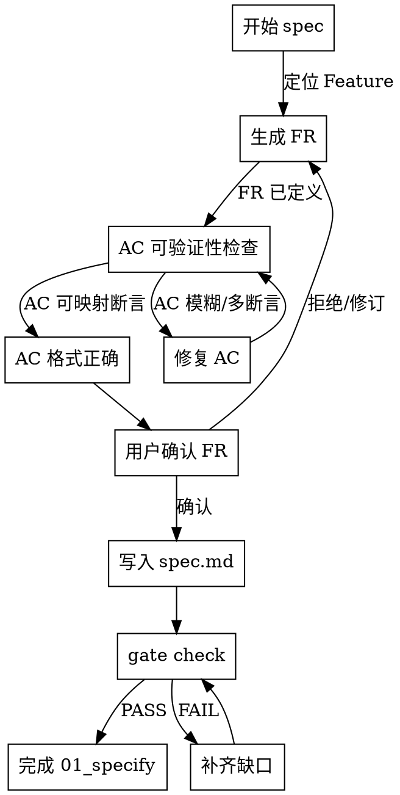

# Skill: spec

定义需求规格，生成 FR 功能需求与验收标准（AC）。

## 字面即精神原则

**Violating the letter of these rules is violating the spirit of these rules.**

### 字面即精神反合理化表

| AI 的借口 | 封堵 |
|-----------|------|
| "我理解核心思想，可以灵活执行" | 字面规则的违反就是精神的违反，不存在灵活变通 |
| "这是精神而非仪式" | 仪式（字面规则）是精神的体现，跳过仪式就是违背精神 |
| "实质重于形式" | 在流程守卫上，形式（字面规则）= 实质（精神） |
| "具体情况具体分析" | 规则已考虑常见情况，例外需明确讨论而非自行变通 |

## 反合理化守卫

当你产生以下念头时，立即停止并回到流程：

| AI 的借口 | 封堵 |
|-----------|------|
| "需求很清楚，不需要澄清" | 你认为清楚 != 无歧义，检查 NEEDS CLARIFICATION 项 |
| "AC 用自然语言就够了" | 自然语言 AC 难以自动转化为测试用例 |
| "这个 NFR 不重要，先跳过" | 跳过 NFR = 埋下技术债，至少标记为 P2 |
| "用户没提到边界情况" | 用户不提 != 不存在，主动识别是 spec 的职责 |
| "先写个大概，后面再细化" | 模糊 spec 会放大后续设计与实现成本 |
| "这个需求和上次项目一样" | 上下文不同，直接类比会引入错误假设 |

## 模板驱动约束（P1-03）

spec 阶段只定义 WHAT，不定义 HOW：
- 必须写：业务目标、边界、验收标准、NFR、风险与约束
- 禁止写：模块实现细节、类/函数级算法、具体库选型
- 若出现实现细节，必须重写为可验证的需求或约束条款

## 结构化歧义消解（P1-02）

出现以下任一情况必须标记 `[NEEDS CLARIFICATION]`：
- 边界值不明确
- 异常处理未定义
- 优先级冲突
- 多种可能解释
- 依赖外部系统但接口缺失

歧义分类标签：
- `BOUNDARY`（边界值）
- `ERROR`（异常处理）
- `PRIORITY`（优先级冲突）
- `SEMANTIC`（语义多解）
- `DEPENDENCY`（外部依赖缺失）

标记格式：
`[NEEDS CLARIFICATION][<TYPE>] FR-XXX-001: 具体问题？候选范围 A/B/C`

## AC ID 规范（P1-02）

- 命名：`AC-<ABBR>-<FRSEQ>-<NN>`
- 示例：`FR-AUTH-001` 下的第 1 条 AC 为 `AC-AUTH-001-01`
- 约束：一个 AC ID 只能映射一条可验证断言，禁止一条 AC 混合多个断言

## Spec Review 清单（P1-01）

在输出前必须按以下清单复核：
- `references/spec-review-checklist.md`
- `references/test-level-glossary.md`（UT/IT/E2E/ST 术语）

## 2-Action Rule（Planning-with-Files P0-1）

- 每连续完成 2 个关键动作（生成 FR、澄清歧义、确认 AC）后，必须把结论写入 `findings.md`
- 若中断会话，至少留下：当前 FR、待澄清项、下一步命令
- 最小落盘字段：
  - 当前结论：本次会话确定的需求点
  - 证据路径：`spec.md` 或 `traceability-matrix.md` 中的位置
  - 下一步：待处理的 `[NEEDS CLARIFICATION]` 项或下一 FR
- 未落盘的信息一律视为不可靠上下文

## AC 可验证性决策图（Superpowers P1-2）



## 触发条件
- 阶段: 01_specify
- Command: `/spec-first:spec`

## 执行阶段
- P0: 定位 Feature，校验阶段为 01_specify
- P1: 加载 constitution.md 及矩阵中已有 FR
- P2: 生成 FR 定义（ID、标题、验收标准）
- P3: 与用户确认 FR 列表（允许修订）
- P4: 将 FR 写入 traceability-matrix.md，回填每个 FR 的标题/状态，更新 spec 文档
- P5: 执行 gate check 校验 01_specify 阶段门禁；可选执行 matrix check 做诊断（非阻断，不以退出码判失败）

## CLI 依赖
- `spec-first id next FR <abbr> --feature <featureId>`
- `spec-first matrix update <featureId> <id> --title "<title>" [--status <status>] [--upstream <ids>] [--downstream <ids>]`
- `spec-first gate check <featureId>`
- `spec-first matrix check <featureId> || true`（可选，诊断用途；仅采集输出）

## 输出路径
- `specs/{featureId}/traceability-matrix.md`
- `specs/{featureId}/spec.md`

## 确认策略
- 推荐遵循 runtime confirm_policy：
  - strict（Mode N；或 Mode I + Size S 且含 NFR-SEC/新外部接口）
  - auto（Mode I + Size S 且无高风险信号）
  - assisted（Mode I + Size M/L）

## 成功标准
- `spec.md` 已写入，包含所有 FR 定义和验收标准（AC）
- 所有 FR 已通过 `id next FR` 注册
- 所有 AC 使用统一 AC ID 规范，并可一一映射验证断言
- `traceability-matrix.md` 已更新，每个 FR 有对应行且标题非空
- `gate check` 在 `01_specify` 阶段通过
- 若执行 `matrix check`：允许出现 FR 在早期阶段缺少 DS/TASK/TC 的 warning，但该检查仅作诊断，不阻断 spec 流程

## 示例（P2 输出格式）

```markdown
### FR-AUTH-001: 短信验证码登录

**描述**: 用户通过手机号 + 短信验证码完成登录

**验收标准**:
- AC-AUTH-001-01: 输入合法手机号后点击发送，60s 内收到 6 位数字验证码
- AC-AUTH-001-02: 输入正确验证码后 3s 内完成登录并跳转首页
- AC-AUTH-001-03: 验证码错误时显示"验证码错误，请重新输入"
```
