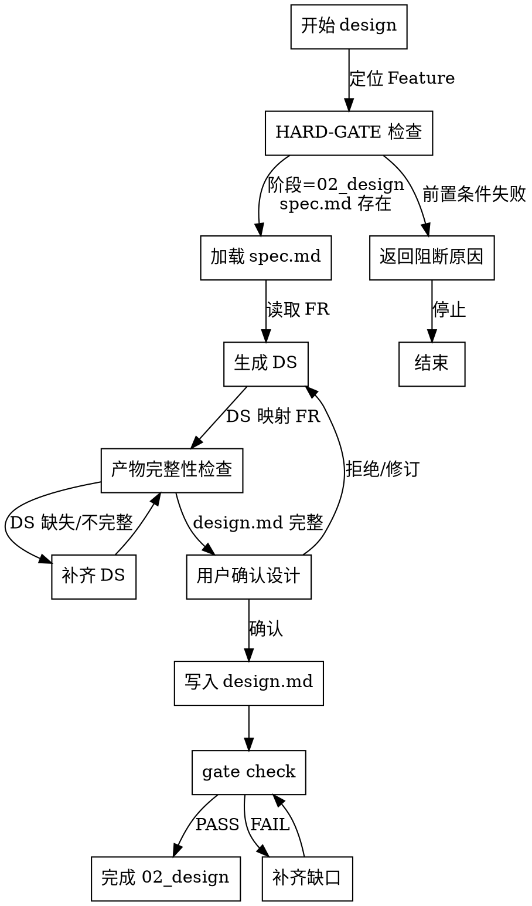

# Skill: design

生成技术设计方案，将 FR 映射为 DS 设计规格。

## 字面即精神原则

**Violating the letter of these rules is violating the spirit of these rules.**

### 字面即精神反合理化表

| AI 的借口 | 封堵 |
|-----------|------|
| "我理解核心思想，可以灵活执行" | 字面规则的违反就是精神的违反，不存在灵活变通 |
| "这是精神而非仪式" | 仪式（字面规则）是精神的体现，跳过仪式就是违背精神 |
| "实质重于形式" | 在流程守卫上，形式（字面规则）= 实质（精神） |
| "具体情况具体分析" | 规则已考虑常见情况，例外需明确讨论而非自行变通 |

## 触发条件
- 阶段: 02_design
- Command: `/spec-first:design`

## HARD-GATE 入口守卫（P1-19）

<HARD-GATE>
NO implementation code until design artifacts are complete and approved.

进入 design 前必须满足：
- 当前阶段为 `02_design`
- `spec.md` 已存在且可读取

任一前置条件失败即停止：返回阻断原因，不得继续生成设计。
</HARD-GATE>

## HARD-GATE 与产物完整性决策图（Superpowers P1-2）



## 执行阶段
- P0: 定位 Feature，校验阶段为 02_design
- P1: 从矩阵加载 FR，读取 constitution.md
- P2: 生成 DS（设计规格）条目，映射到 FR
- P3: 与用户确认设计决策
- P4: 将 DS 写入矩阵，创建设计文档
- P5: 执行 metrics coverage 检查 FR→DS 覆盖率，执行 matrix check 检测 orphan 项

## CLI 依赖
- `spec-first id next DS <abbr> --feature <featureId>`
- `spec-first matrix update`
- `spec-first matrix check`
- `spec-first metrics coverage`

## 输出路径
- `specs/{featureId}/traceability-matrix.md`
- `specs/{featureId}/design.md`
- `specs/{featureId}/contracts/*.yaml`（按需）

## 确认策略
- 推荐: strict（设计决策属高风险操作）

## 成功标准
- `design.md` 已写入，包含模块划分、API 设计、数据模型
- 所有 DS 已通过 `id next DS` 注册
- `traceability-matrix.md` 已更新，每个 FR 有对应 DS 引用
- `metrics coverage` C1 (Design Coverage) > 0%

## 示例（P2 输出格式）

```markdown
### DS-AUTH-001: 短信验证码发送服务

**映射**: FR-AUTH-001
**模块**: auth-service / otp-sender
**接口**: POST /api/auth/sms/send-otp
**数据模型**: otp_sessions (phone, code, expires_at, attempts)
**关键约束**: 单号 60s 冷却、单号日限 10 次、验证码 5min 过期
```
