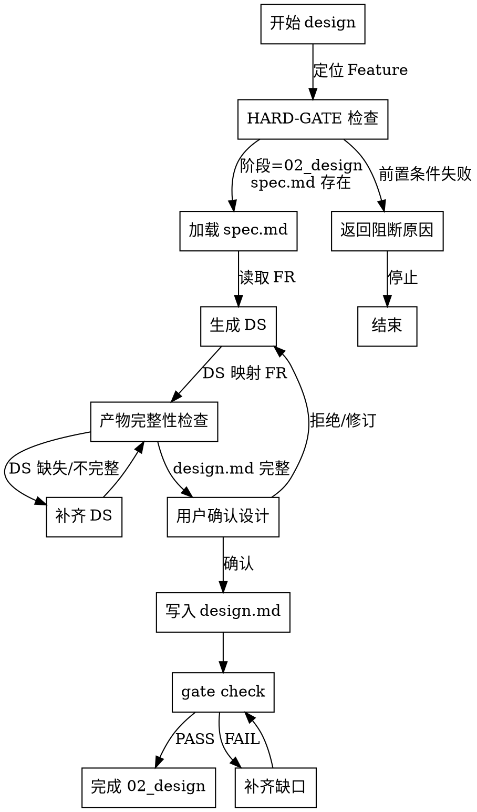

# Skill: design

生成技术设计方案，将 FR 映射为 DS 设计规格。

## 字面即精神原则

**Violating the letter of these rules is violating the spirit of these rules.**

### 字面即精神反合理化表

| AI 的借口 | 封堵 |
|-----------|------|
| "我理解核心思想，可以灵活执行" | 字面规则的违反就是精神的违反，不存在灵活变通 |
| "这是精神而非仪式" | 仪式（字面规则）是精神的体现，跳过仪式就是违背精神 |
| "实质重于形式" | 在流程守卫上，形式（字面规则）= 实质（精神） |
| "具体情况具体分析" | 规则已考虑常见情况，例外需明确讨论而非自行变通 |

## 模板驱动约束（P1-03）

design 阶段输出系统级 HOW，不输出实现级 HOW：
- 必须写：模块边界、接口契约、数据模型、一致性/回滚策略
- 禁止写：类/函数级实现、具体代码片段、与需求无关的库细节
- 自我修正上限：`3` 轮
- 当设计依据不足时必须标记 `[NEEDS CLARIFICATION][TYPE]`（每轮最多 3 项）

## Simplicity First - 设计简洁性守卫

核心原则：design 只覆盖当前 FR / NFR / 约束明确需要的系统级 HOW，不引入与当前交付无关的投机性层次。

生成 DS 前必须自检：
- 这个模块、分层或基础设施是否直接服务于当前 FR / NFR / 约束？
- 这个扩展点是否在当前阶段立即需要？
- 如果删掉这层设计，是否会影响当前交付或宪法合规？

默认禁止：
- 为“将来可能支持多租户 / 插件 / 多实现”提前加层
- 为单一实现强行加入策略模式、适配层、事件总线、缓存层
- 引入与当前 FR 无直接关系的服务拆分或基础设施

若识别到后续可能有价值的设计方向：记录到 `findings.md` 或 ADR 候选，不在当前 design 中强制落地。

## Agent 上下文自动同步（P2-05）

- design 结束并推进阶段后，必须触发宿主上下文同步（`CLAUDE.md` / `AGENTS.md` 的托管区块）
- 托管区块可覆盖更新；`[MANUAL]` 手工区块不可覆盖
- 若同步失败，必须在 `findings.md` 记录 warning，不得静默

## 文件系统即外部记忆（统一约束）

- 每连续 2 个关键动作（设计决策、接口定义、回滚策略确认）后，必须更新 `findings.md`。
- 中断前至少落盘：当前设计决策、未决问题、下一步命令。
- 最小落盘字段：当前结论、证据路径（`design.md`/契约文件位置）、下一步动作。

## 触发条件
- 阶段: 02_design
- Command: `/spec-first:design [featureId]`


## Feature 定位规则

### 优先级

1. **显式参数**: 用户提供 featureId 参数时直接使用
2. **自动定位**: 读取 `.spec-first/current` 获取当前激活 Feature
3. **交互式**: 列出可用 Feature 供用户选择

### 错误处理

- `.spec-first/current` 不存在或为空 → 降级到交互式
- 指定 Feature 的阶段不匹配 → 报错并终止

## HARD-GATE 入口守卫（P1-19）

<HARD-GATE>
NO implementation code until design artifacts are complete and approved.

进入 design 前必须满足：
- 当前阶段为 `02_design`
- `spec.md` 已存在且可读取

任一前置条件失败即停止：返回阻断原因，不得继续生成设计。
</HARD-GATE>

## Plan Mode 协同（P1-08）

- 对架构分层、接口边界、数据一致性策略等关键设计决策，优先在 Plan Mode 中先收敛再落文档
- Plan Mode 的关键结论必须同步到 `findings.md`，并在 `design.md` 中保留可追溯引用

## 与 05-research 的协同契约

`04-design` 是主 skill，`05-research` 是按需 companion skill。

当满足以下任一条件时，`04-design` 应自动或按需触发 `05-research`：
- 存在 2 个以上合理候选方案
- 需要外部最佳实践、官方文档或兼容性依据
- 安全 / 性能 / 成本结论无法仅靠本仓库上下文得出
- 需要评估第三方服务、框架或外部集成方案

触发后必须：
- 将 research 结论写入 `research.md`
- 将摘要、证据路径、下一步动作写入 `findings.md`

`04-design` 消费 research 输出时，必须把以下信息回写到 `design.md`：
- 最终采用方案
- 采用理由
- 关键风险
- 待验证项（如仍存在）

边界：
- `05-research` 提供证据输入，不替代 `design.md`
- `04-design` 不应绕过 `research.md` 直接用外部资料拍板

## 宪法权威检查（P1-CON）

### P2.5: 设计宪法检查

生成 DS 后、进入用户确认前，必须执行宪法一致性检查：

1. 加载 `specs/{featureId}/constitution.md`
2. 对照 `../03-spec/references/constitution-authority.md`
3. 检查每条 DS 是否违反宪法约束
4. 发现冲突时：
   - 标记 `[CONSTITUTION_VIOLATION]`
   - 记录冲突条款与受影响 DS
   - 先修正 Design，再继续后续步骤

若 Design 与 Constitution 冲突，优先修正 Design，不得带冲突推进。

## HARD-GATE 与产物完整性决策图（Superpowers P1-2）



## 执行阶段
- P0: 定位 Feature（优先读取 `.spec-first/current`，无则交互式提示），校验阶段为 02_design
- P1: 从 spec/design 读取需求依据，读取 constitution.md
- P2: 生成 DS（设计规格）条目，映射到 FR，并逐条执行“设计简洁性守卫”自检；若出现多方案或外部证据缺口，先触发 `05-research`
- P3: 与用户确认设计决策，仅保留直接支撑当前交付的必要设计
- P4: 将 DS 写入设计文档，并把 `research.md` 的推荐结论/风险/待验证项回流到 `design.md`
- P5: 执行文档关联校验，检查孤立文档与缺失引用

## CLI 依赖
- `spec-first id next DS <abbr> --feature <featureId>`
- `spec-first docs links validate`
- `spec-first docs links show`
- `spec-first metrics report`

## 输出路径
- `specs/{featureId}/document-links.yaml`
- `specs/{featureId}/design.md`
- `specs/{featureId}/contracts/*.yaml`（按需）

## 确认策略
- 推荐: strict（设计决策属高风险操作）

## 成功标准
- `design.md` 已写入，包含模块划分、API 设计、数据模型
- 所有 DS 已通过 `id next DS` 注册
- `document-links.yaml` 已更新，设计文档引用完整
- 文档关联校验通过，无孤立项
- 无与当前交付无关的投机性架构层

**格式校验（P4 落盘后自动执行）**:
```bash
spec-first validate format <featureId>
```

- 检查 design.md 章节格式
- 检查 ID 格式（无多余连字符）
- 检查文件路径完整性
- 校验失败时需修复

## 示例（P2 输出格式）

```markdown
### DS-AUTH-001: 短信验证码发送服务

**映射**: FR-AUTH-001
**模块**: auth-service / otp-sender
**接口**: POST /api/auth/sms/send-otp
**数据模型**: otp_sessions (phone, code, expires_at, attempts)
**关键约束**: 单号 60s 冷却、单号日限 10 次、验证码 5min 过期
```

## 背景输入
- 背景质量字段与枚举遵循 `../shared/background-quality-contract.md`
- 优先读取 `design-view`
- 输入元数据字段使用 `backgroundInputStatus`
- 若需输出用户可见背景字段，统一使用 `background_input_status`
- `backgroundInputStatus` 属于输入层字段，不替代文档输出字段命名
- 正式设计评审前应尽量达到 `full`
- 若命中高依赖阶段，可提升到 `L3` 设计门槛
