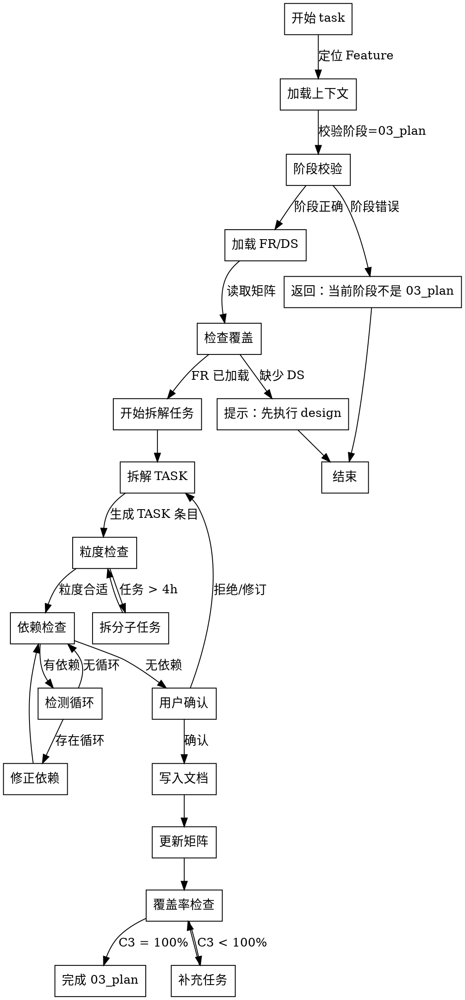

# Skill: task

将需求拆解为可执行的 TASK 任务清单。

## Announce at Start

```
I'm using the task skill to break down [Feature] into executable tasks.
```

## 字面即精神原则

**Violating the letter of these rules is violating the spirit of these rules.**

### 字面即精神反合理化表

| AI 的借口 | 封堵 |
|-----------|------|
| "我理解核心思想，可以灵活执行" | 字面规则的违反就是精神的违反，不存在灵活变通 |
| "这是精神而非仪式" | 仪式（字面规则）是精神的体现，跳过仪式就是违背精神 |
| "实质重于形式" | 在流程守卫上，形式（字面规则）= 实质（精神） |
| "具体情况具体分析" | 规则已考虑常见情况，例外需明确讨论而非自行变通 |

### 反合理化守卫

当你产生以下念头时，立即停止并回到流程：

| AI 的借口 | 封堵 |
|-----------|------|
| "任务很明确，不需要拆这么细" | 任务粗放 = 执行困难，必须拆到 2-4h 可完成 |
| "开发者会自己理解" | 假设开发者有上下文是错误的，必须写明每一步 |
| "步骤写得太啰嗦" | 啰嗦总比模糊好，执行者可跳过但不能猜测 |
| "这个任务很简单，一步就行" | 简单任务也需明确：改什么文件、怎么验证、何时完成 |
| "依赖关系用自然语言更清楚" | 自然语言无法自动校验，必须用 TASK ID |

## When to Use

用于将 FR 和 DS 拆解为可执行的任务清单：
- 完成需求规格（spec）后
- 完成技术设计（design）后
- 准备开始实现（code）前

**Use this ESPECIALLY when**：
- 任务需要多人协作
- 任务需要分阶段交付
- 任务有复杂的依赖关系
- 任务需要估算工期

## Don't Skip Task Breakdown When

| 场景 | 常见借口 | 实际风险 |
|------|----------|----------|
| 小功能 | "就几个接口，直接写吧" | 缺少任务清单 = 进度不可追踪 |
| 紧急需求 | "时间紧，先做再补" | 边做边补 = 遗漏任务 |
| 熟悉领域 | "我做过类似的" | 每个项目有差异，需要完整任务 |
| 单人开发 | "就我一个人，拆了没用" | 任务清单 = 进度可见性 + 中断恢复 |

> **Iron Law**: "NO CODE WITHOUT TASK BREAKDOWN."

## Bite-Sized Task Granularity

### 粒度标准

| 层级 | 时间范围 | 包含步骤 | 示例 |
|------|----------|----------|------|
| **步骤 (Step)** | 5-30 分钟 | 单个具体动作 | "创建 `src/auth/login.ts`" |
| **任务 (Task)** | 2-4 小时 | 3-7 个步骤 | "实现登录 API" |
| **用户故事 (User Story)** | 1-3 天 | 2-5 个任务 | "用户通过短信登录" |

### 任务拆解原则

**DO**:
- ✅ 拆到具体文件和函数
- ✅ 每个步骤有预期输出
- ✅ 包含验证和提交步骤
- ✅ 明确需要读取的参考文档

**DON'T**:
- ❌ "实现 XXX 功能"（太粗）
- ❌ "调研 XXX 技术"（需拆为具体查阅步骤）
- ❌ "优化 XXX 性能"（需定义具体目标和验证方法）
- ❌ 超过 1 天工期的任务（需进一步拆解）

### 步骤类型规范

| 步骤类型 | 示例 | 预期时间 |
|---------|------|----------|
| 创建文件 | Create `src/auth/service.ts` | 5-10 分钟 |
| 读取参考 | Read `docs/api-spec.md` section 3 | 5-15 分钟 |
| 编写代码 | Implement `login()` function | 15-30 分钟 |
| 运行测试 | `pnpm vitest run tests/unit/auth.test.ts` | 2-5 分钟 |
| 更新矩阵 | Sync `traceability-matrix.md` | 2-5 分钟 |
| 记录结论 | Update `findings.md` with next step | 2-5 分钟 |

## Task Structure Detail

### 标准任务格式

```markdown
### TASK-XXX-YYY: [任务标题]

**Owner**: [FE/BE/DEV/QA/DEVOPS]
**预计工期**: [Xd/Xh]
**traces**: [FR-XXX,DS-XXX]
**depends_on**: [TASK-ID or -]
**用户故事**: [US#]

**目标**：
一句话描述这个任务要达成的结果。

**验收标准**：
- [ ] 具体可验证的条件 1
- [ ] 具体可验证的条件 2

**文件清单**：
- Create: `path/to/new/file.ext`
- Modify: `path/to/existing/file.ext:line-range`
- Reference: `path/to/reference/file.ext`

**执行步骤**：

**Step 1: [动作描述]**
- 具体操作
- 预期输出: [具体结果]

**Step 2: [动作描述]**
- 具体操作
- 预期输出: [具体结果]

...

**Step N: Commit**
```bash
git add <files>
git commit -m "scope: brief description"
```

**验证命令**：
```bash
# 运行测试/检查
<command>
# 预期输出
<expected output>
```

**状态**: todo | in_progress | blocked | verified | done
```

### 任务明细表

| Task ID | 标题 | Owner | 预计工期 | traces | depends_on | 验收标准 | 验证命令 | 状态 |
|---------|------|-------|----------|--------|------------|----------|----------|------|
| TASK-AUTH-001 | 初始化鉴权模块 | BE | 0.5d | FR-AUTH-001,DS-AUTH-001 | - | 模块骨架创建完成 | pnpm vitest run tests/unit/auth/init.test.ts | todo |
| TASK-AUTH-002 | 发送验证码 API | BE | 1d | FR-AUTH-001,DS-AUTH-001 | TASK-AUTH-001 | API 可调用且返回正确 | pnpm vitest run tests/unit/auth/send-otp.test.ts | todo |

## Task Breakup 决策流程图



## When to Stop and Ask

**停止任务拆解，立即询问用户**：

| 场景 | 行动 |
|------|------|
| DS 不完整 | 提示：部分 FR 缺少对应 DS，是否继续？ |
| 粒度模糊 | 提示：任务 "XXX" 粒度过粗，是否拆分？ |
| 依赖复杂 | 提示：检测到 N 层依赖，建议进入 Plan Mode |
| 工期异常 | 提示：任务 "XXX" 工期 > 2 天，是否进一步拆解？ |
| 技术未知 | 提示：任务 "XXX" 涉及未知技术，是否先执行 research？ |

## 模板驱动约束

task 阶段只输出执行计划，不输出实现代码：
- **必须写**：任务范围、依赖、验收标准、并行性标记、文件清单、执行步骤
- **禁止写**：代码实现细节、框架/库调用示例
- **自我修正上限**：`{{MAX_SELF_CORRECTION}}` 轮（默认 3）
- **假设标记**：当信息不足时必须标记 `[NEEDS CLARIFICATION][TYPE]`（每轮最多 3 项）

## Plan Mode 协同

- 对复杂 Feature（任务数 > 20 或依赖层级 > 3），优先在 Plan Mode 中先规划任务结构
- Plan Mode 的结论必须同步到 `findings.md`，包含：
  - 任务分组策略（按用户故事 / 按技术分层）
  - 并行策略（哪些任务可并行）
  - 风险识别（关键路径、技术风险）

## 2-Action Rule（Planning-with-Files P0-1）

- 每连续完成 2 个关键动作（拆解任务、调整依赖、确认验收标准）后，必须把结论写入 `findings.md`
- 若中断会话，至少留下：当前任务批次、阻塞项、下一步命令
- 最小落盘字段：
  - **当前结论**：已拆解的 TASK 列表
  - **证据路径**：`task_plan.md` / `traceability-matrix.md` 位置
  - **下一步**：待拆解的 FR/DS 或待调整的依赖
- 未落盘的信息一律视为不可靠上下文

## 触发条件

- **阶段**：03_plan
- **Command**：`/spec-first:task`


## Feature 定位规则

### 优先级

1. **显式参数**: 用户提供 featureId 参数时直接使用
2. **自动定位**: 读取 `.spec-first/current` 获取当前激活 Feature
3. **交互式**: 列出可用 Feature 供用户选择

### 错误处理

- `.spec-first/current` 不存在或为空 → 降级到交互式
- 指定 Feature 的阶段不匹配 → 报错并终止

## 背景输入

- 背景质量字段与枚举遵循 `../shared/background-quality-contract.md`
- 必须读取 `spec.md` + `design.md` + `traceability-matrix.md`
- 输入元数据字段使用 `backgroundInputStatus`
- 若需输出用户可见背景字段，统一使用 `background_input_status`
- `backgroundInputStatus` 属于输入层字段，不替代文档输出字段命名
- 任务拆解依赖完整的 FR 和 DS 映射

## 执行阶段

- **P0**: 定位 Feature，校验阶段为 03_plan
- **P1**: 从矩阵加载 FR 和 DS 条目
- **P2**: 生成 TASK 拆解，映射到 FR（ID、标题、工期、依赖）
- **P3**: 与用户确认任务计划
- **P4**: 将 TASK 写入矩阵和 task_plan.md
- **P5**: 执行 review checklist 自检

## CLI 依赖

- `spec-first id next TASK <abbr> --feature <featureId>`
- `spec-first matrix update`
- `spec-first matrix check`
- `spec-first trace validate <featureId>`

## 输出路径

- `specs/{featureId}/traceability-matrix.md`
- `specs/{featureId}/task_plan.md`

## 确认策略

- **strict**（高风险）：涉及核心架构、多人协作
- **assisted**（中风险）：常规任务拆解（默认推荐）
- **auto**（低风险）：简单 Feature（< 5 个任务）

## 成功标准

- `task_plan.md` 已写入，包含所有 TASK 定义（ID、标题、Owner、工期、依赖、验收标准、验证命令、状态）
- 所有 TASK 已通过 `id next TASK` 注册
- `traceability-matrix.md` 已更新，每个 FR 有对应 TASK 引用
- `trace validate` / `matrix check` 通过
- `metrics coverage` 或 Gate 校验显示 `C3 (Task Coverage) = 100%`
- Review Checklist 已通过自检

**格式校验（P4 落盘后自动执行）**:
```bash
spec-first validate format <featureId>
```

- 检查 PRD 章节格式
- 检查 ID 格式（无多余连字符）
- 检查文件路径完整性
- 校验失败时需修复

## Review Checklist

输出前必须通过自检（见 `references/task-checklist.md`）：

### 必查项（A-G）
- [ ] 所有 FR/DS 都有对应 TASK
- [ ] 任务粒度 2-4h，步骤 5-30min
- [ ] 依赖使用 TASK ID，无循环
- [ ] 每个任务有明确验收标准
- [ ] 每个 TASK 有唯一 Owner
- [ ] 用户故事映射完整

### 常见陷阱（H）
- [ ] 无 "TODO"、"待补充" 占位符
- [ ] 无 "实现XXX" 模糊任务
- [ ] 无超过 1 天工期的任务

### 可执行性（I）
- [ ] 陌生开发者可理解任务
- [ ] 中断后可从计划恢复

## TASK 字段语义

- **Owner**：单一责任人（一个 TASK 仅允许 1 名 owner）
- **Status**：主文档示例统一使用 `todo | in_progress | blocked | verified | done`
- **depends_on**：仅允许引用同一 Feature 下 TASK ID，禁止自然语言依赖
- **任务明细表契约**：首个非空单元格为 TASK ID，最后非空单元格为状态

## 模板引用路径

本 skill 使用的模板位于 `references/` 目录：

| 模板类型 | 路径 | 用途 |
|---------|------|------|
| 任务检查 | `task-checklist.md` | 拆解质量检查清单 |
| 任务模板 | `task-template.md` | 标准任务格式规范 |
| 协作约定 | `coordination-conventions.md` | `[P]` / `[US#]`、handoff、日志与操作标记 |

## 示例（P2 输出格式）

```markdown
# Task Plan: 短信验证码登录

## 目标
实现用户通过手机号 + 短信验证码完成登录功能。

## 当前阶段
Phase 2: Implementation

## 用户故事分组

### US1 — SMS Login (P1)
- [ ] TASK-AUTH-002 [P] [US1] 实现发送验证码 API
- [ ] TASK-AUTH-003 [US1] 实现验证码登录 API

### US2 — Rate Limiting (P1)
- [ ] TASK-AUTH-004 [US2] 实现短信发送频控
- [ ] TASK-AUTH-005 [US2] 实现登录尝试频控

## 任务明细

| Task ID | 标题 | Owner | 预计工期 | traces | depends_on | 验收标准 | 验证命令 | 状态 |
|---------|------|-------|----------|--------|------------|----------|----------|------|
| TASK-AUTH-002 | 发送验证码 API | BE | 1d | FR-AUTH-001,DS-AUTH-001 | - | API 可调用，返回成功/频控错误码 | pnpm vitest run tests/unit/auth/send-otp.test.ts | todo |
| TASK-AUTH-003 | 验证码登录 API | BE | 1d | FR-AUTH-001,DS-AUTH-002 | TASK-AUTH-002 | 正确登录并覆盖错误路径 | pnpm vitest run tests/unit/auth/login-by-code.test.ts | todo |
```

## Handoff

任务拆解完成后，只保留一条统一交接语：

`task_plan.md` 已写入。下一步进入 `/spec-first:code`，按依赖顺序执行；若存在 `[P]` 标记任务，可按并行约定分批推进。

并行标记、用户故事标记、交接选项和日志格式见：

- [coordination-conventions.md](/Users/kuang/xiaobu/spec-first/skills/spec-first/06-task/references/coordination-conventions.md)

## Hooks 行为规范

本 skill 配置了自动化 hooks，用于强化任务拆解质量：

### PreToolUse（工具调用前提醒）

| 匹配工具 | 提醒内容 | 目的 |
|---------|---------|------|
| `Write` / `Edit` | 写入任务前检查粒度：单个任务 2-4h，单个步骤 5-30min | 确保任务可执行 |
| `Write` | 确保每个任务有：明确目标、文件清单、执行步骤、验收标准 | 确保任务完整性 |

### PostToolUse（工具调用后提醒）

| 匹配工具 | 提醒内容 | 目的 |
|---------|---------|------|
| `Write` / `Edit` | 文件已更新，检查是否同步 traceability-matrix.md | 确保矩阵同步 |

### Stop（会话结束前检查）

会话结束时触发 checkpoint，检查：
- 任务粒度是否合理（2-4h）
- 依赖关系是否完整（无循环）
- 验收标准是否明确
- references 已正确引用

## 中断恢复策略

当任务拆解过程中断时，使用以下策略恢复：

### 恢复步骤

1. **读取 `findings.md`** — 查看上次结论
2. **读取 `task_plan.md`** — 查看当前任务列表
3. **读取 `traceability-matrix.md`** — 查看已注册的 TASK
4. **继续从断点开始** — 根据 `下一步` 字段恢复

### 中断前必须落盘

| 字段 | 说明 | 示例 |
|------|------|------|
| 当前结论 | 已拆解的 TASK 列表 | "已完成 TASK-AUTH-001 到 TASK-AUTH-005" |
| 证据路径 | 任务计划文件位置 | `specs/FSREQ-XXX/task_plan.md:20-50` |
| 下一步 | 待处理的 FR/DS | "继续处理 FR-AUTH-002" |

## 测试设计前置要求（v2）

- 每个 TASK 都必须显式给出测试设计输入：`target_fr_ids`、`target_ac_ids`、`recommended_test_levels`、`failure_cases`、`definition_of_done`、`test_intent`。
- 这些字段是 `/spec-first:code` 执行 TDD 的前置输入，不允许留到 `verify` 再补。
