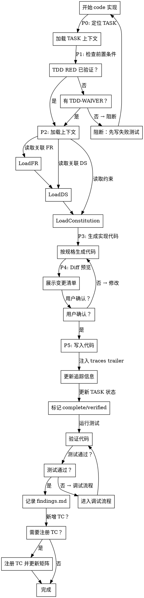
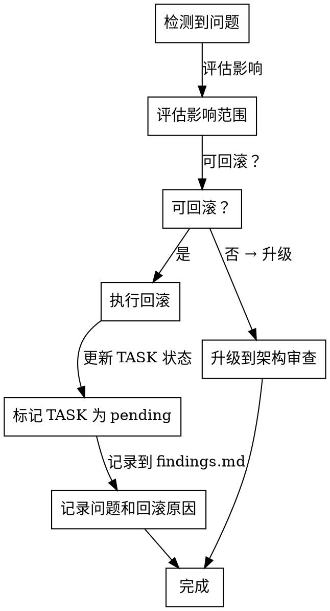

# Skill: code

按 TASK 规格实现代码，自动关联追踪链路。

## Announce at Start

```
I'm using the code skill to implement [TASK_ID]: [Task Title].
```

## 字面即精神原则

**Violating the letter of these rules is violating the spirit of these rules.**

### 字面即精神反合理化表

| AI 的借口 | 封堵 |
|-----------|------|
| "我理解核心思想，可以灵活执行" | 字面规则的违反就是精神的违反，不存在灵活变通 |
| "这是精神而非仪式" | 仪式（字面规则）是精神的体现，跳过仪式就是违背精神 |
| "实质重于形式" | 在流程守卫上，形式（字面规则）= 实质（精神） |
| "具体情况具体分析" | 规则已考虑常见情况，例外需明确讨论而非自行变通 |

### 反合理化守卫

当你产生以下念头时，立即停止并回到流程：

| AI 的借口 | 封堵 |
|-----------|------|
| "这个改动太小，不需要走 code-review" | 小改动也有回归风险，review 耗时 < 2 分钟 |
| "我已经手动检查过了" | 手动检查 != 自动校验证据 |
| "先写完再补测试" | 事后测试证明不了什么，测试应与改动配套 |
| "这只是重构，不影响功能" | 重构不改行为 != 重构不引入 bug |
| "快速修一下，之后再调查" | 快速修复掩盖根因，系统化调试更快 |
| "我看到问题了，让我直接修" | 看到症状 != 理解根因 |
| "同时改多处，一起测试" | 无法隔离哪个改动有效，会引入新 bug |
| "再试一次修复"（已失败 2+ 次） | 3 次失败 = 架构问题，停止修复并升级 |
| "我记得刚才看到的内容" | 上下文会被压缩，记忆不可靠，重要信息必须落盘 |

## When to Use

用于执行代码实现：
- 完成任务拆解后，开始实现 TASK
- 修复 Bug 时（需遵循 systematic-debugging）
- 重构代码时（需先有测试保护）

**Use this ESPECIALLY when**：
- 需要按 TASK 规格实现功能
- 需要遵循 TDD 流程
- 需要关联追踪链路（FR → DS → TASK → TC → 代码）

## Don't Skip Code Review When

| 场景 | 常见借口 | 实际风险 |
|------|----------|----------|
| 小改动 | "就改了几行" | 可能影响调用方，回归风险 |
| 紧急修复 | "先上线再说" | 技术债累积，可能引入新 bug |
| 自信满满 | "我检查过了" | 主观检查 != 客观验证 |
| 重构 | "不改行为" | 重构常引入意外行为变化 |

> **Iron Law**: "NO PRODUCTION CODE WITHOUT A FAILING TEST FIRST."

## 上下文持久化规则

Context Window = RAM（易失、有限），Filesystem = Disk（持久、可恢复）。

压缩必须可恢复：即使丢弃内容，也要保留 URL / 文件路径 / ID 指针。

### Read/Write 决策矩阵

| 场景 | 决策 | 原因 |
|------|------|------|
| 刚写完一个文件 | 不立即重读 | 内容仍在当前上下文，可减少无效 I/O |
| 开始新 TASK | 先读 `task_plan.md` 与 `findings.md` | 重新定向上下文 |
| 浏览器/MCP 返回结果 | 立即写入 `findings.md` | 外部数据不持久 |
| 查看图片/PDF/网页 | 先摘要后写盘 | 多模态内容易在压缩时丢失 |
| 发生错误或测试失败 | 先读相关文件与最近变更 | 修复前必须确认当前状态 |
| 长间隔后恢复工作 | 读运行态文件再操作 | 防止基于旧记忆做错误修改 |

## 2-Action Rule（P1-04）

- 每连续完成 2 个关键动作（读外部信息、改代码、跑验证）后，必须把结论写入 `findings.md`
- 若中断会话，至少留下：当前 TASK、阻塞点、下一步命令
- 未落盘的信息一律视为不可靠上下文

## Worktree First（P1-16）

以下高风险操作默认建议在独立 worktree 中执行：
- 大范围重构（跨目录、多模块）
- 可能影响发布分支稳定性的变更
- 需要并行验证多个修复方案的变更

最小建议流程：
1. `git worktree add ../worktree-<TASK-ID> <branch>`
2. 在独立 worktree 中实现与验证
3. 验证通过后再合并回主工作区

## 调试流程（测试失败时）

铁律：NO FIXES WITHOUT ROOT CAUSE INVESTIGATION FIRST

| 阶段 | 关键活动 | 成功标准 |
|------|---------|---------|
| 1. 根因调查 | 读错误、复现、检查近期变更、追踪数据流 | 理解 WHAT 与 WHY |
| 2. 模式分析 | 找到可工作的类似实现并对比差异 | 差异点可定位 |
| 3. 假设验证 | 单一假设、最小实验、一次只改一个变量 | 假设被确认或被否定 |
| 4. 实现修复 | 先失败测试，再单一修复，再全量验证 | 问题关闭且无回归 |

硬规则：同类修复失败 3 次后必须停止并升级到架构审查。

## 3-Strike Error Protocol（P1-05）

- 同类错误连续失败 3 次后，禁止继续"再试一次"
- 必须升级到架构审查或方案重设计
- 升级动作与结论必须写入 `findings.md`

## 代码变更决策流程图



## HARD-GATE 入口守卫（P1-19）

<HARD-GATE>
NO code changes until prerequisites are verified.

进入 code 前必须满足：
- 当前阶段为 `04_implement`
- 当前 Feature 存在 `design.md`
- `task_plan.md` 至少有 1 条 `in_progress` TASK

任一前置条件失败即停止：返回阻断原因，不得继续写代码。
</HARD-GATE>

## TDD 强制入口守卫（P1-TDD）

NO PRODUCTION CODE WITHOUT A FAILING TEST FIRST.

进入 code 前，当前 `in_progress` TASK 必须满足以下之一：
1. 在 `findings.md` 中存在该 TASK 的 RED 证据（失败测试命令 + 非 0 退出码 + 失败原因为功能缺失）
2. 在 `findings.md` 中存在该 TASK 的结构化 `[TDD-WAIVER]` 记录（场景、理由、批准人、时间）

任一条件不满足即阻断，不得继续写生产代码。

### TDD 证据落盘（必做）

每次 Verify RED / Verify GREEN 后，必须更新 `findings.md`，至少包含：
- TASK ID
- 测试命令（完整）
- 退出码
- 关键输出摘要（失败原因或通过结论）

### TDD-WAIVER 记录格式

```markdown
### [TDD-WAIVER] TASK-ID

| 字段 | 值 |
|------|-----|
| **场景** | UI 细节调整 / 配置文件变更 / 文档更新 |
| **理由** | 无法通过自动化测试验证 / 测试成本过高 |
| **批准人** | Tech Lead / 用户确认 |
| **时间** | 2026-03-05T10:30:00Z |
```

### 测试追踪闭环（必做）

新增测试涉及新覆盖点时，必须完成：
1. 注册 TC：`spec-first id next TC <abbr> --feature <featureId> --level <UT|IT|E2E|ST>`
2. 回填矩阵：`spec-first matrix update <featureId} <tcId> --upstream <frId>`

未完成闭环会导致 C4/C5 在阶段推进时不达标。

### 测试命令探测策略（P1-TDD-CMD）

为保证跨技术栈可执行，测试命令需按下列顺序探测：

`pnpm test` → `npm test` → `yarn test` → `pytest` → `go test`

约束：
1. 探测仅用于选择命令，不作为 RED/GREEN 证据
2. RED 与 GREEN 必须使用同一条最终命令
3. 证据必须包含该最终命令的完整输出与退出码

## Code Review 前检查清单

在提交代码前，必须完成以下检查：

### 代码质量检查

| 检查项 | 命令 | 验证标准 |
|--------|------|----------|
| Lint 通过 | `npm run lint` | 退出码 0，无警告 |
| Typecheck 通过 | `npm run typecheck` | 退出码 0，无类型错误 |
| 单元测试通过 | `按探测策略选择的测试命令` | 退出码 0，覆盖率达标 |
| Build 通过 | `npm run build` | 退出码 0，产物生成 |

### 追踪完整性检查

| 检查项 | 验证方式 |
|--------|----------|
| traces trailer 已注入 | 每个新文件末尾有 `// Related: FR-xxx, DS-xxx, TASK-xxx` |
| TASK 状态已更新 | `task_plan.md` 中 TASK 标记为 `complete` 或 `verified` |
| findings.md 已记录 | 包含 RED/GREEN 证据 |
| TC 已注册（如新增测试） | 矩阵中有新 TC 条目 |

### 变更影响检查

| 检查项 | 验证方式 |
|--------|----------|
| 调用方兼容性 | 检查变更函数/类的所有引用 |
| 数据库变更（如有） | migration 脚本已准备 |
| 配置变更（如有） | .env.example 已更新 |

## Traces Trailer 规范

### 格式定义

每个实现文件末尾必须注入 traces trailer，格式如下：

```typescript
// Related: FR-AUTH-001, DS-AUTH-001
// Task: TASK-AUTH-002
// Author: Claude Code (spec-first:code)
// Date: 2026-03-05
```

### 字段说明

| 字段 | 说明 | 示例 |
|------|------|------|
| Related | 关联的需求 ID 和设计 ID | `FR-AUTH-001, DS-AUTH-001` |
| Task | 当前 TASK ID | `TASK-AUTH-002` |
| Author | 生成者 | `Claude Code (spec-first:code)` |
| Date | 生成日期 | `2026-03-05` |

### 多关联格式

当一个文件关联多个 FR/DS/TASK 时：

```typescript
// Related: FR-AUTH-001, FR-AUTH-002
// Design: DS-AUTH-001, DS-AUTH-003
// Tasks: TASK-AUTH-002, TASK-AUTH-004
// Author: Claude Code (spec-first:code)
// Date: 2026-03-05
```

## 代码质量门禁

### 静态检查

| 工具 | 检查内容 | 阈值 |
|------|----------|------|
| ESLint | 代码规范 | 0 errors, 0 warnings |
| TypeScript | 类型安全 | 0 type errors |
| Prettier | 代码格式 | 与项目一致 |

### 动态检查

| 工具 | 检查内容 | 阈值 |
|------|----------|------|
| Vitest | 单元测试 | 100% pass |
| Coverage | 代码覆盖率 | Lines ≥ 75%, Branches ≥ 65% |

### 代码审查维度

| 维度 | 检查内容 |
|------|----------|
| **正确性** | 逻辑正确、边界处理、错误处理 |
| **安全性** | 无注入漏洞、敏感数据保护 |
| **性能** | 无明显性能问题、资源正确释放 |
| **可维护性** | 命名清晰、注释充分、结构合理 |
| **测试** | 测试覆盖关键路径、边界条件 |

## 回滚策略

### 变更分类与回滚方式

| 变更类型 | 回滚难度 | 回滚方式 |
|----------|----------|----------|
| **新增功能** | 低 | 删除新增代码，回滚 TASK 状态 |
| **修改行为** | 中 | git revert 恢复变更 |
| **重构** | 中 | git revert 恢复变更 |
| **数据库迁移** | 高 | 需要反向 migration |
| **API 变更** | 高 | 需要版本管理或兼容层 |

### 回滚触发条件

| 场景 | 触发条件 |
|------|----------|
| 测试失败 | 关键测试失败且无法快速修复 |
| 类型错误 | typecheck 无法通过 |
| 性能退化 | 性能基准测试下降 > 10% |
| 安全漏洞 | 安全扫描发现高危问题 |

### 回滚流程



## 触发条件

- **阶段**: 04_implement
- **Command**: `/spec-first:code`


## Feature 定位规则

### 优先级

1. **显式参数**: 用户提供 featureId 参数时直接使用
2. **自动定位**: 读取 `.spec-first/current` 获取当前激活 Feature
3. **交互式**: 列出可用 Feature 供用户选择

### 错误处理

- `.spec-first/current` 不存在或为空 → 降级到交互式
- 指定 Feature 的阶段不匹配 → 报错并终止

## 执行阶段

- **P0**: 定位 Feature，校验阶段为 04_implement，从 task_plan.md 定位当前进行中的 TASK
- **P1**: 加载 TASK 上下文、关联的 FR/DS、constitution 约束，验证 TDD 入口守卫
- **P2**: 按规格约束生成实现代码
- **P3**: 与用户确认代码变更（diff 预览，必须包含固定字段）
- **P4**: 写入代码文件，注入 traces trailer
- **P5**: 更新 task_plan.md 中 TASK 状态，更新 findings.md

## P3 diff 预览模板（固定字段）

### 变更文件清单

| 类型 | 文件路径 | 关联 ID | 风险 |
|------|----------|---------|------|
| [新增/修改/删除] | `path/to/file.ts` | FR-xxx, DS-xxx, TASK-xxx | [高/中/低] |

### 风险标注

| 风险类型 | 说明 | 缓解措施 |
|----------|------|----------|
| 行为变更 | 描述行为变化 | 兼容性处理 |
| 兼容性 | 影响的调用方 | 版本管理 |
| 回滚点 | 回滚方式 | git revert / 删除 |

### 拟执行验证命令

```bash
# Lint
npm run lint

# Typecheck
npm run typecheck

# Step 1: 探测测试命令（仅用于选择，不计入 RED/GREEN 证据）
# 探测顺序: pnpm test → npm test → yarn test → pytest → go test

# Step 2: 使用选定命令执行 RED（保留完整输出与退出码）
# <selected_test_cmd> <path/to/test>

# Step 3: 使用同一命令执行 GREEN（保留完整输出与退出码）
# <selected_test_cmd> <path/to/test>

# Build
npm run build
```

## CLI 依赖

- `spec-first commit`
- `spec-first matrix update`
- `spec-first ai context`
- `spec-first id next TC <abbr> --feature <featureId> --level <UT|IT|E2E|ST>`

## 输出路径

- 源代码文件（按 TASK 规格）
- `specs/{featureId}/task_plan.md`
- `specs/{featureId}/findings.md`

## 确认策略

- 推荐: strict（Mode N）/ assisted（Mode I）

## 成功标准

- 代码文件已写入，符合 TASK 规格和 DS 约束
- `task_plan.md` 中对应 TASK 状态更新为 `complete` 或 `verified`
- traces trailer 已注入到每个新文件
- `findings.md` 已记录 RED/GREEN 证据（命令 + 退出码）
- 若新增测试：已完成 `TC` 注册与 `matrix` 追踪关联
- 代码质量门禁通过（lint / typecheck / test）

## 示例（P2 输出格式）

```markdown
### TASK-AUTH-002: 短信发送 API

**文件**: `src/api/auth/sms/send-otp.ts`
**变更摘要**: 新增 POST /api/auth/sms/send-otp 端点
**关联**: FR-AUTH-001 → DS-AUTH-001
**代码**:
```typescript
// src/api/auth/sms/send-otp.ts
import { Request, Response } from 'express';

/**
 * POST /api/auth/sms/send-otp
 * 发送短信验证码
 *
 * @see FR-AUTH-001 短信登录功能
 * @see DS-AUTH-001 短信发送 API 设计
 */
export async function sendOtpHandler(req: Request, res: Response) {
  // Implementation...
}

// Related: FR-AUTH-001, DS-AUTH-001
// Task: TASK-AUTH-002
// Author: Claude Code (spec-first:code)
// Date: 2026-03-05
```
```

## 模板引用路径

本 skill 使用的模板位于 `references/` 目录：

| 模板类型 | 路径 | 用途 |
|---------|------|------|
| 代码规范 | `code-standards.md` | 代码风格、命名规范 |
| 测试模板 | `test-template.md` | 单元测试标准格式 |
| Diff 模板 | `diff-template.md` | 变更预览格式 |

## Hooks 行为规范

本 skill 配置了自动化 hooks，用于强化代码质量：

### PreToolUse（工具调用前提醒）

| 匹配工具 | 提醒内容 | 目的 |
|---------|---------|------|
| `Write` / `Edit` | 写入代码前检查：TDD RED 已验证？代码与规格对齐？traces 注入准备？ | 确保 TDD 流程 |
| 测试命令 | 测试/校验前检查：命令完整？退出码记录？失败项有根因分析？ | 确保验证质量 |

### PostToolUse（工具调用后提醒）

| 匹配工具 | 提醒内容 | 目的 |
|---------|---------|------|
| `Write` / `Edit` | 代码已写入，检查是否需要：更新 TASK 状态、记录 findings.md、执行测试验证 | 确保流程闭环 |
| 测试命令 | 测试结果已记录，检查是否需要：注册 TC、更新矩阵、标记 TDD 状态 | 确保追踪完整 |

### Stop（会话结束前检查）

会话结束时触发 checkpoint，检查：
- TDD 循环完成？
- 测试通过？
- TC 注册？
- TASK 状态更新？
- findings.md 记录？
