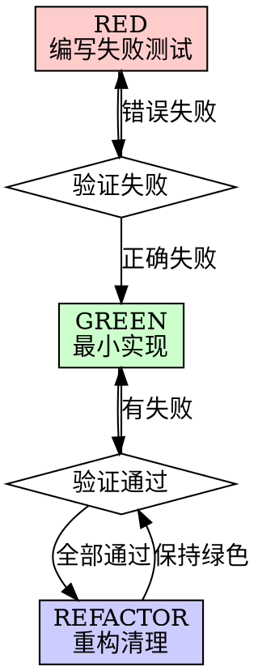
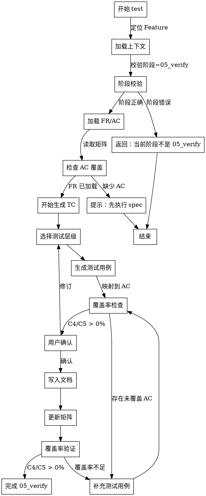

# Skill: test

生成测试用例（TC），映射 FR 与 AC 确保覆盖率。

## Announce at Start

```
I'm using the test skill to generate test cases for [Feature].
```

## 字面即精神原则

**Violating the letter of these rules is violating the spirit of these rules.**

### 字面即精神反合理化表

| AI 的借口 | 封堵 |
|-----------|------|
| "我理解核心思想，可以灵活执行" | 字面规则的违反就是精神的违反，不存在灵活变通 |
| "这是精神而非仪式" | 仪式（字面规则）是精神的体现，跳过仪式就是违背精神 |
| "实质重于形式" | 在流程守卫上，形式（字面规则）= 实质（精神） |
| "具体情况具体分析" | 规则已考虑常见情况，例外需明确讨论而非自行变通 |

### 反合理化守卫

当你产生以下念头时，立即停止并回到流程：

| AI 的借口 | 封堵 |
|-----------|------|
| "测试用例很简单，不需要写那么详细" | 简单 != 可执行，必须写明步骤和预期 |
| "这个场景不会发生，跳过测试" | 你认为不会 != 不会发生，边界情况必须测 |
| "UT 就够了，不需要 IT/E2E" | 单元测试无法验证集成，必须覆盖完整层级 |
| "测试用例数量够了，不用再覆盖" | 数量 != 覆盖率，必须检查 FR/AC 映射 |
| "先写代码，后面补测试" | 违反 TDD 原则，测试先于代码 |

## When to Use

用于生成测试用例，覆盖功能需求：
- 完成需求规格（spec）后
- 完成技术设计（design）后
- 完成任务拆解（task）后
- 开始实现（code）前

**Use this ESPECIALLY when**：
- 需要 100% AC 覆盖
- 需要验证跨系统集成
- 需要验收标准可测试化
- 需要自动化测试基础

## Don't Skip Test Generation When

| 场景 | 常见借口 | 实际风险 |
|------|----------|----------|
| 小功能 | "就几个接口，手动测就行" | 手动测试无法回归，自动化测试才是保障 |
| 紧急需求 | "时间紧，先上线再补" | 上线再补 = 永远不补，技术债累积 |
| 简单逻辑 | "很简单，不会出错" | 简单逻辑也有边界情况 |
| 重复功能 | "以前测过类似功能" | 上下文不同，可能有新问题 |
| 外部依赖 | "第三方服务已经测试过" | 集成点必须测试，第三方不负责集成 |

> **Iron Law**: "NO FEATURE WITHOUT TEST COVERAGE."

## TDD 原则

### Red-Green-Refactor 循环



### Iron Law

```
NO PRODUCTION CODE WITHOUT A FAILING TEST FIRST
```

- 先写测试，看它失败
- 编写最小代码让测试通过
- 重构代码，保持测试通过

### 测试优先顺序

1. **先写测试用例文档** — 本 skill 负责生成
2. **再写测试代码** — code skill 负责实现
3. **最后写实现代码** — 遵循 TDD 原则

## 测试层级详解

### 层级定义

| 层级 | 全称 | 范围 | 执行时间 | 占比 |
|------|------|------|----------|------|
| **UT** | Unit Test | 单模块/函数级，隔离外部依赖 | < 1s | 60% |
| **IT** | Integration Test | 多模块或模块+基础设施集成 | 1-10s | 30% |
| **E2E** | End-to-End Test | 端到端用户路径验证 | 10-60s | 10% |
| **ST** | System Test | 系统级非功能或全局行为 | 1-10min | 按需 |

### 层级选择决策树

```
需要测试的行为
    │
    ├─ 是否涉及外部系统（数据库/API/消息队列）？
    │   ├─ 是 → 是否需要验证端到端用户路径？
    │   │   ├─ 是 → E2E
    │   │   └─ 否 → IT
    │   └─ 否 → UT
    │
    └─ 是否涉及非功能需求（性能/稳定性/并发）？
        └─ 是 → ST
```

### AC 到测试层级的映射

| AC 类型 | 推荐层级 | 备选层级 |
|---------|----------|----------|
| 功能逻辑（纯函数） | UT | - |
| API 端点 | IT | E2E |
| 数据库操作 | IT | E2E |
| 用户交互流程 | E2E | IT |
| 性能要求 | ST | - |

## 测试用例结构规范

### 标准格式

```markdown
### TC-{LEVEL}-{ABBR}-{SEQ}: [测试用例标题]

**映射**: FR-XXX, AC-XXX
**级别**: UT | IT | E2E | ST
**优先级**: P0 | P1 | P2 | P3
**前置条件**: [执行前需要满足的条件]
**后置条件**: [执行后需要清理的资源]

**步骤**:
1. [具体操作]
2. [具体操作]
3. [具体操作]

**预期结果**:
- [具体可验证的结果 1]
- [具体可验证的结果 2]
```

### 测试用例类型

| 类型 | 描述 | 示例 |
|------|------|------|
| **Happy Path** | 正常路径验证 | 登录成功 |
| **Sad Path** | 异常路径验证 | 密码错误 |
| **Edge Case** | 边界条件验证 | 验证码过期 |

## Test Generation 决策流程图



## Plan Mode 协同

- 对复杂测试场景（跨系统集成、性能测试），优先在 Plan Mode 中规划测试策略
- Plan Mode 的结论必须同步到 `findings.md`，包含：
  - 测试层级分配（UT/IT/E2E/ST）
  - 测试数据策略（fixtures/mocks/containers）
  - 测试环境要求

## 2-Action Rule（Planning-with-Files P0-1）

- 每连续完成 2 个关键动作（生成 TC、调整层级、确认覆盖）后，必须把结论写入 `findings.md`
- 若中断会话，至少留下：已生成 TC 列表、未覆盖 AC、下一步命令
- 最小落盘字段：
  - **当前结论**：已生成的 TC 列表
  - **证据路径**：`tests/*.test.md` / `traceability-matrix.md` 位置
  - **下一步**：待覆盖的 AC
- 未落盘的信息一律视为不可靠上下文

## 触发条件

- **阶段**：05_verify
- **Command**：`/spec-first:test`

## 执行阶段

- **P0**: 定位 Feature，校验阶段为 05_verify
- **P1**: 从矩阵加载 FR、AC 及已有 TC
- **P2**: 生成 TC（测试用例）条目，映射到 FR/AC
- **P3**: 与用户确认测试计划
- **P4**: 将 TC 写入矩阵，生成测试脚手架文件
- **P5**: 执行 metrics coverage 检查 C4/C5

## CLI 依赖

- `spec-first id next TC <abbr> --feature <featureId> --level <UT|IT|E2E|ST>`
- `spec-first matrix update`
- `spec-first metrics coverage`

## 输出路径

- `specs/{featureId}/traceability-matrix.md`
- `specs/{featureId}/tests/*.test.md`

## 确认策略

- **strict**（高风险）：涉及安全、支付、核心业务
- **assisted**（中风险）：常规功能测试（默认推荐）
- **auto**（低风险）：简单功能（< 5 个 AC）

## 成功标准

- 所有 TC 已通过 `id next TC` 注册
- `traceability-matrix.md` 已更新，每个 FR 有对应 TC 引用
- `specs/{featureId}/tests/*.test.md` 测试文件已生成
- `metrics coverage` C4 (Test Coverage FR) 和 C5 (Test Coverage AC) > 0%
- 每个 AC 至少映射一个 TC

## Review Checklist

输出前必须通过自检：

### 必查项
- [ ] 每个 FR 有对应 TC
- [ ] 每个 AC 有对应 TC
- [ ] TC 层级选择合理
- [ ] TC 有明确的前置/后置条件
- [ ] TC 有具体的步骤和预期结果
- [ ] Happy Path/Sad Path/Edge Case 都有覆盖

### 覆盖率
- [ ] C4 (Test Coverage FR) > 0%
- [ ] C5 (Test Coverage AC) > 0%
- [ ] 关键路径有 E2E 覆盖
- [ ] 边界情况有 UT 覆盖

## 模板引用路径

本 skill 使用的模板位于 `references/` 目录：

| 模板类型 | 路径 | 用途 |
|---------|------|------|
| 测试层级指南 | `test-level-guide.md` | 层级选择决策树 |
| 测试用例模板 | `test-case-template.md` | 标准用例格式规范 |

## 示例（P2 输出格式）

```markdown
# Test Plan: 短信验证码登录

## 测试覆盖矩阵

| FR | AC | TC | 层级 |
|----|----|----|------|
| FR-AUTH-001 | AC-AUTH-001-01 | TC-IT-AUTH-001 | IT |
| FR-AUTH-001 | AC-AUTH-001-02 | TC-IT-AUTH-002 | IT |
| FR-AUTH-001 | AC-AUTH-001-03 | TC-UT-AUTH-003 | UT |
| FR-AUTH-001 | - | TC-E2E-AUTH-004 | E2E |

## 测试用例

### TC-IT-AUTH-001: 短信登录 Happy Path

**映射**: FR-AUTH-001, AC-AUTH-001-01, AC-AUTH-001-02
**级别**: IT (Integration)
**优先级**: P0

**前置条件**: 用户已注册手机号 13800138000
**后置条件**: 清理测试用户数据

**步骤**:
1. POST /api/auth/sms/send-otp {phone: "13800138000"}
2. 从 otp_sessions 获取验证码
3. POST /api/auth/sms/login {phone: "13800138000", code: "<otp>"}

**预期结果**:
- 状态码 200
- 返回 JWT token
- token 可通过验证

### TC-UT-AUTH-003: 验证码 5 分钟过期

**映射**: FR-AUTH-001, AC-AUTH-001-04
**级别**: UT (Unit)
**优先级**: P1

**前置条件**: -
**后置条件**: -

**步骤**:
1. 创建验证码，设置 created_at 为 6 分钟前
2. 调用 validateOtp(code)

**预期结果**:
- 返回 false
- 错误信息 "验证码已过期"
```

## Hooks 行为规范

本 skill 配置了自动化 hooks，用于强化测试用例质量：

### PreToolUse（工具调用前提醒）

| 匹配工具 | 提醒内容 | 目的 |
|---------|---------|------|
| `Write` / `Edit` | 写入测试用例前检查：是否映射 FR/AC？层级是否合适？验收标准是否可验证？ | 确保测试用例质量 |
| `id next TC` | TC ID 格式：TC-{LEVEL}-{ABBR}-{SEQ}，LEVEL 必须是 UT/IT/E2E/ST | 确保命名规范 |

### PostToolUse（工具调用后提醒）

| 匹配工具 | 提醒内容 | 目的 |
|---------|---------|------|
| `Write` / `Edit` | 测试用例已更新，检查是否同步 traceability-matrix.md | 确保矩阵同步 |

### Stop（会话结束前检查）

会话结束时触发 checkpoint，检查：
- 每个 FR 有对应 TC？
- 每个 AC 有覆盖？
- C4/C5 覆盖率 > 0%？
