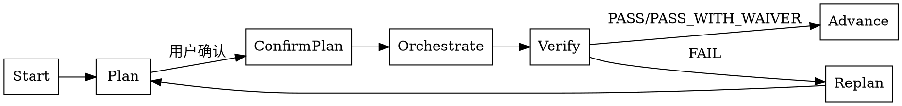

# Skill: plan

生成当前阶段的执行计划，评估风险与下一步骤。

## 触发条件
- 阶段: 任意（编排层 Skill）
- Command: `/spec-first:plan`

## plan 与 orchestrate 职责边界（P1-18）

| 能力 | plan | orchestrate |
|------|------|-------------|
| 目标 | 产出计划与风险评估 | 执行编排与阶段推进 |
| 输出 | 下一步、风险、资源、阻塞建议 | 调度序列、执行结果、推进决策 |
| 是否写产物 | 写 `findings.md`（计划摘要） | 写 `findings.md`（执行证据） |
| 是否推进阶段 | 否 | 是（在 verify 通过后） |

## 决策流程图（P1-18）

## Plan Mode 协同（P1-08）

- plan 产出必须映射到 `findings.md` 的固定字段：
  - `目标阶段`
  - `下一步动作`
  - `阻塞项`
  - `风险等级`
  - `建议命令`
- 若进入执行阶段，orchestrate 必须引用最近一次 plan 摘要作为输入

## 执行阶段
- P0: 定位 Feature 上下文；存在多个 Feature 时列出供用户选择
- P1: 确认当前 Feature，加载阶段与状态
- P2: 生成执行计划（下一步骤、风险评估、资源分配）
- P3: 与用户确认计划
- P4: 将计划摘要写入 findings.md
- P5: 无副作用

## CLI 依赖
- `spec-first feature list`
- `spec-first feature switch <featureId>`
- `spec-first feature current`
- `spec-first stage current`
- `spec-first metrics health`
- `spec-first doctor`

## 输出路径
- `specs/{featureId}/findings.md`

## 确认策略
- 推荐: assisted（计划需人工审阅）

## 成功标准
- 执行计划已生成，包含下一步骤、风险评估、资源分配
- 已明确目标 featureId 与当前阶段
- 用户确认后计划已写入 `findings.md`
- 计划摘要字段可被 orchestrate 直接复用

## 编排规则
- 根据当前阶段调度对应 Skill
- 识别阻塞任务并建议解决方案
