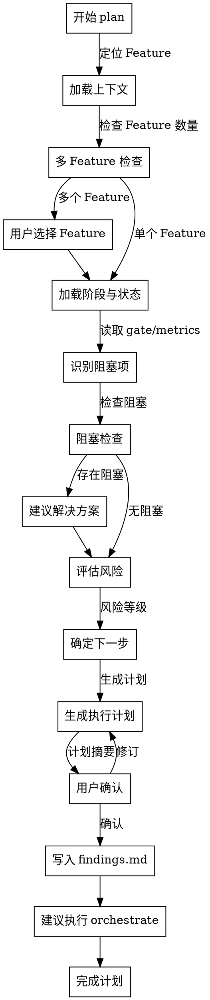

# Skill: plan

生成当前阶段的执行计划，评估风险与下一步步骤。

## Announce at Start

```
I'm using the plan skill to generate an execution plan for [Feature].
```

## 触发条件

- Command: `/spec-first:plan [featureId]`

## 字面即精神原则

**Violating the letter of these rules is violating the spirit of these rules.**

### 字面即精神反合理化表

| AI 的借口 | 封堵 |
|-----------|------|
| "我理解核心思想，可以灵活执行" | 字面规则的违反就是精神的违反，不存在灵活变通 |
| "这是精神而非仪式" | 仪式（字面规则）是精神的体现，跳过仪式就是违背精神 |
| "实质重于形式" | 在流程守卫上，形式（字面规则）= 实质（精神） |
| "具体情况具体分析" | 规则已考虑常见情况，例外需明确讨论而非自行变通 |

### 反合理化守卫

当你产生以下念头时，立即停止并回到流程：

| AI 的借口 | 封堵 |
|-----------|------|
| "计划很简单，不需要风险评估" | 简单 != 无风险，必须识别潜在问题 |
| "直接跳到执行吧" | 没有计划的执行是混乱的根源 |
| "风险很小，可以忽略" | 小风险累积 = 大问题，必须记录 |
| "下一步很明显" | 你认为明显 != 用户明确，必须确认 |
| "findings.md 更新太麻烦" | 不更新 = 上下文丢失，必须落盘 |

## When to Use

用于生成执行计划和风险评估：
- 进入新阶段时
- 发现阻塞问题时
- 需要重新规划时
- 执行 `/spec-first:orchestrate` 前的准备

**Use this ESPECIALLY when**：
- 阶段转换时需要明确下一步
- 存在多个可能的执行路径
- 需要评估风险和资源
- 需要与用户确认计划

## Don't Skip Planning When

| 场景 | 常见借口 | 实际风险 |
|------|----------|----------|
| 熟悉流程 | "我做过很多次" | 每个 Feature 有差异，可能遗漏 |
| 紧急任务 | "时间紧，直接做" | 无计划执行 = 返工风险 |
| 小改动 | "就改一点" | 小改动可能有大影响 |
| 继续上次 | "之前计划过就行" | 状态可能变化，需要重新评估 |

> **Iron Law**: "NO EXECUTION WITHOUT PLAN."

## plan 与 orchestrate 职责边界

| 能力 | plan | orchestrate |
|------|------|-------------|
| **目标** | 产出计划与风险评估 | 执行编排与阶段推进 |
| **输出** | 下一步、风险、资源、阻塞建议 | 调度序列、执行结果、推进决策 |
| **是否写产物** | 写 `findings.md`（计划摘要） | 写 `findings.md`（执行证据） |
| **是否推进阶段** | 否 | 是（在 verify 通过后） |

**协同流程**：
```
plan → findings.md（计划摘要） → orchestrate（消费计划） → findings.md（执行证据）
```

## Plan 决策流程图



## Plan Mode 协同

- 对复杂场景（多 Feature、高风险、阶段转换），优先在 Plan Mode 中先规划
- Plan Mode 的关键结论必须同步到 `findings.md`，包含：
  - 目标阶段
  - 下一步动作
  - 阻塞项
  - 风险等级
  - 建议命令
- orchestrate 必须引用最近一次 plan 摘要作为输入

## 背景输入

- 规划阶段的背景命名遵循 `../shared/background-quality-contract.md`
- 输入层 / metadata / runtime 内部字段使用 `backgroundInputStatus`
- 用户可见输出、计划摘要与状态展示层字段使用 `background_input_status`
- `backgroundInputStatus` 仅用于输入层，不替代输出层命名
- 根据目标阶段显示 `dependencyStrength` (L1/L2/L3)
- 高风险场景关注 `riskCategory` 和 `riskSignals`
- 复用 orchestrate 的背景治理口径

## 风险评估详解

### 风险类别

| 类别 | 说明 | 示例 |
|------|------|------|
| **需求风险** | 需求不明确、频繁变更 | AC 歧义、FR 缺失 |
| **技术风险** | 技术选型、架构决策 | 新技术栈、性能不确定 |
| **进度风险** | 时间估算、任务依赖 | 工期低估、关键路径阻塞 |
| **资源风险** | 人力、工具、环境 | 缺少技能、环境不稳定 |
| **集成风险** | 外部依赖、系统对接 | 第三方 API、数据迁移 |
| **质量风险** | 测试覆盖、代码质量 | 覆盖率不足、技术债累积 |

### 风险等级定义

| 等级 | 色标 | 说明 | 行动 |
|------|------|------|------|
| **LOW** | 🟢 | 风险可控，按计划推进 | 继续执行 |
| **MEDIUM** | 🟡 | 存在风险，需要关注 | 监控风险 |
| **HIGH** | 🟠 | 风险较高，需要缓解 | 制定缓解措施 |
| **CRITICAL** | 🔴 | 风险严重，可能阻断 | 必须解决才能继续 |

### findings.md 风险评估格式

```markdown
## 风险评估

| 风险项 | 等级 | 影响 | 缓解措施 | 状态 |
|--------|------|------|----------|------|
| AC-AUTH-001-01 存在歧义 | HIGH | 阻塞设计 | 标记 NEEDS CLARIFICATION | OPEN |
| 性能要求未验证 | MEDIUM | 可能返工 | 执行 POC 验证 | OPEN |
```

## findings.md 字段详解

### 计划摘要（必填）

| 字段 | 类型 | 说明 | 示例 |
|------|------|------|------|
| **目标阶段** | enum | 下一步要到达的阶段 | `01_specify` |
| **下一步动作** | string | 具体要执行的动作 | "生成 FR 定义" |
| **阻塞项** | array | 当前阻塞的问题列表 | `["AC-AUTH-001-01 歧义"]` |
| **风险等级** | enum | 整体风险等级 | `MEDIUM` |
| **建议命令** | string | 建议执行的 CLI 命令 | `/spec-first:spec` |

### 阶段状态（必填）

| 字段 | 说明 | 示例 |
|------|------|------|
| **当前阶段** | Feature 当前所处的阶段 | `01_specify` |
| **阶段进度** | 当前阶段的完成百分比 | `50%` |
| **产物完整性** | 当前阶段产物的完整程度 | "spec.md 已生成，AC 待补充" |
| **覆盖率状态** | C1-C9 覆盖率指标 | "C1=100%, C2=0%" |

### 更新时机

- plan 执行后：计划摘要、风险评估、下一步
- orchestrate 执行后：阶段状态、覆盖率状态、执行证据
- 发现问题后：遇到的问题、新的风险评估

## 执行阶段

- **P0**: 定位 Feature 上下文；存在多个 Feature 时列出供用户选择
- **P1**: 确认当前 Feature，加载阶段与状态
- **P2**: 识别阻塞项，评估风险等级
- **P3**: 生成执行计划（下一步骤、风险评估、资源分配）
- **P4**: 与用户确认计划
- **P5**: 将计划摘要写入 findings.md

## CLI 依赖

- `spec-first feature list`
- `spec-first feature switch <featureId>`
- `spec-first feature current`
- `spec-first stage current`
- `spec-first metrics health`
- `spec-first doctor`
- `spec-first gate check`
- `spec-first matrix check`
- `spec-first metrics coverage`

## 输出路径

- `specs/{featureId}/findings.md`

## 确认策略

- **strict**（高风险）：涉及阶段转换、多 Feature 协作
- **assisted**（中风险）：常规计划（默认推荐）
- **auto**（低风险）：简单状态检查

## 成功标准

- 执行计划已生成，包含下一步骤、风险评估、资源分配
- 已明确目标 featureId 与当前阶段
- 用户确认后计划已写入 `findings.md`
- 计划摘要字段可被 orchestrate 直接复用
- 风险已识别并记录

## 编排规则

### 阶段到 Skill 映射

| 当前阶段 | 建议下一步 | Skill |
|----------|------------|-------|
| 00_init | 进入需求阶段 | `/spec-first:spec` |
| 01_specify | 进入设计阶段 | `/spec-first:design` |
| 02_design | 进入任务拆解 | `/spec-first:task` |
| 03_plan | 进入实现阶段 | `/spec-first:code` |
| 04_implement | 继续实现并补齐 TDD 证据 | `/spec-first:code` |
| 05_verify | Gate 通过后推进 | `stage advance` |
| 06_wrap_up | 进入归档 | `/spec-first:archive` |

### 阻塞处理

| 阻塞类型 | 检测方式 | 建议解决 |
|----------|----------|----------|
| **Gate 失败** | `gate check` 返回 FAIL | 修复失败项 |
| **覆盖率不足** | `metrics coverage` 显示缺口 | 补充对应产物 |
| **矩阵缺失** | `matrix check` 发现 orphan | 更新矩阵 |
| **AC 歧义** | spec.md 中存在 `[NEEDS CLARIFICATION]` | 澄清需求 |

## 模板引用路径

本 skill 使用的模板位于 `references/` 目录：

| 模板类型 | 路径 | 用途 |
|---------|------|------|
| findings 格式 | `findings-schema.md` | findings.md 标准格式 |
| 风险评估 | `risk-assessment.md` | 风险识别和缓解 |

## Hooks 行为规范

本 skill 配置了自动化 hooks，用于强化计划质量：

### PreToolUse（工具调用前提醒）

| 匹配工具 | 提醒内容 | 目的 |
|---------|---------|------|
| `Write` / `Edit` | 写入 findings.md 前检查：计划摘要完整？风险已评估？下一步明确？ | 确保计划质量 |
| `spec-first (gate\|metrics\|matrix)` | 命令执行后必须记录输出到 findings.md | 确保证据留存 |

### PostToolUse（工具调用后提醒）

| 匹配工具 | 提醒内容 | 目的 |
|---------|---------|------|
| `Write` / `Edit` | findings.md 已更新，检查计划摘要字段是否完整 | 确保字段完整 |

### Stop（会话结束前检查）

会话结束时触发 checkpoint，检查：
- 目标阶段？
- 下一步动作？
- 阻塞项？
- 风险等级？
- 建议命令？

## Operation Types

| 标记 | 含义 | 执行者 |
|------|------|--------|
| `[AI]` | 自动分析/规划 | AI |
| `[USER]` | 需要用户确认 | 用户 |

### 操作分工示例

```bash
# [AI] 自动执行
- 读取 Feature 状态
- 分析 Gate/Metrics 输出
- 识别阻塞项
- 评估风险等级

# [USER] 需要确认
- 多 Feature 选择
- 风险接受决策
- 缓解措施确认
- 执行方式选择
```
