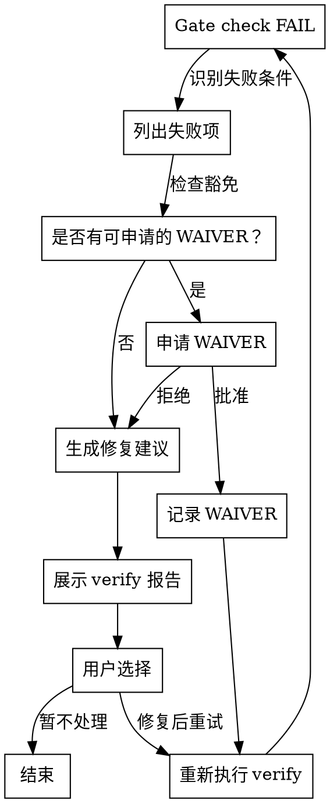
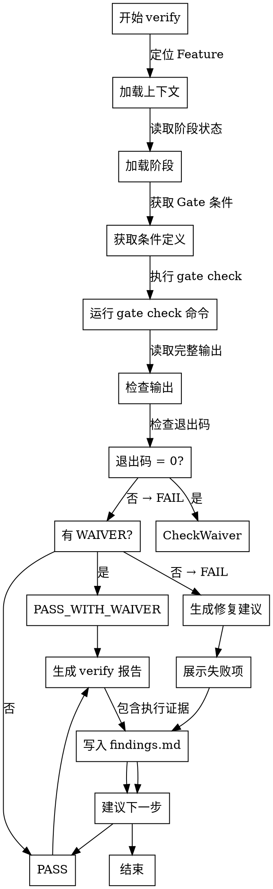

# Skill: verify

执行阶段验收校验，评估 Gate 条件与文档健康缺口。

## Announce at Start

```
I'm using the verify skill to validate [Feature] stage completion.
```

## 字面即精神原则

**Violating the letter of these rules is violating the spirit of these rules.**

### 字面即精神反合理化表

| AI 的借口 | 封堵 |
|-----------|------|
| "我理解核心思想，可以灵活执行" | 字面规则的违反就是精神的违反，不存在灵活变通 |
| "这是精神而非仪式" | 仪式（字面规则）是精神的体现，跳过仪式就是违背精神 |
| "实质重于形式" | 在流程守卫上，形式（字面规则）= 实质（精神） |
| "具体情况具体分析" | 规则已考虑常见情况，例外需明确讨论而非自行变通 |

### 反合理化守卫

当你产生以下念头时，立即停止并回到流程：

| AI 的借口 | 封堵 |
|-----------|------|
| "检查过了，应该没问题" | 你认为没问题 != 有证据，必须执行验证命令 |
| "上一轮通过了" | 历史通过 != 当前通过，状态可能已变化 |
| "时间紧，跳过验证吧" | 跳过验证 = 债务累积，后续代价更大 |
| "小改动不需要验证" | 小改动可能有大影响，必须验证 |
| "输出太长了，只看结果" | 必须完整读取输出，检查失败项 |

## When to Use

用于执行阶段验收校验：
- 完成阶段交付物后
- 准备推进到下一阶段前
- 执行 `/spec-first:orchestrate` 时的检查
- 发布前的最终检查

**Use this ESPECIALLY when**：
- 需要确认阶段是否可以推进
- 需要识别文档健康缺口
- 需要获取可执行的修复建议
- 需要生成验证报告

## 工具选择策略

- CLI / gate / metrics / docs links 校验：
  - 优先使用 `spec-first` 命令
- 浏览器交互验收与页面验证：
  - 宿主支持时优先 `playwright-mcp`
- 浏览器工具不可用时：
  - 退回手工验证模板，并把步骤、结果、失败点写入 findings

## verify-view 背景输入

- 主背景输入：`verify-view`
- 必查字段：`critical_flows`、`validation_focus`、`recommended_checks`、`validation_hooks`、`release_blockers`
- 高风险验证场景必须优先核对 `critical_flows` 与 pre-release-verification 相关阻断项

## Don't Skip Verification When

| 场景 | 常见借口 | 实际风险 |
|------|----------|----------|
| 小改动 | "就改了几行" | 可能影响其他功能 |
| 时间紧 | "先上线再说" | 技术债累积，后续返工 |
| 之前通过 | "上次验证过了" | 代码已变更，需要重新验证 |
| 自信满满 | "我检查过了" | 主观检查 != 客观验证 |

> **Iron Law**: "NO STAGE ADVANCE WITHOUT VERIFICATION."

## 证据铁律

铁律：声称任何阶段通过前，必须提供新鲜的验证证据。

### 五步 Gate Function

1. **IDENTIFY** — 什么命令能证明这个声明？
2. **RUN** — 执行完整命令（新鲜的、完整的）
3. **READ** — 完整输出，检查退出码，计数失败项
4. **VERIFY** — 输出是否确认了声明？
5. **ONLY THEN** — 发出声明

### 禁止使用的表述

- ❌ "should pass" / "looks good" / "已完成" / "我检查过了"
- ❌ "应该没问题" / "上一轮通过了" / "差不多了"
- ❌ "应该可以推进" / "我觉得够了"

### 正确的表述方式

- ✅ "Gate check 返回 PASS，退出码 0"
- ✅ "C2=100%, C3=100%, 所有条件满足"
- ✅ "执行命令 `spec-first gate check {featureId}` 输出显示..."

## 文件系统即外部记忆

- 每连续 2 个关键动作（执行验证命令、读取输出、形成结论）后，必须更新 `findings.md`
- 每条通过/失败结论必须落盘到文件证据，不得仅停留在会话上下文
- 中断前至少写入：已执行命令、退出码、阻塞项和下一步验证命令

## Common Failures 表

| 声明 | 需要的证据 | 不充分的证据 |
|------|-----------|-------------|
| Gate 通过 | `spec-first gate check <featureId>` 输出: `PASS` 或 `PASS_WITH_WAIVER` | "我检查过了"、"应该没问题" |
| 文档关联达标 | `spec-first docs links validate <featureId>` + 当前阶段 `gate check` 判定通过 | "所有文档都已关联" |
| 阶段可推进 | `gate check` 退出码 0（`PASS/PASS_WITH_WAIVER`）+ `docs links validate` 满足当前阶段策略 | "上一轮通过了" |
| TASK 完成 | 测试命令输出 + review 通过 | "代码写完了" |
| Feature 可归档 | `spec-first gate check <featureId>` + `spec-first docs links validate <featureId>` + 归档产物证据 | "所有 TASK 都标记完成了" |

## TDD 与文档健康的边界

verify 必须区分：

- 门禁信号：C4 / C5 / C6 等结果性指标
- TDD 证据：`[TDD-RED] / [TDD-WAIVER] / [TDD-GREEN]` 等过程性证据

禁止把“门禁达标”表述成“已经遵守 TDD”。
如果 `findings.md` 显示存在 TDD 缺口，应在 verify 结论中单列风险，即使 Gate 结果仍然通过。

## Gate 状态

| 状态 | 说明 | 退出码 | 可推进阶段 | 下一步 |
|------|------|--------|-----------|--------|
| **PASS** | 所有条件通过 | 0 | ✅ 是 | 执行 stage advance |
| **PASS_WITH_WAIVER** | 有条件通过 | 0 | ✅ 是（需记录豁免） | 记录 WAIVER 后 advance |
| **FAIL** | 存在失败条件 | 1 | ❌ 否 | 修复失败项后重试 |

## 各阶段 Gate 条件

### 00_init

| 条件 ID | 描述 | 阈值 |
|---------|------|------|
| G-INIT-01 | Feature directory exists | ✅/❌ |
| G-INIT-02 | Mode/Size/Platforms confirmed | ✅/❌ |
| G-INIT-03 | stage-state.json exists | ✅/❌ |

### 01_specify

| 条件 ID | 描述 | 阈值 |
|---------|------|------|
| G-SPEC-01 | spec.md exists | ✅/❌ |
| G-SPEC-02 | FR/NFR IDs assigned | count > 0 |
| G-SPEC-03 | Spec quality score (C10) | ≥ 80% |

### 02_design

| 条件 ID | 描述 | 阈值 |
|---------|------|------|
| G-DESIGN-01 | design.md exists | ✅/❌ |
| G-DESIGN-02 | API contract completeness (C2) | = 100% |
| G-DESIGN-03 | Constitution compliance (C11) | = 100% |

### 03_plan

| 条件 ID | 描述 | 阈值 |
|---------|------|------|
| G-PLAN-01 | Task breakdown completeness (C3) | = 100% |
| G-PLAN-02 | Task compliance (C8) | = 100% |
| G-PLAN-03 | Analyze CRITICAL findings | = 0 |

### 04_implement

| 条件 ID | 描述 | 阈值 |
|---------|------|------|
| G-IMPL-01 | Unit test completeness (C4) | 读取 gate.thresholds.G-IMPL-01 |
| G-IMPL-02 | PR compliance (C7) | = 100% |

### 05_verify

| 条件 ID | 描述 | 阈值 |
|---------|------|------|
| G-VERIFY-01 | Test signal for FR (C4) | 读取 gate.thresholds.G-VERIFY-01 |
| G-VERIFY-02 | Test signal for AC (C5) | ≥ 90% (M/L), 60% (S) |
| G-VERIFY-03 | Verification evidence completeness (C9) | = 100% |

> `G-IMPL-01` / `G-VERIFY-01` 的阈值真理源为 `.spec-first/meta/config.yaml` 与 `.spec-first/local/config.yaml` 中的 `gate.thresholds`。执行 verify 时读取 `.spec-first/meta/config.yaml` / `.spec-first/local/config.yaml`，再解释 Gate 结果。

### 06_wrap_up

| 条件 ID | 描述 | 阈值 |
|---------|------|------|
| G-WRAP-01 | Implementation completeness (C6) | = 100% |
| G-WRAP-02 | All document links resolved | ✅/❌ |

### 07_release

| 条件 ID | 描述 | 阈值 |
|---------|------|------|
| G-REL-01 | Smoke test report exists | ✅/❌ |
| G-REL-02 | Release note exists | ✅/❌ |

## WAIVER（豁免）机制

### 什么是 WAIVER

WAIVER（豁免）是一种有条件的通过状态。当某个 Gate 条件失败，但有充分的理由可以暂时跳过时，可以申请豁免。

### WAIVER 适用场景

| 场景 | 示例 | 审批要求 |
|------|------|----------|
| **技术限制** | 第三方服务暂不可用 | 技术负责人批准 |
| **时间压力** | 紧急修复，暂时跳过非关键条件 | 产品负责人批准 |
| **渐进式完成** | 大型 Feature 分阶段交付 | 分阶段计划批准 |
| **已知风险** | 风险已识别且可控 | 风险评估文档 |

### WAIVER 记录格式

```markdown
## WAIVER 记录

| 条件 ID | 豁免理由 | 批准人 | 有效期 | 状态 |
|---------|----------|--------|--------|------|
| G-SPEC-03 | C10 暂时无法达到，分阶段提升 | Tech Lead | 2026-03-31 | ACTIVE |
```

## 失败处理流程



## 门禁信号详解

### C1-C9 指标概览

| 指标 | 名称 | 含义 | 阈值示例 |
|------|------|------|----------|
| **C1** | Spec Completeness | 需求完整性 | 01_specify: >0% |
| **C2** | API Contract Completeness | API 设计完整性 | 02_design: 100% |
| **C3** | Task Breakdown Completeness | 任务拆解完整性 | 03_plan: 100% |
| **C4** | FR Test Signal | 测试对 FR 的验证信号 | 05_verify: 100% |
| **C5** | AC Test Signal | 测试对 AC 的验证信号 | 05_verify: ≥90% |
| **C6** | Implementation Completeness | 实现完整性 | 06_wrap_up: 100% |
| **C7** | PR Compliance | PR 合规率 | 04_implement: 100% |
| **C8** | Task Compliance | 任务合规率 | 03_plan+: 100% |
| **C9** | Verification Evidence Completeness | 验证证据完整性 | 05_verify: 100% |

### 指标修复命令

| 失败指标 | 修复命令 |
|---------|----------|
| C1 < 阈值 | `/spec-first:spec` |
| C2 < 阈值 | `/spec-first:design` |
| C3 < 阈值 | `/spec-first:task` |
| C4 < 阈值 | 回到 `task/code` 补齐测试设计与 TDD 证据 |
| C5 < 阈值 | 回到 `task/code` 补齐测试设计与 TDD 证据 |
| C6 < 阈值 | 继续实现 TASK |
| C7 < 阈值 | 修复 PR |
| C8 < 阈值 | 修正 TASK 字段 |
| C9 < 阈值 | 修正 TC 字段 |

## Verify 决策流程图



## 量化通过条件

- **Gate 通过**：`spec-first gate check <featureId>` 退出码为 0，且状态为 `PASS` 或 `PASS_WITH_WAIVER`
- **阶段可推进**：`gate check` 通过；`docs links validate` 按阶段策略执行
- **门禁可接受**：以 `gate check` 对当前阶段的阈值判定为准
- **结论可宣告**：以上证据均为本次会话新鲜执行结果（非历史缓存）

## 判定证据链要求

- 失败条目必须映射到具体对象（FR、文档章节、任务、测试证据）
- 每个失败条目必须附带至少 1 条可执行修复建议

## 触发条件

- **阶段**：任意（编排层 Skill）
- **Command**：`/spec-first:verify`


## Feature 定位规则

### 优先级

1. **显式参数**: 用户提供 featureId 参数时直接使用
2. **自动定位**: 读取 `.spec-first/current` 获取当前激活 Feature
3. **交互式**: 列出可用 Feature 供用户选择

### 错误处理

- `.spec-first/current` 不存在或为空 → 降级到交互式
- 指定 Feature 的阶段不匹配 → 报错并终止

## 三层检查体系（P1-LAYER）

### Layer 1: 单层检查（Single-Layer）

- 目标：对单层产物做局部质量检查（SOLID/安全/性能/测试）
- 推荐入口：`/spec-first:review --layer single`

### Layer 2: 跨层检查（Cross-Layer）

- 目标：核查跨层数据流、依赖路径、同层一致性与批量修改完整性
- 推荐入口：`/spec-first:review --layer cross`

### Layer 3: 完成检查（Completion）

- 目标：阶段推进前统一验收（gate check + docs links validate + 文档健康判定）
- 推荐入口：`/spec-first:verify --layer completion`

> 说明：当前 runtime 仅开放 verify 的 completion 层；single/cross 由 review 承载。

## Layer 参数约定

- 支持：`/spec-first:verify --layer completion`
- 默认：未传 `--layer` 时按 `completion` 执行
- 限制：本期仅允许 `completion`；其余 layer 值由 runtime 参数校验直接拒绝

## 执行阶段

- **P0**: 定位 Feature，加载当前阶段
- **P1**: 加载 `verify-view`、文档关联、文档健康指标、Gate 条件
- **P2**: 执行 `gate check`、`docs links validate`、`metrics report`，获取验证结果
- **P3**: 生成校验报告（Gate 评估、文档关联完整性、文档健康缺口、verify-view 重点、修复建议）
- **P4**: 将校验结果写入 findings.md
- **P4.5**: 如发现 TDD 过程缺口，单列写入 findings.md，避免被门禁信号结论掩盖
- **P5**: 若所有条件满足，建议执行 stage advance

## CLI 依赖

- `spec-first gate check`
- `spec-first docs links validate`
- `spec-first metrics report`

## 输出路径

- `specs/{featureId}/findings.md`

## 确认策略

- **auto**（默认）：只读校验，不需要用户确认

## 成功标准

- 校验报告已生成，包含 Gate 评估、文档关联完整性、文档健康缺口
- 校验结果已写入 `findings.md`
- 如存在 TDD 缺口，已与门禁信号问题分开描述
- 声称通过时必须附带本次执行命令输出与退出码
- 若所有条件满足，已建议执行 `stage advance`
- FAIL 时必须包含可执行的修复建议
- 已核对 `verify-view` 必查字段并纳入校验结论

## Verify 报告格式

### 报告结构

1. **执行摘要** — Feature、阶段、状态、退出码、执行时间
2. **Gate 条件检查** — PASS/WAIVER/FAIL 条目列表
3. **门禁信号** — C1-C9 当前值、阈值、状态
4. **失败条目详情** — 关联对象、修复建议
5. **建议下一步** — 基于结果的可执行建议
6. **执行证据** — 命令输出、退出码

### 报告示例

```markdown
# Verify Report: FSREQ-20260209-AUTH-001

## 执行摘要

| 字段 | 值 |
|------|-----|
| **Feature** | FSREQ-20260209-AUTH-001 |
| **阶段** | 01_specify |
| **Gate 状态** | PASS |
| **退出码** | 0 |

## Gate 条件检查

- [G-SPEC-01] spec.md exists ✅
- [G-SPEC-02] FR/NFR IDs assigned ✅ (FR count: 3)
- [G-SPEC-03] Spec quality score (C10) ✅ (C10=85%)

## 门禁信号

| 指标 | 当前值 | 阈值 | 状态 |
|------|--------|------|------|
| C1 (Spec Completeness) | 100% | >0% | ✅ |
| C10 (Spec Quality) | 85% | ≥80% | ✅ |

## 建议下一步

Gate 已通过，可以推进到下一阶段。
建议执行: `spec-first stage advance`
```

## 模板引用路径

本 skill 使用的模板位于 `references/` 目录：

| 模板类型 | 路径 | 用途 |
|---------|------|------|
| Gate 条件 | `gate-conditions.md` | 各阶段 Gate 条件定义 |
| 文档指标 | `coverage-metrics.md` | D1-D5 文档健康说明 |
| 报告模板 | `verify-report-template.md` | verify 报告格式 |

## Hooks 行为规范

本 skill 配置了自动化 hooks，用于强化验证质量：

### PreToolUse（工具调用前提醒）

| 匹配工具 | 提醒内容 | 目的 |
|---------|---------|------|
| `spec-first (gate\|metrics\|docs)` | 执行验证命令后必须完整记录输出到 findings.md | 确保证据留存 |
| `spec-first (gate\|metrics\|docs)` | 五步 Gate Function: IDENTIFY → RUN → READ → VERIFY → ONLY THEN | 强化铁律 |
| `Write` / `Edit` | 写入校验结果前检查：命令输出完整？退出码正确？失败项有修复建议？ | 确保报告质量 |

### PostToolUse（工具调用后提醒）

| 匹配工具 | 提醒内容 | 目的 |
|---------|---------|------|
| `Write` / `Edit` | verify 报告已更新，检查是否包含执行证据和修复建议 | 确保报告完整 |

### Stop（会话结束前检查）

会话结束时触发 checkpoint，检查：
- Gate 命令执行？
- 输出记录？
- 退出码验证？
- 失败项修复建议？

## 背景输入
- 背景质量字段与枚举遵循 `../shared/background-quality-contract.md`
- 优先读取 `verify-view`
- 核对 `critical_flows`、`validation_focus`、`recommended_checks`、`validation_hooks`、`release_blockers`
- 高风险验证 / 上线前验证属于 `pre-release-verification` 场景
- 高风险验证可提升背景依赖强度，并显式声明 `background_input_status`
