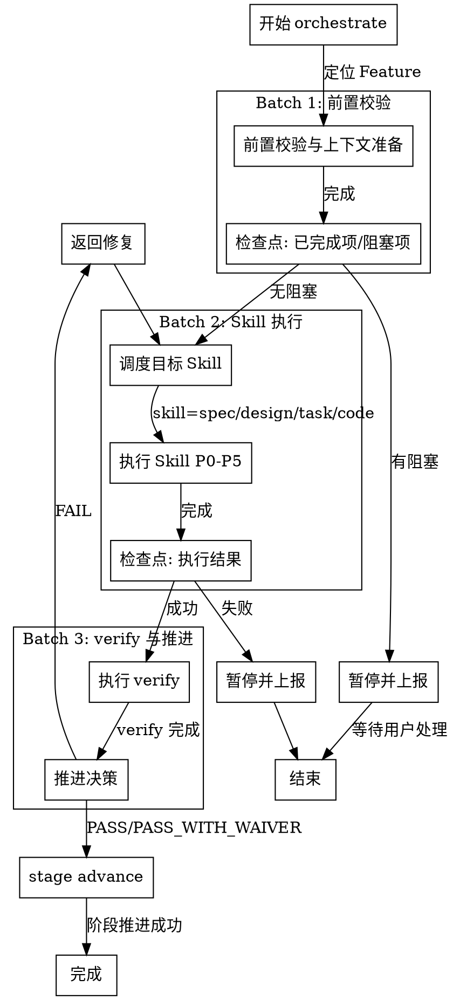

# Skill: orchestrate

编排调度器，驱动 plan -> skill -> verify -> advance 全流程。

## 触发条件
- 阶段: 任意（主编排 Skill）
- Command: `/spec-first:orchestrate`

## 参数模式
- `/spec-first:orchestrate`：默认只做协调与建议，不自动推进阶段
- `/spec-first:orchestrate --auto`：运行 todo auto-loop，并在批次结束后进入统一决策层
- `/spec-first:orchestrate --auto --resume`：基于最近 checkpoint 恢复 auto-loop
- `/spec-first:orchestrate --auto-advance`：仅当决策层返回 `READY_TO_ADVANCE / AUTO_ADVANCE` 时才执行 `stage advance`
- 未启用 `--auto-advance` 时，即使满足推进条件也只输出建议，不自动写入阶段状态

## Feature 定位规则

### 优先级

1. **显式参数**: 用户提供 featureId 参数时直接使用
2. **自动定位**: 读取 `.spec-first/current` 获取当前激活 Feature
3. **交互式**: 列出可用 Feature 供用户选择

### 错误处理

- `.spec-first/current` 不存在或为空 → 降级到交互式
- 指定 Feature 不存在 → 报错并终止

## 文件系统即外部记忆（统一约束）

- 每完成 2 个关键动作（批次执行、检查点判定、阻塞处置）后，必须更新 `findings.md`。
- 每个批次结束必须落盘：已完成项、阻塞项、下一批入口条件。
- 中断前至少写入：当前批次、未完成 TASK、恢复入口命令。

## 编排流程决策图（Superpowers P1-2）

## 执行阶段
- P0: 定位 Feature（优先读取 `.spec-first/current`，无则交互式提示），加载当前阶段与状态
- P1: 加载 stage-state、覆盖率、Gate 历史、任务计划
- P2: 生成编排计划：plan -> skill 执行 -> verify -> stage advance
- P3: 与用户确认编排序列
- P4: 按序执行调度的子 Skill
- P5: Gate 通过后推进阶段

## 证据铁律（阶段推进）

在声明“阶段可推进”前，必须遵循 verify 的五步证据铁律：
- 先执行 `spec-first gate check <featureId>` 与必要的 `docs links validate / metrics report` 命令
- 明确读取并报告退出码
- 仅当证据为本次会话新鲜执行结果时，才允许进入 `stage advance`

## 上下文裁剪规则（Fresh Context Per Task）

为每个 TASK 启动全新的 subagent 时，只提供：
1. 当前 TASK 全文（从 `task_plan.md` 提取）
2. 仅与当前 TASK traces 关联的 FR/NFR
3. 必要的设计上下文（相关 DS/API）

不传递：
- 前一个 TASK 的完整执行日志
- 其他 TASK 的调试信息
- 无关的 spec/design 章节
- 已完成 TASK 的代码 diff 与中间产物

Context Pack control：每个 TASK 的上下文包建议控制在 2KB 以内。

## `[P]` 并行语义

- `[P]` 表示任务在依赖满足时可并行调度
- `[P]` 是调度语义，不依赖 `orchestrate --auto`
- 即使并行调度，每个 TASK 仍需独立证据链与独立验收

## Todo 续航状态机（P1-10）

TASK 执行由 `todo-runner` 驱动，状态流转如下：

- `pending` → `in_progress`：依赖全部满足时自动拾取
- `in_progress` → `done`：TASK 验收通过（`complete/verified` 作为 legacy alias 在读取时归一）
- `in_progress` → `blocked`：遇到阻塞，暂停并上报
- 中断恢复：重启后优先恢复 `in_progress` 项，再按依赖拓扑拾取 `pending` 项

终止条件：
- 所有 TASK 达到 `done` → 正常结束（legacy `complete/verified` 会先归一到 `done`）
- 达到 `max_iterations`（来自 `config.yaml` 的 `runtime.max_iterations`）→ 自动 halt 并输出未完成摘要
- 持久化文件：`specs/{featureId}/todo-state.json`，支持跨会话恢复

## 批量执行与检查点（P1-13）

- 编排必须按批次执行，不允许无限串行推进：
  - Batch 1：前置校验与上下文准备
  - Batch 2：目标阶段 Skill 执行
  - Batch 3：verify 与推进决策
- 每个批次结束必须输出检查点：
  - 已完成项
  - 阻塞项
  - 下一批入口条件
- 任一批次出现阻塞时，必须暂停并上报，不得“带病推进”

### 编排反合理化守卫

| AI 的借口 | 封堵 |
|-----------|------|
| \"先把后续批次跑完再统一看\" | 无检查点就不可审计，必须批次收口后再继续 |
| \"这个阻塞先忽略，后面一起修\" | 阻塞项不清零不得推进批次 |
| \"只要大方向没问题就能 advance\" | `stage advance` 只能基于证据铁律，不接受方向性判断 |

## CLI 依赖
- `spec-first stage current`
- `spec-first stage advance`
- `spec-first gate check`
- `spec-first metrics health`

## 输出路径
- `specs/{featureId}/findings.md`

## 确认策略
- 推荐: strict（编排驱动阶段转换）

## 成功标准
- 编排计划已生成并经用户确认
- 所有调度的子 Skill 执行成功
- `verify` 校验通过且证据链完整
- `stage advance` 已执行，阶段已推进

## 编排规则
- 主调度器：根据当前阶段分派对应 Skill
- 序列：plan -> (spec|design|task|code|archive) -> verify -> advance

### 调度协议

Stage -> Skill 映射（P4 按此表调度）：

| 当前阶段 | 调度 Skill | 说明 |
|---------|-----------|------|
| 00_init | 无（init 已完成） | 直接 verify -> advance |
| 01_specify | 03-spec | 需求定义 |
| 02_design | 04-design | 技术设计（05-research 按需） |
| 03_plan | 06-task | 任务拆解 |
| 04_implement | 07-code | 代码实现（08-review 按需） |
| 05_verify | 12-verify | 阶段验收 |
| 06_wrap_up | 10-archive | 归档总结 |

### 07_release / 08_done 责任说明

- `07_release` 与 `08_done` 不再通过额外 skill 目录调度
- 这两个阶段由现有 runtime route 承接，命令入口分别是 `golive` 与 `done`
- orchestrate 在文档层必须显式承认这条责任链，避免制造“主流程只到 archive”的假象
- 因此 `06_wrap_up` 之后的标准路径是：`archive -> golive -> done`

### 子 Skill 失败处理

- 子 Skill P0 失败（阶段不匹配）-> orchestrate 终止，报告阶段冲突
- 子 Skill P3 用户拒绝 -> orchestrate 暂停，等待用户决定是否继续
- 子 Skill P4/P5 失败 -> orchestrate 终止，不执行 stage advance，报告失败 Skill 和错误
- 任何子 Skill 失败后，已完成的子 Skill 产出物保留不回滚

### 参数传递

- 所有子 Skill 继承 orchestrate 的 featureId
- 子 Skill 的 confirm_policy 保持各自定义（不被 orchestrate 覆盖）

## 背景治理口径
- orchestrate 治理信号命名遵循 `../shared/orchestration-governance-contract.md`
- 展示层 / user-visible guidance 字段统一使用 `background_status`、`dependency_strength`、`risk_category`、`risk_signals`、`recommended_action`
- orchestrate 内部 runtime 结构允许继续使用 camelCase，但输出给用户时必须投影为展示层 snake_case 字段
- 背景状态：`full / degraded / blind`
- 依赖强度：`L1 / L2 / L3`
- `L3` 由高依赖阶段（`02_design / 04_implement / 05_verify`）叠加 `hard-gate` 高风险信号推导得出
- 高风险信号复用运行时评估结果，例如：并行任务标记、跨目录变更、核心模块变更
- 检测到 `L3` 时，还需给出阶段化 `risk_category`：`formal-design-review / high-risk-implementation / pre-release-verification`
- `blind` 状态下必须显式警告，并优先建议补跑 `/spec-first:first`
- `degraded` + `L2/L3` 时，应提示风险评估，不得静默推进
- 若检测到高风险信号，运行时上下文应额外输出 `risk_category` 与 `risk_signals`
- orchestrate 负责投影已有治理信号，不在展示层发明新的风险语义
