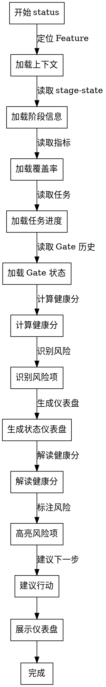

# Skill: status

展示 Feature 状态仪表盘（阶段、覆盖率、健康分、任务进度）。

## Announce at Start

```
I'm using the status skill to show the current state of [Feature].
```

## When to Use

用于查看 Feature 当前状态：
- 查看项目进度
- 识别潜在风险
- 准备进度汇报
- 决策是否推进阶段

**Use this ESPECIALLY when**：
- 需要快速了解 Feature 整体状况
- 需要识别阻塞项和风险
- 需要向团队汇报进度
- 需要决策下一步行动

## Don't Skip Status Check When

| 场景 | 常见借口 | 实际风险 |
|------|----------|----------|
| 阶段推进前 | "应该没问题，直接推进吧" | 未识别风险，推进后可能回退 |
| 长时间开发后 | "一直在做，应该快完成了" | 缺少客观进度评估 |
| 多人协作 | "大家都知道进度" | 信息不对称，协作效率低 |
| 汇报前 | "凭印象说就行" | 数据不准确，影响决策 |

> **Iron Law**: "NO STAGE ADVANCE WITHOUT STATUS CHECK."

## 状态仪表盘模板

### 标准格式

```markdown
# Feature Status Dashboard

## 📊 基本信息

| 字段 | 值 |
|------|-----|
| **Feature ID** | {featureId} |
| **标题** | {title} |
| **当前阶段** | {stage} |
| **模式** | {mode} |
| **规模** | {size} |
| **平台** | {platforms} |

---

## 🎯 阶段进度

```
00_init ✅ → 01_specify ✅ → 02_design ✅ → 03_plan 🔄 → 04_implement ⏸️ → ...
```

**当前阶段**: 03_plan (任务拆解)
**阶段状态**: in_progress
**停留时间**: 2 天

---

## 📈 覆盖率指标

| 指标 | 当前值 | 阈值 | 状态 | 说明 |
|------|--------|------|------|------|
| C1 (Spec Coverage) | 100% | >0% | ✅ | 需求已定义 |
| C2 (API Coverage) | 100% | 100% | ✅ | 设计已完成 |
| C3 (Task Coverage) | 80% | 100% | ⚠️ | 部分 FR 缺少 TASK |
| C4 (Test Coverage FR) | 0% | ≥80% | ❌ | 测试用例未生成 |
| C5 (Test Coverage AC) | 0% | ≥90% | ❌ | AC 覆盖不足 |
| C6 (Implementation Coverage) | 0% | >0% | ❌ | 实现未开始 |

---

## 💯 健康分

**总分**: 72/100 (🟡 中等)

| 维度 | 得分 | 权重 | 说明 |
|------|------|------|------|
| 覆盖率完整性 | 60/100 | 40% | C3 未达标 |
| 质量门禁 | 80/100 | 30% | Gate 条件部分通过 |
| 任务进度 | 75/100 | 20% | 任务完成 75% |
| 风险控制 | 70/100 | 10% | 存在中等风险 |

---

## 📋 任务进度

| 状态 | 数量 | 占比 |
|------|------|------|
| ✅ complete | 6 | 60% |
| 🔄 in_progress | 2 | 20% |
| ⏸️ planned | 2 | 20% |
| 🚫 blocked | 0 | 0% |

**总任务数**: 10
**完成率**: 60%
**预计剩余**: 1.5 天

---

## ⚠️ 风险识别

### 🔴 高风险 (0)
无

### 🟡 中风险 (2)
1. **C3 覆盖率不足** — 部分 FR 缺少 TASK，影响实现完整性
   - 影响: 可能遗漏功能点
   - 建议: 补充 TASK 拆解

2. **测试用例未生成** — C4/C5 为 0，无法验证功能
   - 影响: 质量无保障
   - 建议: 执行 `/spec-first:test` 生成测试用例

### 🟢 低风险 (1)
1. **任务进度略慢** — 预计剩余 1.5 天，可能延期 0.5 天
   - 影响: 轻微延期
   - 建议: 评估是否需要资源支持

---

## 🎬 建议下一步

基于当前状态，建议：

1. **补充 TASK 拆解** — 执行 `/spec-first:task` 完成 C3 覆盖
2. **生成测试用例** — 执行 `/spec-first:test` 提升 C4/C5
3. **继续实现任务** — 完成剩余 2 个 in_progress 任务

**可推进阶段？** ❌ 否（C3 未达标）
```

## 健康分解读

### 分数段定义

| 分数段 | 等级 | 图标 | 说明 | 行动建议 |
|--------|------|------|------|----------|
| 90-100 | 优秀 | 🟢 | 状态良好，可推进 | 继续保持 |
| 70-89 | 良好 | 🟡 | 存在改进空间 | 关注风险项 |
| 50-69 | 中等 | 🟠 | 存在明显问题 | 优先修复 |
| 0-49 | 较差 | 🔴 | 严重问题 | 立即处理 |

### 健康分计算

```
健康分 = 覆盖率完整性 × 40% + 质量门禁 × 30% + 任务进度 × 20% + 风险控制 × 10%
```

#### 覆盖率完整性（40%）

```
覆盖率完整性 = (C1 + C2 + C3 + C4 + C5 + C6) / 6
```

- C1-C6 按阈值达标情况计分
- 达标 = 100 分，未达标 = 0 分

#### 质量门禁（30%）

```
质量门禁 = (通过条件数 / 总条件数) × 100
```

- 基于当前阶段的 Gate 条件
- PASS = 100 分，PASS_WITH_WAIVER = 80 分，FAIL = 0 分

#### 任务进度（20%）

```
任务进度 = (完成任务数 / 总任务数) × 100
```

- complete + verified 计入完成
- in_progress 计入 50%
- planned/blocked 不计入

#### 风险控制（10%）

```
风险控制 = 100 - (高风险数 × 30 + 中风险数 × 10 + 低风险数 × 5)
```

- 高风险 -30 分/个
- 中风险 -10 分/个
- 低风险 -5 分/个

## 风险指标

### 风险等级定义

| 等级 | 图标 | 触发条件 | 影响 | 响应时间 |
|------|------|----------|------|----------|
| 🔴 高风险 | Critical | 阻塞阶段推进、安全漏洞、数据丢失风险 | 严重 | 立即处理 |
| 🟡 中风险 | Warning | 覆盖率不足、质量问题、进度延期 | 中等 | 24h 内处理 |
| 🟢 低风险 | Info | 轻微延期、文档不完整 | 轻微 | 本周内处理 |

### 常见风险类型

| 风险类型 | 等级 | 检测条件 | 建议行动 |
|---------|------|----------|----------|
| **覆盖率不足** | 🟡 | C1-C6 任一指标 < 阈值 | 补充对应产物 |
| **Gate 失败** | 🔴 | Gate check 返回 FAIL | 修复失败条件 |
| **任务阻塞** | 🔴 | 存在 blocked 状态任务 | 解除阻塞 |
| **进度延期** | 🟡 | 实际进度 < 预期进度 20% | 评估资源 |
| **测试缺失** | 🟡 | C4/C5 = 0 | 生成测试用例 |
| **文档过期** | 🟢 | 文档更新时间 > 7 天 | 更新文档 |

## Status 决策流程图



## 触发条件

- **阶段**: 任意（不限阶段）
- **Command**: `/spec-first:status`

## 执行阶段

- **P0**: 定位当前 Feature
- **P1**: 加载 stage-state、指标、任务计划、Gate 历史
- **P2**: 计算健康分、识别风险
- **P3**: 生成状态仪表盘（阶段、覆盖率、健康分、任务、风险）
- **P4**: 解读健康分、标注风险、建议下一步
- **P5**: 向用户展示状态（无需确认）

## CLI 依赖

- `spec-first stage current`
- `spec-first metrics health`
- `spec-first metrics coverage`
- `spec-first feature current`
- `spec-first gate check`

## 输出路径

- 无（仅展示）

## 确认策略

- 推荐: auto（只读状态查询）

## 成功标准

- 状态仪表盘已展示（基本信息、阶段进度、覆盖率、健康分、任务进度、风险识别）
- 健康分已计算并解读
- 风险项已识别并分级
- 建议下一步已提供
- 可推进阶段判断已给出

## 模板引用路径

本 skill 使用的模板位于 `references/` 目录：

| 模板类型 | 路径 | 用途 |
|---------|------|------|
| 状态仪表盘模板 | `status-dashboard-template.md` | 标准展示格式 |
| 健康分指南 | `health-score-guide.md` | 健康分计算与解读 |
| 风险指标 | `risk-indicators.md` | 风险识别与分级 |

## Hooks 行为规范

本 skill 配置了自动化 hooks，用于强化状态查询质量：

### PreToolUse（工具调用前提醒）

| 匹配工具 | 提醒内容 | 目的 |
|---------|---------|------|
| 状态查询命令 | 执行状态查询命令前检查：Feature 已定位？命令参数正确？ | 确保查询准确 |

### PostToolUse（工具调用后提醒）

| 匹配工具 | 提醒内容 | 目的 |
|---------|---------|------|
| 状态查询命令 | 状态数据已获取，检查是否需要：解读健康分、标注风险项、建议下一步 | 确保输出完整 |

### Stop（会话结束前检查）

会话结束时触发 checkpoint，检查：
- 状态仪表盘完整？
- 健康分已解读？
- 风险项已标注？
- 下一步建议已提供？
