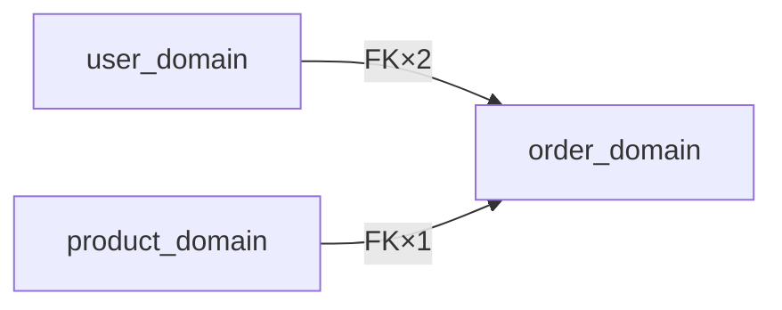

# Database Worker（四层索引）

> 本文件仅在 Phase 3 中 `fact-inventory.database[]` 提供了 `db_type=mysql` 的静态候选连接，且 `database-routing.json.selected_connections[]` 中至少存在一条显式选定 route 时执行。

## 产物按库规模自适应

| 规模 | 过滤后表数 | 必须产物 |
|---|---|---|
| 小型 | ≤ 30 | `database/database-index.md` + `database/data-flow.md` + `database/database-er.md` |
| 中型 | 31–100 | `database/database-index.md` + `database/data-flow.md` + `database/domains/<name>-domain.md × N` |
| 大型 | > 100 | 全四层：上述全部 + `database/semantic-catalog.md` |

---

## Step 1 — 连接前校验 + 连接与 schema 读取

### selected_route = mcp 预校验

`mcp__mysql-mcp-server__execute_query("SELECT 1")` probe：
- 成功 → `execute_query("SELECT DATABASE()")` 一致性校验：
  - **期望值来源**：Phase 1 database 探测时从 `.env` / `DATABASE_URL` / `config/database.yml` 中提取的 DB 名（若无则跳过比对）
  - **校验规则**：
    - 返回 NULL → 终止，写 `generation_errors[{ error: "mcp-no-database-selected: 连接成功但未选中数据库，请检查 MCP 连接配置" }]`，跳过 database worker
    - 返回 `information_schema` / `mysql` / `performance_schema` → 终止，写 generation_errors，跳过 database worker（系统库，不应导出）
    - 与期望 DB 名不匹配（且有期望值）→ 打印 ⚠️ 警告，**不终止**，继续使用当前连接的 DB（允许 MCP 默认 DB 与 .env 不同）
    - 其余 → 通过校验，继续 `list_tables`
- 失败（工具不可用/超时）→ 写 `generation_errors[{ extractor: "database_worker", error: "mcp-connection-failed", ... }]`，**跳过整个 database worker，继续 Phase 3 其他产物**

### selected_route = cli 预校验

先检查必要环境变量是否已设置：
```
if $DB_HOST 未设置 OR $DB_USER 未设置:
  写 generation_errors[{ extractor: "database_worker", error: "db-env-vars-missing: DB_HOST/DB_USER not set", ... }]
  跳过整个 database worker，继续 Phase 3 其他产物
```
环境变量均已设置 → `mysql -h $DB_HOST -u $DB_USER -p$DB_PASS --connect-timeout=10 -e "SHOW TABLES"` → `SHOW CREATE TABLE <t> × N`
命令失败（exit 非 0）→ 写 `generation_errors`，跳过 database worker

---

## Step 2 — R23 backup table filter

过滤后缀 `_bak/_backup/_old/_copy/_tmp/_temp/_deprecated/_archive`；前缀 `bak_/backup_/tmp_/temp_`；日期模式 `_20YYMMDD/_YYYY_MM/_YYYYMM`。

> **不使用 last_update 启发式**：`information_schema.tables.update_time` 对 InnoDB 表始终为 NULL（MySQL InnoDB 行为），基于此字段的 stale 检测从不触发，已删除该规则。命名模式过滤已覆盖绝大多数 backup 表场景。

在 `database-index.md` 的 auto 段中列出所有被过滤的表及原因（透明报告）。

## Step 2b — 读取增量基线（重跑时执行）

```
Read artifact-manifest.json → prev_table_hashes, prev_domain_assignments
如果文件不存在或字段为空 → 视为首次运行，所有表标记为 changed
```

---

## Step 3 — Per-table hash 计算与增量判定

```
对每张过滤后的表:
  current_hash = SHA256(SHOW CREATE TABLE <t> 的完整输出)
  if current_hash == prev_table_hashes[t]:
    status = unchanged   # auto 段跳过重写，manual 段不触碰
  else:
    status = changed     # auto 段重新生成
新表（prev 中不存在）: status = new

规模判定（按过滤后总表数）:
  ≤ 30  → 小型
  31–100 → 中型
  > 100  → 大型
```

---

## Step 4 — 域分配（稳定优先）

```
对每张表:
  if prev_domain_assignments[t] exists:
    domain = prev_domain_assignments[t]   # 复用，不重聚类
  else:
    domain = cluster(t)   # 仅对新表运行 FK 连通分量 + 命名前缀推断
```

实体类型推断（所有表）：
主数据（被多域 FK 引用）/ 事务（status + amount + created_at）/ 状态机（status enum + updated_at）/ 关系（纯 FK 对）/ 配置（key/value 模式）/ 审计（operator + created_at，无 updated_at）/ 缓存（expires_at/ttl）

---

## Step 5 — 文件写入（auto/manual 标记系统）

所有数据库文档使用统一的标记语义（命名空间：`spec-graph-bootstrap`）：
- `<!-- spec-graph-bootstrap:auto:* -->` 段：bootstrap 按需重写（hash 变化或新表时）
- `<!-- spec-graph-bootstrap:manual:* -->` 段：**bootstrap 永远不触碰**，团队自由编辑

### database-index.md 写入格式

```markdown
<!-- spec-graph-bootstrap:auto:start hash=<all-tables-combined-hash> -->
## 概览
- 总表数（过滤后）: N
- 业务域数: M
- 主要数据库类型: MySQL <version>

## 业务域清单
| 域 | 核心表（≤5 个） | 简述 | 详情 |
|---|---|---|---|
...

## 核心实体快查
| 表名 | 业务名 | 实体类型 | 所属域 |
|---|---|---|---|
...

## 跨域接口
| 源域 | 目标域 | 桥接字段 | 基数 |
|---|---|---|---|
...

## 业务术语速查
| 业务术语 | 映射表.字段 | 操作类型 |
|---|---|---|
...（从 data-flow.md 场景名 + entrypoints 路径 + 表名/列名推断，≤15 行）

## 域间依赖拓扑（仅中型/大型，2+ 域时生成）


## 被过滤表
| 表名 | 过滤原因 |
|---|---|
...（R23 backup table filter 结果）

## Live Query
> 生成时间: <ISO date> | 以下命令基于 bootstrap 时的连接配置，数据可能已过期

快速验证命令（selected_route=mcp 时）：
- 查表结构: `mcp__mysql-mcp-server__execute_query("SHOW CREATE TABLE <table_name>")`
- 查数据样本: `mcp__mysql-mcp-server__execute_query("SELECT * FROM <table_name> LIMIT 5")`

快速验证命令（selected_route=cli 时）：
- 查表结构: `mysql -h $DB_HOST -u $DB_USER -p$DB_PASS -e "SHOW CREATE TABLE <table_name>"`
- 查数据样本: `mysql -h $DB_HOST -u $DB_USER -p$DB_PASS -e "SELECT * FROM <table_name> LIMIT 5"`
<!-- spec-graph-bootstrap:auto:end -->

<!-- spec-graph-bootstrap:manual:start -->
<!-- ADR 引导：
### 业务背景
（项目的数据库使用背景，如：为什么选择 MySQL、历史迁移情况）

### 已知技术债
（如：某表缺少索引、某字段类型不合理、待迁移的遗留结构）

### 命名约定
（团队的表/字段命名规范，如：统一 snake_case、枚举值约定、软删除字段名）
-->
<!-- spec-graph-bootstrap:manual:end -->
```

`all-tables-combined-hash` 计算规则：
```
sorted_tables = 过滤后所有表名按字母升序排列
hash_input    = sorted_tables.map(t → table_hashes[t]).join("\n")
all-tables-combined-hash = SHA256(hash_input)
```
重跑规则：any-table-changed → 重写 auto 段（含业务术语速查、域间拓扑、Live Query 时间戳全部更新）；manual 段完整保留。

**业务术语速查写入规则**：
- 从 `data-flow.md` 场景标题提取动词（"下单"→写入，"查询"→读取，"审核"→状态变更）
- 从 `fact-inventory.entrypoints`（HTTP 类型）推断操作语义（POST→写入，GET→读取，PUT/PATCH→状态变更）
- 从表名/列名中文 COMMENT 或命名推断业务术语
- 仅保留核心业务术语（≤15 行）

**域间依赖拓扑写入规则**：
- 仅在域数 ≥ 2 时生成（中型/大型系统）
- Mermaid `graph LR`，节点=域名，边标注=该方向 FK 总数
- 域数=1 或小型单域系统不生成此段

**Live Query 段写入规则**：
- 根据 `database-routing.json.route_decisions[]` 中的显式 `selected_route` 选择命令模板（mcp → MCP 格式，cli → CLI 格式）
- 时间戳使用当前 ISO date，每次重跑 auto 段时自动更新
- CLI 模板只写变量名（$DB_HOST 等），不写值，符合凭据保护规则

### semantic-catalog.md 写入格式（大型）

```markdown
<!-- spec-graph-bootstrap:auto:start table=orders hash=sha256:abc123 -->
## orders
- **业务名**: 订单
- **实体类型**: 事务
- **所属域**: order_domain
- **核心字段**: `id`(PK), `user_id`(FK→users), `status`(enum), `total_amount`(decimal)
- **索引提示**: KEY idx_user_status (user_id, status); KEY idx_created (created_at)
- **核心约束**: `UNIQUE(order_no)`; `CHECK(total_amount >= 0)`; `DEFAULT(status='pending')`; `COMMENT '订单主表'`
- **关联**: `user_id` → `users.id`（下单用户）；`order_items.order_id` → `orders.id`（行项目）
- **业务说明**: 记录每笔订单的主体信息
<!-- spec-graph-bootstrap:auto:end -->

<!-- spec-graph-bootstrap:manual:start table=orders -->
<!-- ADR 引导：
### 字段命名不一致
（如：某字段实际含义与命名不符，历史原因记录）

### 废弃字段
（如：某字段已不再使用但未删除，原因和计划）

### 历史包袱
（如：表结构变迁历史、数据迁移遗留问题）
-->
<!-- spec-graph-bootstrap:manual:end -->
```
重跑规则：hash 未变 → 跳过该表的 auto 段；hash 变化 → 仅重写该表 auto 段；manual 段不变。

**核心约束写入规则（Schemonic 式精选）**：
- 来自 `SHOW CREATE TABLE` 输出
- 仅保留：`UNIQUE`（业务唯一性）、`CHECK`（值域限制）、有业务含义的 `DEFAULT`、有业务含义的 `COMMENT`
- 不包含：NOT NULL（过于普遍）、AUTO_INCREMENT（PK 标准）、普通 INDEX/KEY（已在索引提示中覆盖）、CURRENT_TIMESTAMP 等通用默认值

### data-flow.md 写入规则（人工优先模式，所有规模）

```
文件不存在：
  → 全量生成初稿，文件顶部附 generated-draft 标记

文件存在 + 含 <!-- spec-graph-bootstrap:generated-draft --> 标记：
  → 团队尚未确认，覆盖重新生成（保留 generated-draft 标记）

文件存在 + 不含 generated-draft 标记（团队已确认）：
  → 增量模式：
    基线对比：加载上次运行的 fact-inventory.json（若存在），提取上次 entrypoints 路径集合
    新增入口 = 本次 fact-inventory.entrypoints(HTTP/worker) - 上次路径集合
    对每个新增入口：仅追加（不修改已有内容），格式：
      ## [待确认：<scenario-name>]（spec-graph-bootstrap 新检测，请团队审核后删除此提示）
    若上次 fact-inventory.json 不存在：跳过追加，仅打印提示"无法确定增量基线，跳过本次追加"
```

初次生成文件顶部必须包含：
```markdown
<!-- spec-graph-bootstrap:generated-draft -->
> ⚠️ 此文件为 bootstrap 初稿，基于入口点推断生成，请团队补充业务细节并验证准确性。
> 确认完毕后，删除上方的 `<!-- spec-graph-bootstrap:generated-draft -->` 注释行（整行删除）——
> 删除该注释行后 bootstrap 不再覆盖，只追加新检测到的场景。
```
内容来源：`fact-inventory.entrypoints`（HTTP/worker 类型）→ 业务场景；`risk-signals`（high severity）→ 高风险路径风险表。覆盖 3–5 个核心场景，每个场景含：触发点 + 编号步骤 + 状态机图（有 status enum 的核心事务表）。

每个场景的可选 sequenceDiagram（时序交互图）：
```
生成条件：场景涉及 2+ 系统组件/服务（跨域调用、外部服务交互、消息队列）
不生成：单库 CRUD 场景（单表 SELECT/INSERT 等简单操作）
位置：编号步骤 + 状态机之后
格式：Mermaid sequenceDiagram，参与者使用业务服务名（不用表名）
```

### database-er.md / domains/\<name\>-domain.md 写入格式

~~~markdown
<!-- spec-graph-bootstrap:auto:start hash=<domain-tables-combined-hash> -->
```mermaid
erDiagram
  ...（≤25 张表）
```
<!-- spec-graph-bootstrap:auto:end -->

<!-- spec-graph-bootstrap:manual:start -->
<!-- ADR 引导：
### 软删除规则
（如：使用 deleted_at 字段 / is_deleted 标记 / 物理删除，适用范围）

### 分区策略
（如：按时间分区、按租户分区、无分区，决策原因）

### 业务约束
（如：ER 图未体现的业务规则、跨表一致性要求、触发器逻辑）
-->
<!-- spec-graph-bootstrap:manual:end -->
~~~

`domain-tables-combined-hash` 计算规则（与 all-tables-combined-hash 同算法，作用域为域内表）：
```
domain_sorted_tables = 该域内过滤后的表名按字母升序排列
hash_input           = domain_sorted_tables.map(t → table_hashes[t]).join("\n")
domain-tables-combined-hash = SHA256(hash_input)
```
重跑规则：域内任一表 changed → 重写该域文件 auto 段；manual 段保留。

---

## Step 6 — 局部回填 artifact-manifest.json

```
# 写法：Read manifest → 深合并以下两个字段 → Write manifest
# 不覆盖其他已有字段（如 status / generated_at / inputs 等）
table_hashes[t] = current_hash   （所有过滤后的表，无论 changed/unchanged）
domain_assignments[t] = domain   （所有表，包括本次新聚类的）
```

在 Phase 3 串行收尾（**README.md 写完后、artifact-manifest 全局第二写之前**）执行，
确保 manifest 反映本次最终状态。

---

## 凭据保护（所有 Step 均适用）

只写连接参数变量名，不写密码或完整连接串；日志中密码值替换为 `***`

## 失败边界

- **routing artifact 无 selected route**：`database/` 目录完全不写入，读取 `generation_blockers[]` 解释阻断原因，其余产物不受影响，不触发 backup 恢复
- **Step 1 连接失败**（预校验阶段已 abort）：`database/` 目录完全未写入，其余产物不受影响，不触发 backup 恢复
- **Step 2–4 中途失败**（schema 读取/hash 计算/域分配失败）：`database/` 目录尚未写入，视同 Step 1 失败处理，写 generation_errors，跳过 database worker
- **Step 5 写入中途失败**（文件部分写入）：`database/` 目录处于半写状态 → 删除整个 `database/` 目录，写 generation_errors，**不触发全量 backup 恢复**（固定 v1 产物未受影响），继续完成 README.md 和 Phase 4
