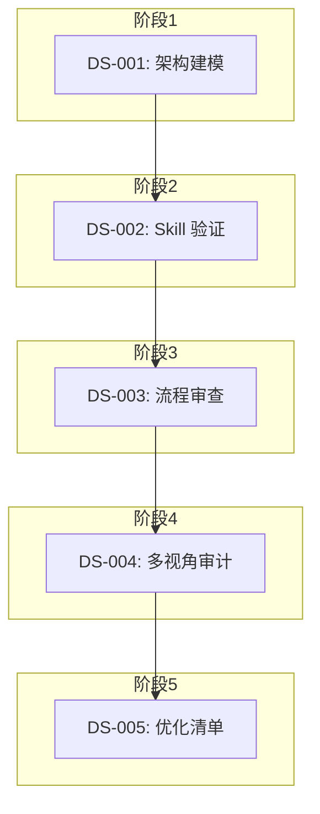

# Design — FSREQ-20260310-SKILLREFINE-001

> Spec-First Skill 层全量优化审查 - 技术设计

## 设计概述

本设计将 Skill 层优化工作分为 5 个阶段，每个阶段对应一个 DS（设计规格），按依赖顺序执行。

---

## DS 设计规格

### DS-SKILLREFINE-001: 代码库架构建模设计

**映射**: FR-SKILLREFINE-001

**模块**: docs/architecture/

**数据模型**:
```yaml
ArchitectureModel:
  skills: Skill[]
  dependencies: Dependency[]
  concepts: Concept[]
  techStack: TechStack[]

Skill:
  id: string          # 如 03-spec
  path: string        # 如 skills/spec-first/03-spec/
  entryFile: string   # 如 SKILL.md
  references: string[] # 参考文档路径列表

Dependency:
  from: string        # 源模块
  to: string          # 目标模块
  type: enum          # calls | references | triggers

Concept:
  name: string        # 如 Context Pack
  location: string    # 实现位置
  description: string
```

**接口**: 无 API 接口，输出为 Markdown 文档

**关键约束**:
- 输出文档路径: `docs/review-bundles/2026-03-11-skill-review/architecture-model.md`
- 文档格式: Markdown + Mermaid 图表
- 宪法合规: Clause P2（事实为本，基于代码扫描）

---

### DS-SKILLREFINE-002: Skill 深度验证设计

**映射**: FR-SKILLREFINE-002

**模块**: tests/skill-validation/

**数据模型**:
```yaml
SkillTestCase:
  skillId: string
  category: enum      # normal | error | boundary
  description: string
  input: object
  expectedOutput: object
  expectedGate: enum  # PASS | FAIL

ValidationReport:
  skillId: string
  testCases: SkillTestCase[]
  passRate: number    # 0-100
  issues: Issue[]
```

**接口**: 无 API 接口，测试框架使用 Vitest

**测试分类**:
1. **正常流程测试**: 验证 Skill 在标准输入下的正确输出
2. **异常流程测试**: 验证 Skill 对无效输入的错误处理
3. **边界流程测试**: 验证 Skill 在边界条件下的行为

**关键约束**:
- 测试框架: Vitest（与项目现有测试一致）
- 每 Skill 至少 3 个测试用例
- 通过率目标: ≥ 80%
- 宪法合规: Clause P4（强制工作流）

---

### DS-SKILLREFINE-003: 全流程健壮性审查设计

**映射**: FR-SKILLREFINE-003

**模块**: tests/e2e/flow-robustness/

**数据模型**:
```yaml
FlowSimulation:
  name: string
  stages: Stage[]     # 01_specify → 02_design → ... → 06_wrap_up
  checkpoints: Checkpoint[]

Checkpoint:
  stage: string
  contextPack: object # 上下文快照
  timestamp: datetime

RecoveryTest:
  interruptPoint: string
  savedContext: object
  recoveryCommand: string
  success: boolean
```

**接口**: 无 API 接口，使用 CLI 命令模拟

**测试场景**:
1. **完整闭环**: init → specify → design → plan → implement → verify → wrap_up
2. **中断恢复**: 在各阶段中断，验证 `spec-first:catchup` 恢复
3. **Gate 阻断**: 故意违反 Gate 条件，验证流程被正确阻断

**关键约束**:
- 使用虚拟 Feature 进行模拟
- 验证 Context Pack 完整性
- 验证 Gate 规则正确性
- 宪法合规: Clause P2（事实为本）

---

### DS-SKILLREFINE-004: 多视角审计设计

**映射**: FR-SKILLREFINE-004

**模块**: docs/review-bundles/2026-03-11-skill-review/

**数据模型**:
```yaml
AuditReport:
  perspective: enum    # ai_collaborator | governance | team_collab
  findings: Finding[]
  recommendations: string[]

Finding:
  category: enum       # logic | flow | ux | architecture
  severity: enum       # P0 | P1 | P2
  description: string
  skillId: string
  suggestion: string
```

**审计视角**:
1. **AI 协同开发者**: 重复沟通成本、人工控制权保留
2. **流程治理负责人**: 流程证据沉淀、变更管理支持
3. **团队协作场景**: 文档可读性、任务交接清晰度

**关键约束**:
- 每视角至少 3 个问题/改进点
- 问题分类: 逻辑缺陷/流程断点/体验优化/架构改进
- 宪法合规: Clause P3（简体中文输出）

---

### DS-SKILLREFINE-005: 优化清单输出设计

**映射**: FR-SKILLREFINE-005

**模块**: docs/review-bundles/2026-03-11-skill-review/

**数据模型**:
```yaml
OptimizationPlan:
  issues: Issue[]
  roadmap: RoadmapItem[]

Issue:
  id: string
  category: enum       # logic | flow | ux | architecture
  priority: enum       # P0 | P1 | P2
  description: string
  solution: string
  verification: string
  affectedSkills: string[]

RoadmapItem:
  phase: string
  issues: string[]     # Issue IDs
  duration: string
  dependencies: string[]
```

**输出格式**:
```markdown
## 问题清单

### P0 问题（阻塞级）
| ID | 分类 | 描述 | 解决方案 | 验证标准 | 受影响 Skill |
|----|------|------|----------|----------|-------------|

### P1 问题（重要级）
...

### P2 问题（优化级）
...

## 优化路线图

### 第一阶段：P0 修复（1周）
- [ ] ISSUE-001: ...
- [ ] ISSUE-002: ...

### 第二阶段：P1 优化（2周）
...
```

**关键约束**:
- 100% 问题有明确优化方向
- P0 问题有可直接执行的修复步骤
- 宪法合规: Clause P1（简洁至上）

---

## 宪法一致性检查

| 条款 | 检查项 | 结果 |
|------|--------|------|
| P1 - 简洁至上 | 无投机性架构层 | ✅ PASS |
| P2 - 事实为本 | 设计基于现有代码结构 | ✅ PASS |
| P3 - 输出语言 | 使用简体中文 | ✅ PASS |
| P4 - 强制工作流 | 设计先于实现 | ✅ PASS |
| P5 - 代码变动铁律 | N/A（设计阶段） | ✅ PASS |
| P6 - 变更记录 | N/A（设计阶段） | ✅ PASS |

---

## 模块依赖图



---

## 技术选型

| 组件 | 选择 | 理由 |
|------|------|------|
| 测试框架 | Vitest | 项目现有标准 |
| 文档格式 | Markdown + Mermaid | 版本管理友好 |
| 数据存储 | 文件系统 | 无需数据库，简单可靠 |

---

## 风险与缓解

| 风险 | 影响 | 缓解措施 |
|------|------|----------|
| 测试覆盖率不足 | 中 | 优先核心 Skill，分批补充 |
| 端到端测试耗时 | 低 | 并行执行，优先关键路径 |
| 问题发现过多 | 中 | 按优先级分类，P0 优先修复 |
