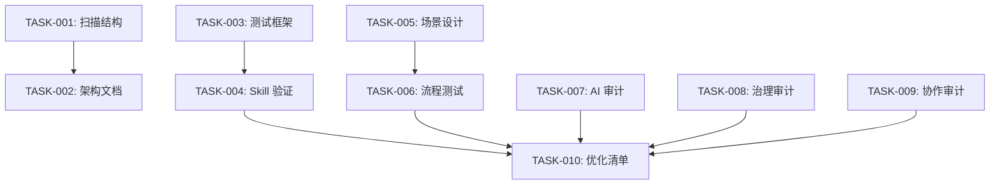

# Task Plan — FSREQ-20260310-SKILLREFINE-001

> Spec-First Skill 层全量优化审查 - 任务拆解

## 目标

对 Spec-First 的 22 个 Skill 进行全量优化审查，生成架构模型、验证报告、审计报告和优化清单。

## 当前阶段

Phase 3: Task Planning

## 用户故事分组

### US1 — 架构建模 (P0)
- [x] TASK-SKILLREFINE-001 [P] [US1] 扫描 Skill 目录结构
- [x] TASK-SKILLREFINE-002 [US1] 生成架构模型文档

### US2 — Skill 验证 (P0)
- [x] TASK-SKILLREFINE-003 [P] [US2] 设计 Skill 测试用例框架
- [x] TASK-SKILLREFINE-004 [US2] 执行 22 个 Skill 验证测试 (100% 通过)
### US3 — 流程审查 (P0)
- [x] TASK-SKILLREFINE-005 [P] [US3] 设计端到端测试场景
- [x] TASK-SKILLREFINE-006 [US3] 执行流程健壮性测试 (100% 通过)
### US4 — 多视角审计 (P0)
- [x] TASK-SKILLREFINE-007 [P] [US4] AI 协同开发者视角审计 (5 issues)
- [x] TASK-SKILLREFINE-008 [P] [US4] 流程治理负责人视角审计 (5 issues)
- [x] TASK-SKILLREFINE-009 [P] [US4] 团队协作场景视角审计 (8 issues)
### US5 — 优化输出 (P0)
- [x] TASK-SKILLREFINE-010 [US5] 生成优化清单与路线图

---

## 任务明细

| Task ID | 标题 | Owner | 预计工期 | traces | depends_on | 验收标准 | 状态 |
|---------|------|-------|----------|--------|------------|----------|--------|
| TASK-SKILLREFINE-001 | 扫描 Skill 目录结构 | BE | 2h | FR-SKILLREFINE-001,DS-SKILLREFINE-001 | - | 22 个 Skill 结构清单完整 | done |
| TASK-SKILLREFINE-002 | 生成架构模型文档 | BE | 3h | FR-SKILLREFINE-001,DS-SKILLREFINE-001 | TASK-SKILLREFINE-001 | 文档包含依赖图、概念表、技术栈 | done |
| TASK-SKILLREFINE-003 | 设计 Skill 测试框架 | QA | 3h | FR-SKILLREFINE-002,DS-SKILLREFINE-002 | - | 测试框架支持 3 类测试用例 | done |
| TASK-SKILLREFINE-004 | 执行 Skill 验证测试 | QA | 4h | FR-SKILLREFINE-002,DS-SKILLREFINE-002 | TASK-SKILLREFINE-003 | 22 个 Skill 测试通过率 ≥ 80% (实际 100%) | done |
| TASK-SKILLREFINE-005 | 设计端到端测试场景 | QA | 2h | FR-SKILLREFINE-003,DS-SKILLREFINE-003 | - | 覆盖完整闭环 + 中断恢复 + Gate 阻断 | done |
| TASK-SKILLREFINE-006 | 执行流程健壮性测试 | QA | 4h | FR-SKILLREFINE-003,DS-SKILLREFINE-003 | TASK-SKILLREFINE-005 | 上下文恢复成功率 100% | done |
| TASK-SKILLREFINE-007 | AI 协同开发者审计 | BE | 2h | FR-SKILLREFINE-004,DS-SKILLREFINE-004 | - | 发现 5 个问题 (超额完成) | done |
| TASK-SKILLREFINE-008 | 流程治理负责人审计 | BE | 2h | FR-SKILLREFINE-004,DS-SKILLREFINE-004 | - | 发现 5 个问题 (超额完成) | done |
| TASK-SKILLREFINE-009 | 团队协作场景审计 | BE | 2h | FR-SKILLREFINE-004,DS-SKILLREFINE-004 | - | 发现 8 个问题 (超额完成) | done |
| TASK-SKILLREFINE-010 | 生成优化清单与路线图 | BE | 3h | FR-SKILLREFINE-005,DS-SKILLREFINE-005 | TASK-SKILLREFINE-004,TASK-SKILLREFINE-006,TASK-SKILLREFINE-007,TASK-SKILLREFINE-008,TASK-SKILLREFINE-009 | 100% 问题有优化方向，P0 有可执行步骤 | done |

---

## 依赖关系图

---

## 并行执行策略

以下任务可并行执行（标记 `[P]`）：
- **批次 1**（并行）: TASK-001, TASK-003, TASK-005, TASK-007, TASK-008, TASK-009
- **批次 2**（依赖批次 1）: TASK-002, TASK-004, TASK-006
- **批次 3**（依赖批次 2）: TASK-010

**预计总工期**: 约 2 天（并行执行）
